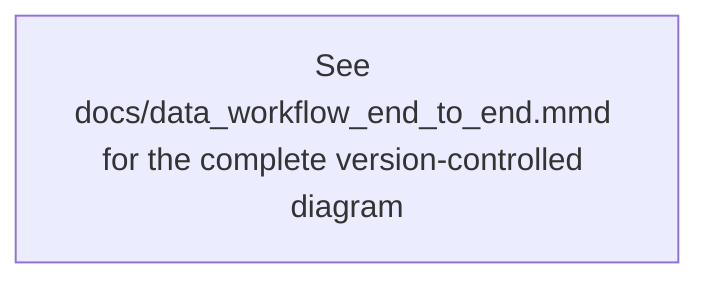

# End-to-End Data Workflow

This document explains the local DASHSys runtime data workflow from user query input through routing, SQL/API evidence acquisition, EvidenceBus normalization, answer grounding, verification, diagnostics, and final packaging.

Mermaid source: [data_workflow_end_to_end.mmd](data_workflow_end_to_end.mmd)

Rendered artifacts:

- [data_workflow_end_to_end.svg](data_workflow_end_to_end.svg)
- [data_workflow_end_to_end.png](data_workflow_end_to_end.png)



## Overview

The packaged default remains `SQL_FIRST_API_VERIFY` through `dashagent.planner.PACKAGED_DEFAULT_STRATEGY`. The main runtime is `dashagent.executor.AgentExecutor`, which prepares metadata and prompts, plans one selected SQL/API plan, executes only validated tool calls, records evidence in `EvidenceBus`, extracts `AnswerSlots`, verifies final claims, and writes `metadata.json`, `filled_system_prompt.txt`, and `trajectory.json`.

The diagram separates two decisions that are easy to conflate:

- Pre-evidence route decision: decide whether runtime evidence must be acquired at all.
- Post-evidence answer composition decision: once evidence exists, decide how to phrase the answer from that evidence.

## Phase 1: Input and Strategy

Inputs can come from a direct user query, public/dev benchmark examples loaded by `EvalHarness.load_examples`, hidden-style diagnostic cases, or generated prompt diagnostics. `Config.from_env` resolves local paths, output directories, strategy flags, and credential-presence behavior without hard-coding absolute paths.

The strategy branch is explicit:

- `SQL_FIRST_API_VERIFY` is the packaged default and keeps SQL-first behavior for evidence prompts.
- `SQL_FIRST_API_VERIFY_HYBRID_ANSWER` maps back to the SQL-first execution base, then enables answer-layer hybrid composition.
- `SQL_FIRST_API_VERIFY_CONCISE_LLM_REWRITE` maps back to the SQL-first execution base, then enables the concise rewrite experiment after the evidence path.
- `ROBUST_GENERALIZED_HARNESS_CANDIDATE_V2` is an explicit research strategy with generalized semantic routing, progressive evidence policy, and research planner behavior. It is not the packaged default.

Runtime guardrails include `runtime_leakage_guard`, `score_provenance_guard`, and hardcode/fake-score guard settings. The local data store is `data/DBSnapshot/*.parquet` loaded by `DuckDBDatabase`; Adobe credentials are read only from environment variables and are reported as redacted/presence-only status.

## Phase 2: Pre-Evidence Routing

The pre-evidence route starts with `prompt_router.route_prompt`, which returns a `PromptRouteDecision`. It can route a purely conceptual prompt to `LLM_DIRECT` before SQL/API planning.

For robust generalized trials, the route can also pass through:

- `prompt_semantic_ir.extract_objective_prompt_features`
- `semantic_parser.parse_prompt_semantics`
- `semantic_intent_classifier.classify_semantic_intent`
- `routing_anti_hallucination_gate`
- `no_tool_safety_verifier`
- `progressive_evidence_policy`
- `semantic_route_decision_ladder`
- `pre_evidence_routing_boundary.should_bypass_evidence_for_llm_direct`

The important rule is:

High-confidence pure general/concept/meta prompts can become `LLM_DIRECT` or `LLM_SAFE_DIRECT`, produce a concept/meta answer, and skip SQL, API, EvidenceBus, AnswerSlots, and the post-evidence answer router.

Data, mixed, ambiguous-data-like, live-state, SQL, or API prompts must enter the evidence pipeline and only answer after EvidenceBus and AnswerSlots are available.

Fixed SQL-first strategies are protected by `pre_evidence_routing_boundary.SQL_FIRST_FIXED_STRATEGIES`; the research semantic no-tool bypass is not applied to `SQL_FIRST_API_VERIFY`, `SQL_FIRST_API_VERIFY_LLM_ANSWER_VERIFIER`, `SQL_FIRST_API_VERIFY_HYBRID_ANSWER`, or `SQL_FIRST_API_VERIFY_CONCISE_LLM_REWRITE`.

## Phase 3: LLM_DIRECT Bypass

There are two no-tool routes shown in the diagram:

- `prompt_route.mode == LLM_DIRECT`: `AgentExecutor` writes metadata, filled prompt, and trajectory, then returns a deterministic no-key fallback without SQL/API tools.
- Robust semantic no-tool applied trial: `_return_semantic_no_tool_applied_result` calls `_conceptual_no_tool_answer`, validates it with `validate_llm_safe_direct_answer`, records `checkpoint_evidence_pipeline_bypass`, and confirms `evidence_bus_built=false` plus `post_evidence_answer_router_ran=false`.

This path is deliberately separate from grounded answer composition. It does not create EvidenceBus or AnswerSlots.

## Phase 4: Evidence Acquisition

Evidence prompts go through normalization, token extraction, deterministic routing, query analysis, relevance scoring, optional value retrieval, optional lookup-path prediction, metadata selection, and prompt rendering.

Planning then uses `StrategyPlanner.create_plan`:

- The SQL-first path uses `_sql_first_api_verify`, with SQL first and API verification when `api_decision.mode` keeps it.
- Applied SQL-first answer experiments still use `execution_base_strategy(...) == SQL_FIRST_API_VERIFY`.
- `ROBUST_GENERALIZED_HARNESS_CANDIDATE_V2` uses `_research_generalized_v2`, which can apply progressive evidence behavior, safe API probe behavior, or SQL/API evidence acquisition depending on the prompt.

`plan_ensemble.select_plan` and `PlanOptimizer` keep a single selected plan and dedupe or block invalid/unresolved work. SQL steps go through `SQLValidator` and `DuckDBDatabase.execute_sql`. API steps go through post-SQL API decision checkpoints when enabled, EvidenceBus forwarding, `APIValidator`, and `AdobeAPIClient.call_api`.

The diagram calls out scope:

- SQL evidence comes from the local snapshot.
- API evidence is live Adobe platform evidence only when a live call succeeds; otherwise dry-run, live-empty, or API-error states must be preserved as caveats.

## Phase 5: Evidence Normalization

`EvidenceBus` records facts from SQL and API results:

- SQL rows, row counts, names, IDs, statuses, timestamps, and first rows.
- API parsed evidence, items, IDs, names, statuses, counts, timestamps, errors, pagination, parser modes, and evidence states.

`api_response_parser.normalize_api_response` and `normalize_api_evidence` distinguish:

- `live_success`
- `live_empty`
- `api_error`
- `dry_run_unavailable`
- `malformed_response`

`evidence_quality_classifier.classify_evidence_quality` keeps critical distinctions such as `API_ERROR` versus no data and `API_LIVE_EMPTY` versus global absence. `answer_slots.extract_answer_slots` then produces count, list/entity, date, status, relationship, and caveat slots.

## Phase 6: Post-Evidence Answer Grounding

The post-evidence answer layer runs only after evidence exists. It is not allowed to decide that evidence should have been skipped.

Implemented components include:

- `answer_synthesizer.synthesize_answer_with_diagnostics` for the legacy safe renderer path.
- `answer_reranker.select_best_answer` and `answer_verifier.verify_answer` for legacy checks.
- `evidence_grounded_answer_builder.build_evidence_grounded_answer`.
- `answer_slot_renderer.render_answer_slots`.
- `broad_question_classifier.classify_broad_question`.
- `answer_intent_router.route_answer_intent`.
- `canonical_data_renderer.render_canonical_data_answer`.
- `llm_concept_answer_generator.generate_llm_concept_answer`.
- `hybrid_answer_composer.compose_hybrid_answer`.
- `hybrid_mixed_answer_composer.compose_hybrid_mixed_answer`.
- `evidence_grounded_llm_answer_generator.generate_evidence_grounded_llm_answer`.
- `concise_llm_answer_rewriter` and `concise_rewrite_selector` for the concise rewrite trial.

The answer mode can be `COUNT`, `LIST`, `STATUS`, `DATE`, `RELATIONSHIP`, `CONCEPT`, `MIXED`, `ERROR_CAVEAT`, or `UNKNOWN`. Data-like answer modes render only evidence-backed facts. Concept or mixed modes can use LLM text only inside the enabled answer experiment and still have to pass evidence-grounded verification.

## Phase 7: Verification and Selection

Final checking uses both the legacy and evidence-grounded verifier stack:

- `final_answer_claim_extractor.extract_final_answer_claims`
- `evidence_allowed_fact_index.build_allowed_fact_index`
- `final_answer_claim_matcher.match_final_answer_claims`
- `evidence_grounded_final_answer_verifier.verify_evidence_grounded_final_answer`
- `answer_verifier.verify_answer`
- `answer_candidate_selector.select_answer_candidate`
- `concise_rewrite_selector.select_concise_rewrite`

The verifier/selector path rejects unsupported counts, dates, statuses, IDs, entities, and relationships. It also blocks common scope errors:

- `API_ERROR` cannot be presented as no data.
- `LIVE_EMPTY` cannot be presented as global absence.
- Local SQL evidence cannot be described as live/current platform evidence.
- Dry-run API fallback cannot be described as live API evidence.

If the highest-ranked candidate fails, the selector falls back to the legacy safe answer or a deterministic fallback.

## Phase 8: Diagnostics, Scoring, and Reports

`TrajectoryLogger` records steps, checkpoints, timing, tool counts, and redacted previews. Each query output contains `metadata.json`, `filled_system_prompt.txt`, and `trajectory.json`.

Evaluation and reporting are local:

- `scripts/run_dev_eval.py` writes `outputs/eval_results*.json/csv` and strategy comparisons.
- `scripts/run_hidden_style_eval.py` writes hidden-style diagnostic reports.
- `scripts/check_submission_ready.py` verifies final-submission readiness, default strategy, required files, unresolved API placeholders, and secret scan status.
- `scripts/package_submission.py` and `scripts/package_query_outputs.py` write packaged outputs under `outputs/final_submission/`.
- `scripts/audit_score_provenance.py` separates organizer-equivalent scores from simulated/internal diagnostics.
- `scripts/audit_hardcoded_runtime_and_score_paths.py` scans for hardcoded gold/oracle/score leakage risks.
- `scripts/generate_sdk_usage_audit.py` checks that runtime LLM calls use the shared SDK abstraction.
- `scripts/run_integrated_robustness_gate.py` combines strict, hidden-style, live API, generated prompt, and submission-readiness gates.
- `scripts/generate_unified_robustness_diagnostics_dashboard.py` summarizes robustness diagnostics.
- `scripts/generate_project_mermaid_visualizations.py`, `scripts/generate_end_to_end_system_dataflow.py`, and `scripts/generate_full_project_dataflow_svg.py` generate local visualization artifacts.

Reports are written under `outputs/reports/`; visualization outputs are under `outputs/visualizations/`; final packaging outputs are under `outputs/final_submission/`.

## Files Inspected

Key project files inspected while building this diagram:

- `README.md`
- `dashagent/config.py`
- `dashagent/planner.py`
- `dashagent/executor.py`
- `dashagent/prompt_router.py`
- `dashagent/pre_evidence_routing_boundary.py`
- `dashagent/prompt_semantic_ir.py`
- `dashagent/semantic_parser.py`
- `dashagent/semantic_intent_classifier.py`
- `dashagent/routing_anti_hallucination_gate.py`
- `dashagent/no_tool_safety_verifier.py`
- `dashagent/progressive_evidence_policy.py`
- `dashagent/semantic_route_decision_ladder.py`
- `dashagent/staged_evidence_policy.py`
- `dashagent/db.py`
- `dashagent/schema_index.py`
- `dashagent/endpoint_catalog.py`
- `dashagent/validators.py`
- `dashagent/api_client.py`
- `dashagent/api_response_parser.py`
- `dashagent/evidence_bus.py`
- `dashagent/evidence_quality_classifier.py`
- `dashagent/answer_slots.py`
- `dashagent/answer_synthesizer.py`
- `dashagent/answer_reranker.py`
- `dashagent/answer_verifier.py`
- `dashagent/broad_question_classifier.py`
- `dashagent/answer_intent_router.py`
- `dashagent/answer_slot_renderer.py`
- `dashagent/canonical_data_renderer.py`
- `dashagent/llm_concept_answer_generator.py`
- `dashagent/hybrid_answer_composer.py`
- `dashagent/hybrid_mixed_answer_composer.py`
- `dashagent/evidence_grounded_answer_builder.py`
- `dashagent/evidence_grounded_llm_answer_generator.py`
- `dashagent/evidence_grounded_final_answer_verifier.py`
- `dashagent/answer_candidate_selector.py`
- `dashagent/concise_llm_answer_rewriter.py`
- `dashagent/concise_rewrite_selector.py`
- `dashagent/eval_harness.py`
- `dashagent/trajectory.py`
- `scripts/run_dev_eval.py`
- `scripts/run_hidden_style_eval.py`
- `scripts/package_submission.py`
- `scripts/package_query_outputs.py`
- `scripts/check_submission_ready.py`
- `scripts/generate_consolidated_reports.py`
- `scripts/generate_project_mermaid_visualizations.py`
- `scripts/generate_end_to_end_system_dataflow.py`
- `scripts/generate_full_project_dataflow_svg.py`
- `scripts/audit_score_provenance.py`
- `scripts/audit_hardcoded_runtime_and_score_paths.py`
- `scripts/generate_sdk_usage_audit.py`
- `scripts/run_integrated_robustness_gate.py`
- `scripts/generate_unified_robustness_diagnostics_dashboard.py`
- `tests/test_robust_generalized_candidate.py`
- `tests/test_hybrid_answer_composer.py`
- `tests/test_concise_rewrite_eligibility.py`
- `tests/test_sql_first_llm_answer_verifier_strategy.py`
- `tests/test_answer_candidate_selector.py`
- `tests/test_evidence_grounded_final_answer_verifier.py`
- `tests/test_gold_style_canonical_renderer.py`
- `tests/test_dataflow_visualization.py`
- `tests/test_visualization_deliverables.py`

## Uncertain or Inferred Parts

- There is no exact `PreEvidenceIntentRouter` class. The diagram labels that concept as the combination of `prompt_router.route_prompt`, semantic route ladder components, and `pre_evidence_routing_boundary.should_bypass_evidence_for_llm_direct`.
- There is no exact `PostEvidenceAnswerModeRouter` class. The diagram labels that concept as `answer_intent_router.route_answer_intent` plus `hybrid_answer_composer.compose_hybrid_answer`, which run after `EvidenceBus` and `AnswerSlots`.
- There is no `LegacySafeRenderer` class. The implementation is the legacy safe path in `answer_synthesizer`, `answer_reranker`, and `answer_verifier`; candidate selection uses the source label `LEGACY_SAFE_RENDERER`.
- There is no standalone `GoldStyleCanonicalRenderer` class. Gold-style canonical rendering appears as a config flag and tests around `canonical_data_renderer.render_canonical_data_answer`.
- `SQL_FIRST_API_VERIFY_CONCISE_LLM_REWRITE` does not change SQL/API planning. It still reaches the concise rewrite only after the SQL-first evidence path and slot/evidence extraction.
- The deterministic `prompt_router` `LLM_DIRECT` fallback exists outside the research semantic no-tool applied trial. Robust semantic bypass records the stronger `checkpoint_evidence_pipeline_bypass` boundary.

## Regenerating SVG and PNG

Check for a local Mermaid renderer:

```bash
command -v mmdc || true
npm ls @mermaid-js/mermaid-cli || true
```

Render with a global Mermaid CLI:

```bash
mmdc -i docs/data_workflow_end_to_end.mmd -o docs/data_workflow_end_to_end.svg
mmdc -i docs/data_workflow_end_to_end.mmd -o docs/data_workflow_end_to_end.png
```

Or render through npm:

```bash
npx --yes @mermaid-js/mermaid-cli -i docs/data_workflow_end_to_end.mmd -o docs/data_workflow_end_to_end.svg
npx --yes @mermaid-js/mermaid-cli -i docs/data_workflow_end_to_end.mmd -o docs/data_workflow_end_to_end.png
```
