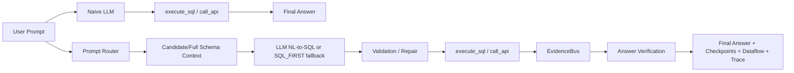

# Baseline Comparison Report

## Summary Table

| System | Description | Normal correctness | Strict correctness | Final score | Tool calls | Tokens | Runtime | LLM status |
| --- | --- | --- | --- | --- | ---: | ---: | ---: | --- |
| RAW_REAL_LLM_TWO_TOOLS_BASELINE | Raw real LLM with execute_sql/call_api only | n/a - tool-loop diagnostic baseline | n/a - tool-loop diagnostic baseline | n/a - tool-loop diagnostic baseline | n/a | n/a | n/a | skipped_no_key |
| GUIDED_REAL_LLM_TWO_TOOLS_BASELINE | Guided real LLM with execute_sql/call_api plus schema/API affordances | n/a - tool-loop diagnostic baseline | n/a - tool-loop diagnostic baseline | n/a - tool-loop diagnostic baseline | n/a | n/a | n/a | skipped_no_key |
| REAL_LLM_TWO_TOOLS_BASELINE | Backward-compatible alias for the raw real LLM baseline | n/a - tool-loop diagnostic baseline | n/a - tool-loop diagnostic baseline | n/a - tool-loop diagnostic baseline | n/a | n/a | n/a | skipped_no_key |
| LLM_FREE_AGENT_BASELINE | Deterministic approximation of a broad LLM agent | 0.6707 | 0.4879 | 0.4529 | 2.1143 | 1023.4 | 0.0161 | n/a |
| SQL_ONLY_BASELINE | Local DB only | 0.5763 | 0.2983 | 0.2795 | 1.0 | 755.9143 | 0.0105 | n/a |
| SQL_FIRST_API_VERIFY | Current deterministic optimized backend | 0.8407 | 0.6743 | 0.6491 | 1.4571 | 831.4571 | 0.0092 | n/a |
| CANDIDATE_GUIDED_LLM_SQL | Optional candidate-context LLM SQL with fallback | n/a | n/a | n/a | n/a | n/a | n/a | n/a |
| FULL_SCHEMA_LLM_SQL | Optional full-schema LLM SQL with fallback | n/a | n/a | n/a | n/a | n/a | n/a | n/a |
| LLM_SQL_FIRST_API_VERIFY | Optional LLM SQL plus deterministic API verification | n/a | n/a | n/a | n/a | n/a | n/a | n/a |
| LLM_CONTROLLER_OPTIMIZED_AGENT | Optional LLM controller with optimized backend tool | n/a | n/a | n/a | n/a | n/a | n/a | skipped_no_key |

Note: RAW/GUIDED real LLM rows are diagnostic tool-loop baselines. They show tool-use reliability and efficiency, while `SQL_FIRST_API_VERIFY` remains the packaged scoring strategy.

## Raw vs Guided Real LLM Tool Loops

| Variant | Rows | Successful | Failed | Valid run rate | Tool execution success rate | Avg valid tool calls | Avg invalid tool calls | Avg endpoint repairs | Avg schema hints |
| --- | ---: | ---: | ---: | ---: | ---: | ---: | ---: | ---: | ---: |
| Raw | 0 | 0 | 0 | 0.0 | 0.0 | 0.0 | 0.0 | 0.0 | 0.0 |
| Guided | 0 | 0 | 0 | 0.0 | 0.0 | 0.0 | 0.0 | 0.0 | 0.0 |

## Tool Execution vs Evidence Availability

A dry-run API call means the tool was invoked and validated, but live evidence was unavailable because Adobe credentials were missing. Dry-run API calls are not counted as successful live evidence.

| Variant | Dry-run only API calls | Avg successful evidence count | Avg invalid tool calls |
| --- | ---: | ---: | ---: |
| Raw | 0 | 0.0 | 0.0 |
| Guided | 0 | 0.0 | 0.0 |

## Provider Reliability Note

Some OpenRouter/OpenAI-backed baseline rows may fail at request level. These rows are separated under failed real LLM tool loops, are not counted as successful tool-loop runs, and do not affect the packaged `SQL_FIRST_API_VERIFY` submission.

| Variant | `llm_request_failed` count |
| --- | ---: |
| Raw | 0 |
| Guided | 0 |

## Tool Failure Categories

| Category | Raw | Guided |
| --- | ---: | ---: |
| dry_run_only_api_count | 0 | 0 |
| duplicate_invalid_call_count | 0 | 0 |
| max_turns_exceeded_count | 0 | 0 |
| no_final_answer_count | 0 | 0 |
| schema_introspection_failure_count | 0 | 0 |
| unknown_column_count | 0 | 0 |
| unknown_endpoint_count | 0 | 0 |
| unknown_table_count | 0 | 0 |
| unsupported_negative_answer_count | 0 | 0 |

## Token And Runtime Efficiency

| Variant | Avg prompt/context tokens | Avg runtime | Avg tool calls |
| --- | ---: | ---: | ---: |
| Raw | 0.0 | 0.0 | 0.0 |
| Guided | 0.0 | 0.0 | 0.0 |

## Improvement: Optimized vs Naive

| Metric | Naive | Optimized | Absolute gain | Relative gain |
| --- | ---: | ---: | ---: | ---: |
| SQL correctness | 0.06 | 0.9333 | 0.8733 | 14.555 |
| API correctness | 0.9742 | 0.9791 | 0.0049 | 0.005 |
| answer correctness | 0.245 | 0.3076 | 0.0626 | 0.2555 |
| overall correctness | 0.4879 | 0.6743 | 0.1864 | 0.382 |
| final score | 0.4529 | 0.6491 | 0.1962 | 0.4332 |
| tool calls | 2.1143 | 1.4571 | -0.6572 | -0.3108 |
| tokens | 1023.4 | 831.4571 | -191.9429 | -0.1876 |
| runtime | 0.0161 | 0.0092 | -0.0069 | -0.4286 |

## Technique Contribution

| Technique | Active in naive baseline? | Active in optimized system? | Expected effect |
| --- | --- | --- | --- |
| prompt router | False | True | keeps conceptual prompts out of the data pipeline and routes evidence prompts safely |
| query normalization | False | True | improves correctness, efficiency, or observability in the optimized path |
| token extraction | False | True | improves correctness, efficiency, or observability in the optimized path |
| candidate context retrieval | False | True | narrows schema/API context without deciding final SQL |
| full-schema fallback | False | True | prevents retrieval misses from blocking NL-to-SQL |
| LLM NL-to-SQL | True | True | lets a real model generate SQL when credentials exist |
| SQL/API templates | False | True | improves correctness, efficiency, or observability in the optimized path |
| plan optimizer | False | True | improves correctness, efficiency, or observability in the optimized path |
| evidence policy | False | True | improves correctness, efficiency, or observability in the optimized path |
| call budget | False | True | improves correctness, efficiency, or observability in the optimized path |
| EvidenceBus | False | True | forwards exact SQL/API evidence into later steps |
| answer verifier | False | True | blocks unsupported final-answer claims |
| answer reranker | False | True | improves correctness, efficiency, or observability in the optimized path |
| checkpoint visualization | False | True | improves correctness, efficiency, or observability in the optimized path |
| OpenAI trace export | False | True | improves correctness, efficiency, or observability in the optimized path |

## System Comparison Diagram

## Lowest Failure Deltas

| Query ID | Naive final | Optimized final | Delta | Likely reason |
| --- | ---: | ---: | ---: | --- |
| `example_004` | 0.8352 | 0.8349 | -0.0003 | optimized path uses validated templates/evidence policy/checkpoints |
| `example_015` | 0.7947 | 0.808 | 0.0133 | optimized path uses validated templates/evidence policy/checkpoints |
| `example_020` | 0.7878 | 0.8011 | 0.0133 | optimized path uses validated templates/evidence policy/checkpoints |
| `example_034` | 0.7967 | 0.81 | 0.0133 | optimized path uses validated templates/evidence policy/checkpoints |
| `example_022` | 0.8014 | 0.8149 | 0.0135 | optimized path uses validated templates/evidence policy/checkpoints |
| `example_026` | 0.7976 | 0.8111 | 0.0135 | optimized path uses validated templates/evidence policy/checkpoints |
| `example_029` | 0.7805 | 0.7941 | 0.0136 | optimized path uses validated templates/evidence policy/checkpoints |
| `example_027` | 0.7947 | 0.8087 | 0.014 | optimized path uses validated templates/evidence policy/checkpoints |
| `example_033` | 0.7832 | 0.7973 | 0.0141 | optimized path uses validated templates/evidence policy/checkpoints |
| `example_017` | 0.7894 | 0.8036 | 0.0142 | optimized path uses validated templates/evidence policy/checkpoints |
