# DASHSys Prompt-To-Answer Dataflow

- Query ID: `is_the_birthday_message_journey_published`
- Strategy: `SQL_FIRST_API_VERIFY`
- Tool calls: `2`

```mermaid
flowchart TD
  subgraph Input
    A["User Prompt<br/>Is the &#x27;Birthday Message&#x27; journey published?"]
    B["Prompt Router<br/>mode=SQL_PLUS_API<br/>policy=unknown"]
    A -->|route_prompt| B
  end
  subgraph QueryUnderstanding[Query Understanding]
    C["Query Normalization<br/>normalized_query + rewrites"]
    D["Tokens / Entities<br/>names + ids + dates + metrics"]
    E["Relevance / QueryAnalysis<br/>tables + APIs + answer family"]
    B -->|normalized text| C
    C -->|query_tokens| D
    D -->|route/domain/family| E
  end
  subgraph ContextPlanning[Context And Planning]
    F["Candidate / Context Card<br/>selected tables + APIs"]
    G["LLM SQL or Template Plan<br/>candidate/full schema + fallback"]
    H["Plan Optimization<br/>budget + dedupe + placeholders"]
    E -->|selected_metadata| F
    F -->|schema/API context| G
    G -->|draft_plan| H
  end
  subgraph ValidationExecution[Validation And Execution]
    I["SQL Validation<br/>SELECT &quot;NAME&quot; AS campaign_name, &quot;LASTDEPLOYEDTIME&quot; AS published_time FROM &quot;dim_campaign&quot; L"]
    J["API Validation<br/>GET /ajo/journey"]
    K["Tool Results<br/>sql_rows + api_payload/dry_run"]
    H -->|optimized_plan| I
    H -->|api_steps| J
    I -->|execute_sql| K
    J -->|call_api or dry-run| K
  end
  subgraph EvidenceAnswer[Evidence And Answer]
    L["EvidenceBus<br/>IDs + names + counts + timestamps"]
    M["Answer Slots<br/>entity + count + status + dry_run"]
    N["Answer Verification<br/>claims + caveats + reranking"]
    O["Final Answer<br/>The journey &quot;Birthday Message&quot; has not been published. The database shows a null published_time for this journey, and live API verification was not executed bec"]
    K -->|extract structured facts| L
    L -->|forward evidence_slots| M
    M -->|verify claims| N
    N -->|verified_answer| O
  end
  subgraph Artifacts
    P["metadata.json<br/>filled_system_prompt.txt<br/>trajectory.json<br/>reports"]
    O -->|write reproducible trace| P
  end
```



## Prompt To SQL/API Mapping

```json
{
  "api_calls": {
    "items": {
      "items": [
        {
          "kind": "api_call",
          "method": "GET",
          "params": {
            "filter": "name==Birthday Message"
          },
          "result": {
            "dry_run": true,
            "endpoint": "/ajo/journey",
            "error": "Adobe credentials unavailable; API call not executed.",
            "method": "GET",
            "ok": false,
            "params": {
              "filter": "name==Birthday Message"
            },
            "result_preview": null,
            "url": "https://platform.adobe.io/ajo/journey"
          },
          "url": "/ajo/journey",
          "validation": {
            "errors": {
              "total_items": 0,
              "truncated_items": false
            },
            "ok": true,
            "repaired": false
          }
        }
      ],
      "total_items": 1,
      "truncated_items": false
    },
    "total_items": 1,
    "truncated_items": false
  },
  "candidate_or_metadata": {
    "estimated_metadata_tokens": 378,
    "prompt_tokens": 941,
    "selected_apis": {
      "items": {
        "items": [
          "journey_list"
        ],
        "total_items": 1,
        "truncated_items": false
      },
      "total_items": 1,
      "truncated_items": false
    },
    "selected_card_name": "journey_campaign",
    "selected_columns": {
      "dim_campaign": {
        "items": {
          "items": [
            "CAMPAIGNID",
            "NAME",
            "STATE"
          ],
          "total_items": 3,
          "truncated_items": false
        },
        "total_items": 5,
        "truncated_items": true
      }
    },
    "selected_tables": {
      "items": {
        "items": [
          "dim_campaign"
        ],
        "total_items": 1,
        "truncated_items": false
      },
      "total_items": 1,
      "truncated_items": false
    }
  },
  "evidence_bus": {
    "evidence": {
      "names": {
        "items": {
          "items": [
            "Birthday Message",
            "Gold Tier Welcome Email"
          ],
          "total_items": 2,
          "truncated_items": false
        },
        "total_items": 2,
        "truncated_items": false
      }
    }
  },
  "normalization": {
    "matching_text": "is the 'birthday message' journey published?",
    "normalized_query": "Is the 'Birthday Message' journey published?"
  },
  "prompt": "Is the 'Birthday Message' journey published?",
  "route": {
    "confidence": 0.88,
    "matched_rules": {
      "items": {
        "items": [
          "sql_plus_api:published"
        ],
        "total_items": 1,
        "truncated_items": false
      },
      "total_items": 1,
      "truncated_items": false
    },
    "mode": "SQL_PLUS_API",
    "reason": "Live/status keyword(s) require SQL grounding plus API verification: published.",
    "recommended_strategy": "SQL_FIRST_API_VERIFY",
    "requires_api": true,
    "requires_database": true,
    "risk": "medium",
    "truncated_fields": 1
  },
  "sql_calls": {
    "items": {
      "items": [
        {
          "kind": "sql_call",
          "result": {
            "error": null,
            "limited": false,
            "ok": true,
            "row_count": 2,
            "rows": {
              "items": {
                "items": {
                  "items": [
                    {
                      "campaign_name": "Birthday Message"
                    },
                    {
                      "campaign_name": "Gold Tier Welcome Email"
                    }
                  ],
                  "total_items": 2,
                  "truncated_items": false
                },
                "total_items": 2,
                "truncated_items": false
              },
              "total_items": 2,
              "truncated_items": false
            }
          },
          "sql": "SELECT \"NAME\" AS campaign_name, \"LASTDEPLOYEDTIME\" AS published_time FROM \"dim_campaign\" LIMIT 50",
          "validation": {
            "errors": {
              "total_items": 0,
              "truncated_items": false
            },
            "ok": true,
            "repaired": false
          }
        }
      ],
      "total_items": 1,
      "truncated_items": false
    },
    "total_items": 1,
    "truncated_items": false
  },
  "tokens": {
    "domains": {
      "items": {
        "items": [
          "journey_campaign"
        ],
        "total_items": 1,
        "truncated_items": false
      },
      "total_items": 1,
      "truncated_items": false
    },
    "quoted_entities": {
      "items": {
        "items": [
          "Birthday Message"
        ],
        "total_items": 1,
        "truncated_items": false
      },
      "total_items": 1,
      "truncated_items": false
    },
    "statuses": {
      "items": {
        "items": [
          "published"
        ],
        "total_items": 1,
        "truncated_items": false
      },
      "total_items": 1,
      "truncated_items": false
    }
  },
  "truncated_fields": 4
}
```

## Checkpoint Effect Table

| Checkpoint | Technique | Input | Output | Effect on data flow | Correctness role | Efficiency role |
| --- | --- | --- | --- | --- | --- | --- |
| `checkpoint_01_raw_query` | raw user query capture |  | {"query": "Is the 'Birthday Message' journey published?", "query_id": "is_the_birthday_message_journey_published", "strategy": "SQL_FIRST_API_VERIFY"} | preserves the original query for reproducibility | keeps later normalization from changing the user-facing question | starts one trace without extra tool calls |
| `checkpoint_00_prompt_router` | LLM_DIRECT / LOCAL_DB_ONLY / SQL_PLUS_API / API_ONLY routing policy | {"query": "Is the 'Birthday Message' journey published?"} | {"preview": "{\"confidence\": 0.88, \"matched_rules\": {\"items\": {\"items\": [\"sql_plus_api:published\"], \"total_items\": 1, \"truncated_items\": false}, \"total_items\": 1, \"truncated_items\": false}, \"mode\": \"SQL_PLUS_API\", \"reason\": \"Live/status keyword(s) require SQL grounding plus...", "truncated": true} | chooses whether the prompt can be answered directly or needs SQL/API evidence | routes data questions to evidence tools instead of unsupported direct answers | allows clearly conceptual prompts to avoid unnecessary SQL/API calls |
| `checkpoint_simple_prompt_gate` | simple prompt gate | {"query": "Is the 'Birthday Message' journey published?"} | {"confidence": 0.88, "is_simple": false, "reason": "Live/status keyword(s) require SQL grounding plus API verification: published.", "suggested_action": "USE_DATA_PIPELINE"} | lets an LLM wrapper answer conceptual questions directly while sending evidence questions to the backend | prevents direct answers for data questions that need SQL/API evidence | can skip the data pipeline only for safe conceptual prompts |
| `checkpoint_02_query_normalization` | data cleaning / query normalization | {"query": "Is the 'Birthday Message' journey published?"} | {"matching_text": "is the 'birthday message' journey published?", "normalized_query": "Is the 'Birthday Message' journey published?"} | creates matching-friendly text while preserving the original query | improves template and route matching across wording variants | reduces repeated fuzzy matching work downstream |
| `checkpoint_03_query_tokens` | domain-aware tokenization/entity extraction | {"normalized_query": "Is the 'Birthday Message' journey published?"} | {"preview": "{\"domains\": {\"items\": {\"items\": [\"journey_campaign\"], \"total_items\": 1, \"truncated_items\": false}, \"total_items\": 1, \"truncated_items\": false}, \"quoted_entities\": {\"items\": {\"items\": [\"Birthday Message\"], \"total_items\": 1, \"truncated_items\": false}, \"total_ite...", "truncated": true} | extracts reusable query fields for routing, planning, and answers | grounds names, IDs, dates, metrics, and statuses before planning | avoids reparsing the query in later modules |
| `checkpoint_04_relevance_scoring` | attention-style relevance scoring | {"preview": "{\"tokens\": {\"domains\": {\"items\": {\"items\": [\"journey_campaign\"], \"total_items\": 1, \"truncated_items\": false}, \"total_items\": 1, \"truncated_items\": false}, \"quoted_entities\": {\"items\": {\"items\": [\"Birthday Message\"], \"total_items\": 1, \"truncated_items\": false},...", "truncated": true} | {"preview": "{\"top_answer_families\": {\"items\": {\"items\": [\"journey_published\", \"inactive_journeys\"], \"total_items\": 2, \"truncated_items\": false}, \"total_items\": 2, \"truncated_items\": false}, \"top_apis\": {\"items\": {\"items\": [\"journey_list\", \"schema_registry_schema\", \"unifie...", "truncated": true} | selects a smaller, more relevant schema/API context | keeps high-signal tables and endpoints near the planner | reduces metadata and prompt tokens when compact metadata is enabled |
| `checkpoint_05_query_analysis` | branch prediction / QueryAnalysis | {"domain_type": "JOURNEY_CAMPAIGN", "route_type": "SQL_THEN_API"} | {"preview": "{\"answer_family\": \"journey_published\", \"api_templates\": {\"items\": {\"items\": [\"journey_by_name\"], \"total_items\": 1, \"truncated_items\": false}, \"total_items\": 1, \"truncated_items\": false}, \"confidence\": 0.8, \"domain_type\": \"JOURNEY_CAMPAIGN\", \"fast_path\": \"journ...", "truncated": true} | computes shared query understanding once | aligns routing, metadata, planning, and reporting decisions | avoids repeated template and routing analysis |
| `checkpoint_06_lookup_path` | TLB-style lookup path prediction | {"answer_family": "journey_published", "domain_type": "JOURNEY_CAMPAIGN"} | {"preview": "{\"api_families\": {\"items\": {\"items\": [\"journey_by_name\", \"journey_inactive\", \"journey_list\"], \"total_items\": 3, \"truncated_items\": false}, \"total_items\": 3, \"truncated_items\": false}, \"api_mode\": \"optional\", \"family\": \"journey_campaign\", \"required_ids\": {\"item...", "truncated": true} | predicts the relevant table/join/API path | guides relationship-heavy SQL/API selection | filters unrelated schema and endpoint candidates |
| `checkpoint_07_context_card` | huge-page-style compact context card | {"broad_context": false, "lookup_path": "journey_campaign"} | {"preview": "{\"estimated_metadata_tokens\": 378, \"prompt_tokens\": 941, \"selected_apis\": {\"items\": {\"items\": [\"journey_list\"], \"total_items\": 1, \"truncated_items\": false}, \"total_items\": 1, \"truncated_items\": false}, \"selected_card_name\": \"journey_campaign\", \"selected_column...", "truncated": true} | packs family-relevant context into metadata.json and the filled prompt | keeps required tables, columns, joins, and API candidates visible | limits context size for non-baseline strategies |
| `checkpoint_08_candidate_plans` | pre-execution plan ensemble | {"base_step_count": 2, "strategy": "SQL_FIRST_API_VERIFY"} | {"preview": "{\"candidate_plan_names\": {\"items\": {\"items\": [\"generic_sql_first\"], \"total_items\": 1, \"truncated_items\": false}, \"total_items\": 1, \"truncated_items\": false}, \"reason_selected\": \"highest pre-execution validation/relevance/cost score\", \"scores\": {\"generic_sql_fi...", "truncated": true} | selects one plan before execution | prefers validated, family-matched plans | does not execute losing candidate plans |
| `checkpoint_09_plan_optimization` | compiler-style plan optimization | {"original_step_count": 2} | {"preview": "{\"call_budget_applied\": false, \"optimized_step_count\": 2, \"optimizer_actions\": {\"items\": {\"items\": [\"ensemble selected generic_sql_first\"], \"total_items\": 1, \"truncated_items\": false}, \"total_items\": 1, \"truncated_items\": false}, \"original_step_count\": 2, \"rem...", "truncated": true} | removes duplicate, skippable, or unsafe calls before validation | drops unresolved placeholder calls unless explicitly warned | enforces a bounded plan before execution |
| `checkpoint_10_evidence_policy` | API_REQUIRED/API_OPTIONAL/API_SKIP policy | {"answer_family": "journey_published", "route_type": "SQL_THEN_API"} | {"preview": "{\"allowed_api_families\": {\"items\": {\"items\": [\"journey_by_name\"], \"total_items\": 1, \"truncated_items\": false}, \"total_items\": 1, \"truncated_items\": false}, \"max_api_calls\": 1, \"mode\": \"API_OPTIONAL\", \"reason\": \"Live/platform verification may improve the answer...", "truncated": true} | decides when API evidence is required, optional, or unnecessary | keeps API calls for API-only/live families | skips or caps API calls when SQL evidence is enough |
| `checkpoint_11_call_budget` | tool-call budgeting | {"preview": "{\"planned_steps\": {\"items\": {\"items\": [{\"action\": \"sql\", \"family\": \"journey_campaign_published\", \"purpose\": \"Fast-path SQL grounding.\", \"sql\": \"SELECT \\\"NAME\\\" AS campaign_name, \\\"LASTDEPLOYEDTIME\\\" AS published_time FROM \\\"dim_campaign\\\" LIMIT 50\"}, {\"action\"...", "truncated": true} | {"final_planned_calls": 2, "max_api_calls": 1, "max_sql_calls": 1, "max_total_tool_calls": 2, "planned_api_calls": 1, "planned_sql_calls": 1} | keeps tool calls within per-family limits | preserves required grounding steps | prevents accidental extra SQL/API calls |
| `checkpoint_12_validation` | SQL/API safety validation | {"preview": "{\"optimized_steps\": {\"items\": {\"items\": [{\"action\": \"sql\", \"family\": \"journey_campaign_published\", \"purpose\": \"Fast-path SQL grounding.\", \"sql\": \"SELECT \\\"NAME\\\" AS campaign_name, \\\"LASTDEPLOYEDTIME\\\" AS published_time FROM \\\"dim_campaign\\\" LIMIT 50\"}, {\"actio...", "truncated": true} | {"preview": "{\"api_validation_status\": {\"items\": {\"items\": [{\"errors\": {\"total_items\": 0, \"truncated_items\": false}, \"ok\": true}], \"total_items\": 1, \"truncated_items\": false}, \"total_items\": 1, \"truncated_items\": false}, \"sql_validation_status\": {\"items\": {\"items\": [{\"erro...", "truncated": true} | records whether planned SQL/API calls were safe to execute | blocks unsafe SQL and unknown/unresolved API calls | prevents wasted execution on invalid calls |
| `checkpoint_13_tool_execution` | SQL/API tool execution | {"validated_step_count": 2} | {"preview": "{\"api_calls_executed\": 1, \"api_results\": {\"items\": {\"items\": [{\"result_preview\": {\"error\": \"Adobe credentials unavailable; API call not executed.\", \"result_preview\": null, \"dry_run\": true, \"endpoint\": \"/ajo/journey\", \"method\": \"GET\", \"ok\": false, \"params\": {\"f...", "truncated": true} | captures the actual SQL/API evidence gathered by the backend | records row counts, dry-run state, and API status for final answer grounding | makes tool-call count and result previews explicit |
| `checkpoint_14_evidence_bus` | operand forwarding / EvidenceBus | {"tool_result_count": 2} | {"evidence": {"names": {"items": {"items": ["Birthday Message", "Gold Tier Welcome Email"], "total_items": 2, "truncated_items": false}, "total_items": 2, "truncated_items": false}}} | forwards structured facts to API params and answer slots | passes exact IDs, names, counts, timestamps, and statuses without text guessing | avoids repeated lookup or reparsing work |
| `checkpoint_15_answer_slots` | structured answer slot extraction | {"tool_result_count": 2} | {"preview": "{\"answer_intent\": \"STATUS\", \"discrepancy_flags\": {\"sql_api_discrepancy\": false}, \"dry_run_flags\": {\"dry_run\": true}, \"missing_slots\": {\"items\": {\"items\": [\"status\"], \"total_items\": 1, \"truncated_items\": false}, \"total_items\": 1, \"truncated_items\": false}, \"slo...", "truncated": true} | turns raw tool results into typed evidence fields | makes final response generation evidence-grounded | keeps answer context compact |
| `checkpoint_16_answer_verification` | claim verification / groundedness checking | {"claim_count": 2, "slots_present": {"items": {"items": ["entity_names", "counts", "sql_row_count"], "total_items": 3, "truncated_items": false}, "total_items": 5, "truncated_items": true}} | {"errors": {"total_items": 0, "truncated_items": false}, "rewrite_applied": false, "supported_claims_count": 2, "unsupported_claims_count": 0, "verifier_passed": true} | checks final-answer claims against SQL/API evidence | blocks unsupported numbers, entities, timestamps, statuses, and dry-run API confirmation | rewrites safely without extra tool calls |
| `checkpoint_17_answer_reranking` | deterministic answer reranking | {"answer_family": "journey_published"} | {"candidate_count": 0, "selected_candidate_type": "base", "selection_reason": "best verifier-passing answer"} | selects the safest answer from same-evidence candidates | prefers verifier-passing and intent-matched answers | uses no additional SQL/API/LLM calls |
| `checkpoint_18_final_answer` | concise grounded final response | {"verifier_passed": true} | {"preview": "{\"answer_length\": 199, \"final_answer\": \"The journey \\\"Birthday Message\\\" has not been published. The database shows a null published_time for this journey, and live API verification was not executed because Adobe credentials are unavailable.\", \"final_token_est...", "truncated": true} | returns the final concise answer to the agent harness | final answer remains tied to evidence and caveats | keeps response concise |
