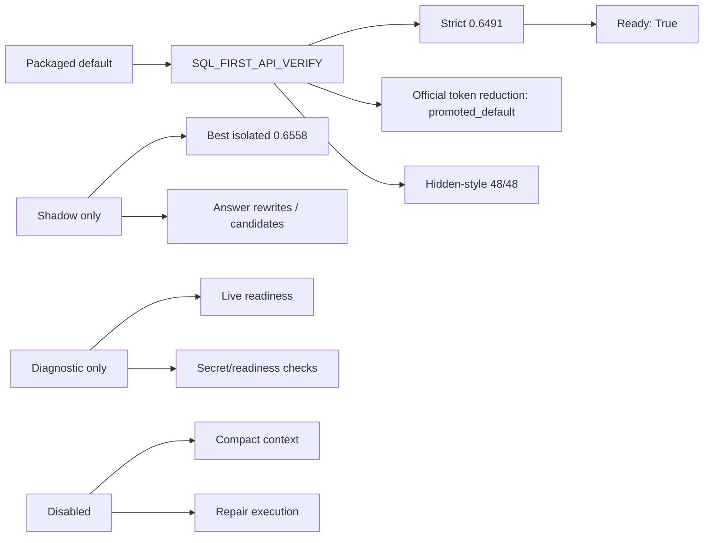

# Current DASHSys System State

## At a Glance

## Summary Table

| Field | Value |
| --- | --- |
| preferred strategy | SQL_FIRST_API_VERIFY |
| packaged strict final score | 0.6491 |
| best isolated score | 0.6558 |
| correctness | 0.6743 |
| tokens / runtime / tool calls | 831.4571 / 0.0092 / 1.4571 |
| hidden-style pass rate | 48/48 |
| family/schema stability | 1.0 / 1.0 |
| final submission ready | True |
| no secret scan ok | True |
| final recommendation | ready_to_submit_with_official_token_reduction |
| LLM status | {'provider': 'openrouter', 'model': 'openrouter/free', 'key_visible': True, 'candidate_count': 6, 'accepted_candidate_count': 0, 'recommendation': 'keep_shadow_only'} |
| LLM baseline framework | {'framework': 'generic_sdk_llm_baseline', 'backend_name': 'qwen2.5-32b-instruct', 'backend_type': 'openai_sdk', 'tool_calling_supported': True, 'strict_scoring_status': 'available', 'recommendation': 'keep_shadow_only', 'state': 'shadow_only'} |
| live-mode readiness | {'diagnostic_only': True, 'all_adobe_credentials_visible': False, 'dry_run_dependent_rows': 34, 'final_answers_changed': False} |
| answer-shape v2 | {'state': 'default_off', 'recommendation': 'safe_for_answer_shape_v2_trial', 'projected_strict_final_score': 0.6497, 'safe_rows': 7} |
| endpoint-family tie-break v2 | {'state': 'shadow_only', 'recommendation': 'keep_shadow_only', 'trial_eligible_rows': 0} |
| SQL-only API-skip | {'state': 'default_off', 'sql_only_skip_guard_rows': 0} |
| compact context | {'enabled': False, 'state': 'disabled'} |
| repair | {'enabled': False, 'state': 'disabled'} |
| official-token reduction | {'enabled': True, 'state': 'promoted_default'} |

## Promotion State

| State | Techniques |
| --- | --- |
| promoted_default | SQL_FIRST_API_VERIFY, query normalization/tokens/relevance, metadata selector, SQL/API templates, endpoint catalog validation, evidence policy, answer synthesis/verifier/reranker, official-token reduction, trajectory checkpoints |
| shadow_only | supportable answer rewrite, endpoint/schema rule candidates, endpoint-family tie-break v2, AST-guided SQL candidate canary, OpenRouter LLM answer rewrite search, SDK LLM baseline framework, autonomous packaged trials |
| diagnostic_only | hidden-style eval, live-mode readiness, local knowledge index coverage, secret scan, package readiness checks |
| blocked / not promoted | answer-shape v2, SQL-only API-skip guard, compact context, repair execution |
