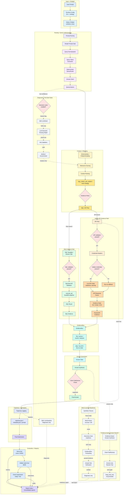

# DASHSys End-to-End System Data Flow

```mermaid
flowchart TB
  subgraph S0["Input + Preflight"]
    user_prompt["User Prompt"]
    runtime_config["Runtime Config<br/>Env + strategy"]
    preflight["Safety Preflight<br/>validators intact"]
  end
  subgraph S1["Routing + Query Understanding"]
    prompt_router["Prompt Routing"]
    simple_gate["Simple Prompt Gate"]
    normalization["Query Normalization"]
    tokens["Query Token<br/>Extraction"]
    query_router["Deterministic<br/>QueryRouter"]
    intent["Answer Intent"]
    analysis["QueryAnalysis"]
  end
  subgraph S2["Context + Planning"]
    schema_catalog["SchemaIndex /<br/>EndpointCatalog"]
    relevance["Relevance Scoring"]
    context_pack["Context Packing"]
    planner["SQL_FIRST_API_VERIFY<br/>main strategy"]
    evidence_policy{"Evidence Policy"}
    sql_api_plan["SQL / API Plan"]
  end
  subgraph S3["SQL Evidence Path"]
    sql_template["SQL Template /<br/>Generic SQL"]
    sql_validation{"SQL validation<br/>passed?"}
    sqlglot["SQLGlot AST<br/>Validation"]
    duckdb["execute_sql<br/>DuckDB snapshot"]
    sql_result["SQL Result"]
    sql_evidence["SQL Evidence"]
  end
  subgraph S4["Adobe API Evidence Path"]
    api_plan["API Plan"]
    api_validation{"API validation<br/>passed?"}
    headers["Credential Headers"]
    credentials{"Adobe credentials<br/>present?"}
    live_api["Live API mode<br/>readiness: warning"]
    dry_run["Dry-run fallback"]
    api_parser["API Response<br/>Parser"]
    evidence_state["Evidence State<br/>live / empty / error"]
    parsed_api["Parsed API<br/>Evidence"]
  end
  subgraph S5["EvidenceBus"]
    evidence_bus["EvidenceBus"]
    evidence_fields["IDs / names /<br/>counts / statuses"]
    evidence_sources["SQL / live API /<br/>dry-run state"]
  end
  subgraph S6["Answer Generation"]
    answer_slots["Answer Slots"]
    answer_synthesis["Answer Synthesis"]
    claim_verification{"Claim Faithfulness<br/>Check"}
    final_answer["Final Answer"]
  end
  subgraph S7["Trajectory + Packaging"]
    trajectory["Trajectory Logging"]
    deliverables["trajectory.json /<br/>metadata.json / prompt"]
    final_submission["Final Submission"]
  end
  subgraph S8["Evaluation + Reports"]
    strict_eval["Strict Eval<br/>score: 0.6553"]
    hidden_eval["Hidden-style Eval<br/>48/48"]
    readiness["Check Submission<br/>ready: True"]
    report_index["Report Index /<br/>Consolidated reports"]
  end
  subgraph S9["Diagnostic / Trial Side Paths"]
    semantic_flag{"Semantic router<br/>enabled?"}
    llm_client["SDK LLMClient"]
    semantic_helper["LLM Semantic<br/>Routing Helper"]
    semantic_validation["Hint Validation"]
    semantic_status["shadow /<br/>not promoted"]
    llm_baseline["SDK LLM Baseline<br/>Diagnostic only"]
  end
  subgraph S10["Mock Live API Readiness"]
    fixtures["Synthetic Fixtures"]
    mock_parser["Mock Parser<br/>success: 126"]
    discovery["Discovery-chain<br/>readiness"]
    mock_forward["EvidenceBus<br/>Forwarding"]
    mock_slots["Answer Slot<br/>Verification"]
    diagnostic_only["Diagnostic only"]
  end
  subgraph S11["Evidence-Aware Answer Rewrite"]
    templates["Evidence-Aware<br/>Answer Synthesis"]
    faithfulness_trial["Claim Faithfulness"]
    rewrite_trial["Answer-only<br/>Rewrite Trial"]
    rewrite_status["keep_trial_only<br/>not promoted"]
  end
  user_prompt --> runtime_config
  runtime_config --> preflight
  preflight --> prompt_router
  prompt_router --> simple_gate
  simple_gate --> normalization
  normalization --> tokens
  tokens --> query_router
  query_router --> intent
  intent --> analysis
  analysis --> schema_catalog
  schema_catalog --> relevance
  relevance --> context_pack
  context_pack --> planner
  planner --> evidence_policy
  evidence_policy --> sql_api_plan
  sql_api_plan -->|SQL branch| sql_template
  sql_template --> sql_validation
  sql_validation -->|yes| sqlglot
  sqlglot --> duckdb
  duckdb --> sql_result
  sql_result --> sql_evidence
  sql_evidence --> evidence_bus
  sql_api_plan -->|API branch| api_plan
  api_plan --> api_validation
  api_validation -->|yes| headers
  headers --> credentials
  credentials -->|yes| live_api
  credentials -->|no| dry_run
  live_api --> api_parser
  dry_run --> api_parser
  api_parser --> evidence_state
  evidence_state --> parsed_api
  parsed_api --> evidence_bus
  evidence_bus --> evidence_fields
  evidence_fields --> evidence_sources
  evidence_sources --> answer_slots
  answer_slots --> answer_synthesis
  answer_synthesis --> claim_verification
  claim_verification -->|supported| final_answer
  final_answer --> trajectory
  trajectory --> deliverables
  deliverables --> final_submission
  final_submission --> strict_eval
  strict_eval --> hidden_eval
  hidden_eval --> readiness
  readiness --> report_index
  strict_eval -->|metrics| report_index
  hidden_eval -->|robustness| report_index
  readiness -->|ready| report_index
  analysis -.->|low confidence| semantic_flag
  semantic_flag -.->|feature flag| llm_client
  llm_client -.->|SDK only| semantic_helper
  semantic_helper -.->|JSON hint| semantic_validation
  semantic_validation -.->|valid| semantic_status
  semantic_status -.->|shadow only| relevance
  trajectory -.->|baseline| llm_baseline
  llm_baseline -.->|diagnostic| report_index
  api_plan -.->|mock live| fixtures
  fixtures -.->|fixture data| mock_parser
  mock_parser -.->|mock| discovery
  discovery -.->|GET-only| mock_forward
  mock_forward -.->|parsed evidence| mock_slots
  mock_slots -.->|verified| diagnostic_only
  diagnostic_only -.->|readiness report| report_index
  answer_synthesis -.->|answer-only| templates
  templates -.-> faithfulness_trial
  faithfulness_trial -.-> rewrite_trial
  rewrite_trial -.->|strict gate| rewrite_status
  rewrite_status -.->|trial report| report_index
  classDef answer fill:#d1fae5,stroke:#243044,color:#111827,stroke-width:1px;
  classDef api fill:#ffedd5,stroke:#243044,color:#111827,stroke-width:1px;
  classDef config fill:#e0f2fe,stroke:#243044,color:#111827,stroke-width:1px;
  classDef context fill:#fef3c7,stroke:#243044,color:#111827,stroke-width:1px;
  classDef decision fill:#fee2e2,stroke:#243044,color:#111827,stroke-width:1px;
  classDef eval fill:#dbeafe,stroke:#243044,color:#111827,stroke-width:1px;
  classDef evidence fill:#ccfbf1,stroke:#243044,color:#111827,stroke-width:1px;
  classDef final fill:#ddd6fe,stroke:#243044,color:#111827,stroke-width:1px;
  classDef input fill:#dbeafe,stroke:#243044,color:#111827,stroke-width:1px;
  classDef live fill:#fed7aa,stroke:#243044,color:#111827,stroke-width:1px;
  classDef muted fill:#f1f5f9,stroke:#243044,color:#111827,stroke-width:1px;
  classDef planning fill:#fde68a,stroke:#243044,color:#111827,stroke-width:1px;
  classDef routing fill:#ede9fe,stroke:#243044,color:#111827,stroke-width:1px;
  classDef slots fill:#cffafe,stroke:#243044,color:#111827,stroke-width:1px;
  classDef sql fill:#dcfce7,stroke:#243044,color:#111827,stroke-width:1px;
  classDef trajectory fill:#e0e7ff,stroke:#243044,color:#111827,stroke-width:1px;
  classDef understanding fill:#f5e8ff,stroke:#243044,color:#111827,stroke-width:1px;
  class user_prompt input;
  class runtime_config config;
  class preflight config;
  class prompt_router routing;
  class simple_gate routing;
  class normalization understanding;
  class tokens understanding;
  class query_router understanding;
  class intent understanding;
  class analysis understanding;
  class schema_catalog context;
  class relevance context;
  class context_pack context;
  class planner planning;
  class evidence_policy decision;
  class sql_api_plan planning;
  class sql_template sql;
  class sql_validation decision;
  class sqlglot sql;
  class duckdb sql;
  class sql_result sql;
  class sql_evidence sql;
  class api_plan api;
  class api_validation decision;
  class headers api;
  class credentials decision;
  class live_api live;
  class dry_run live;
  class api_parser live;
  class evidence_state live;
  class parsed_api live;
  class evidence_bus evidence;
  class evidence_fields evidence;
  class evidence_sources evidence;
  class answer_slots slots;
  class answer_synthesis answer;
  class claim_verification decision;
  class final_answer answer;
  class trajectory trajectory;
  class deliverables trajectory;
  class final_submission final;
  class strict_eval eval;
  class hidden_eval eval;
  class readiness eval;
  class report_index final;
  class semantic_flag decision;
  class llm_client muted;
  class semantic_helper muted;
  class semantic_validation muted;
  class semantic_status muted;
  class llm_baseline muted;
  class fixtures muted;
  class mock_parser muted;
  class discovery muted;
  class mock_forward muted;
  class mock_slots muted;
  class diagnostic_only muted;
  class templates muted;
  class faithfulness_trial muted;
  class rewrite_trial muted;
  class rewrite_status muted;
```

HTML artifact: `outputs/visualizations/end_to_end_system_dataflow.html`
