# DASHSys End-to-End System Data Flow

Auto-generated system documentation. The HTML artifact is fully self-contained and is the primary browser view.

## Flowchart

```mermaid
flowchart LR
  subgraph S0["Input and Guards"]
    user_prompt["User Prompt input"]
    runtime_config["Runtime config and preflight guards"]
  end
  subgraph S1["Routing and Analysis"]
    prompt_router["Prompt Routing"]
    simple_gate["Simple prompt gate"]
    normalization["Query normalization"]
    tokens["Query token extraction"]
    query_router["Deterministic QueryRouter"]
    intent["Answer intent detection"]
    analysis["QueryAnalysis"]
  end
  subgraph S2["Planning Context"]
    metadata_context["Metadata/context selection"]
    schema_index["Endpoint catalog and schema index"]
    plan_generation["SQL_FIRST_API_VERIFY plan generation"]
    evidence_policy{"Evidence policy"}
  end
  subgraph S3["SQL Evidence Path"]
    sql_derivation["SQL derivation"]
    sql_validation{"SQL validation passed?"}
    sqlglot_ast["SQLGlot AST validation"]
    execute_sql["execute_sql / DuckDB local snapshot"]
    sql_result["SQL result"]
    sql_evidence["SQL evidence normalization"]
  end
  subgraph S4["Adobe REST API Evidence Path"]
    api_plan["Adobe API plan"]
    api_validation{"API validation passed?"}
    headers["Credential/header construction"]
    credentials{"Adobe credentials present?"}
    live_api["Live API mode"]
    dry_run_decision{"dry_run fallback?"}
    dry_run["Dry-run fallback mode"]
    api_parser["API response parser"]
    discovery["Discovery-chain readiness"]
    parsed_api["Parsed API evidence"]
  end
  subgraph S5["Evidence and Answer"]
    evidence_bus["EvidenceBus"]
    answer_slots["Answer Slots"]
    answer_synthesis["Answer Synthesis"]
    answer_verify["Answer verification / reranking"]
    final_answer["Final answer"]
  end
  subgraph S6["Packaging and Evaluation"]
    trajectory["Trajectory Logging"]
    final_submission["Final Submission packaging"]
    strict_eval["Strict Eval"]
    hidden_eval["Hidden-style eval"]
    llm_baseline["LLM baseline eval"]
  end
  subgraph S7["Diagnostics and Reports"]
    semantic_enabled{"semantic router feature enabled?"}
    llm_client["SDK LLMClient"]
    semantic_helper["LLM Semantic Routing Helper"]
    semantic_validate{"Validate routing hint"}
    semantic_promoted{"promoted or diagnostic-only?"}
    workflow_audit["Workflow decision audit"]
    live_readiness["Live Adobe API Readiness"]
    mock_fixtures["Mock live API readiness diagnostics"]
    mock_parser["Mock live parser + discovery simulation"]
    evidence_reports["Evidence-Aware Answer Synthesis reports"]
    rewrite_promoted{"answer-only rewrite promoted or keep_trial_only?"}
    consolidated_index["Consolidated report index"]
  end
  user_prompt --> runtime_config
  runtime_config --> prompt_router
  prompt_router --> simple_gate
  simple_gate -->|USE_DATA_PIPELINE| normalization
  normalization --> tokens
  tokens --> query_router
  query_router --> intent
  intent --> analysis
  analysis --> metadata_context
  metadata_context --> schema_index
  schema_index --> plan_generation
  plan_generation --> evidence_policy
  evidence_policy -->|SQL path| sql_derivation
  sql_derivation --> sql_validation
  sql_validation -->|yes| sqlglot_ast
  sqlglot_ast --> execute_sql
  execute_sql --> sql_result
  sql_result --> sql_evidence
  sql_evidence --> evidence_bus
  evidence_policy -->|API path| api_plan
  api_plan --> api_validation
  api_validation -->|yes| headers
  headers --> credentials
  credentials -->|yes| live_api
  credentials -->|no| dry_run_decision
  dry_run_decision -->|true| dry_run
  live_api --> api_parser
  dry_run -->|dry_run=true| api_parser
  api_parser --> discovery
  discovery --> parsed_api
  parsed_api --> evidence_bus
  evidence_bus --> answer_slots
  answer_slots --> answer_synthesis
  answer_synthesis --> answer_verify
  answer_verify --> final_answer
  final_answer --> trajectory
  trajectory -->|packaged| final_submission
  trajectory --> strict_eval
  trajectory --> hidden_eval
  trajectory -->|baseline| llm_baseline
  analysis -.->|low confidence?| semantic_enabled
  semantic_enabled -.->|if enabled| llm_client
  llm_client -.->|SDK only| semantic_helper
  semantic_helper -.->|JSON hint| semantic_validate
  semantic_validate -.->|valid?| semantic_promoted
  semantic_promoted -.->|shadow/diagnostic only| workflow_audit
  trajectory -.->|report-only| workflow_audit
  api_plan -.->|readiness audit| live_readiness
  mock_fixtures -.->|fixture responses| mock_parser
  mock_parser -.->|diagnostic forwarding| evidence_bus
  mock_parser -.->|readiness report| live_readiness
  answer_synthesis -.->|answer-only trial| evidence_reports
  evidence_reports -.->|strict gate| rewrite_promoted
  rewrite_promoted -.->|keep_trial_only| consolidated_index
  strict_eval -->|metrics| consolidated_index
  hidden_eval -->|robustness| consolidated_index
  llm_baseline -.->|baseline| consolidated_index
  live_readiness -.->|reports| consolidated_index
  workflow_audit -.->|reports| consolidated_index
  final_submission -->|readiness| consolidated_index
  classDef analysis fill:#f5e8ff,stroke:#243044,color:#111827,stroke-width:1px;
  classDef answer fill:#d1fae5,stroke:#243044,color:#111827,stroke-width:1px;
  classDef api fill:#ffedd5,stroke:#243044,color:#111827,stroke-width:1px;
  classDef config fill:#e0f2fe,stroke:#243044,color:#111827,stroke-width:1px;
  classDef decision fill:#fee2e2,stroke:#243044,color:#111827,stroke-width:1px;
  classDef eval fill:#dbeafe,stroke:#243044,color:#111827,stroke-width:1px;
  classDef evidence fill:#ccfbf1,stroke:#243044,color:#111827,stroke-width:1px;
  classDef input fill:#dbeafe,stroke:#243044,color:#111827,stroke-width:1px;
  classDef llm fill:#f3e8ff,stroke:#243044,color:#111827,stroke-width:1px;
  classDef packaging fill:#e0e7ff,stroke:#243044,color:#111827,stroke-width:1px;
  classDef planning fill:#fef3c7,stroke:#243044,color:#111827,stroke-width:1px;
  classDef report fill:#f1f5f9,stroke:#243044,color:#111827,stroke-width:1px;
  classDef routing fill:#ede9fe,stroke:#243044,color:#111827,stroke-width:1px;
  classDef sql fill:#dcfce7,stroke:#243044,color:#111827,stroke-width:1px;
  classDef trial fill:#fef9c3,stroke:#243044,color:#111827,stroke-width:1px;
  class user_prompt input;
  class runtime_config config;
  class prompt_router routing;
  class simple_gate routing;
  class normalization routing;
  class tokens routing;
  class query_router routing;
  class intent routing;
  class analysis analysis;
  class semantic_enabled decision;
  class llm_client llm;
  class semantic_helper llm;
  class semantic_validate decision;
  class semantic_promoted decision;
  class metadata_context planning;
  class schema_index planning;
  class plan_generation planning;
  class evidence_policy decision;
  class sql_derivation sql;
  class sql_validation decision;
  class sqlglot_ast sql;
  class execute_sql sql;
  class sql_result sql;
  class sql_evidence sql;
  class api_plan api;
  class api_validation decision;
  class headers api;
  class credentials decision;
  class live_api api;
  class dry_run_decision decision;
  class dry_run api;
  class api_parser api;
  class discovery api;
  class parsed_api api;
  class evidence_bus evidence;
  class answer_slots answer;
  class answer_synthesis answer;
  class answer_verify answer;
  class final_answer answer;
  class trajectory packaging;
  class final_submission packaging;
  class strict_eval eval;
  class hidden_eval eval;
  class llm_baseline eval;
  class workflow_audit report;
  class live_readiness report;
  class mock_fixtures trial;
  class mock_parser trial;
  class evidence_reports trial;
  class rewrite_promoted decision;
  class consolidated_index report;
```

## Current Status

| Field | Value |
| --- | --- |
| preferred strategy | SQL_FIRST_API_VERIFY |
| packaged strict score | 0.6553 |
| best isolated score | 0.6558 |
| hidden style | 48/48 |
| final submission ready | True |
| live adobe api readiness | warning |
| mock parser success count | 126 |
| mock discovery chains simulated | 5 |
| evidence aware answer synthesis recommendation | keep_trial_only |
| semantic router recommendation | do_not_promote |
| runtime llm direct http hits | 0 |
| workshop audit status | pass |

## Artifact Links

| Artifact | Path |
| --- | --- |
| HTML artifact | outputs/visualizations/end_to_end_system_dataflow.html |
| JSON metadata | outputs/visualizations/end_to_end_system_dataflow.json |
| Report index | outputs/reports/report_index.md |

## Source Warnings

