# DASHSys Prompt-To-Answer Dataflow

## Quality Gate Facts

| Field | Value |
| --- | --- |
| Query ID | `example_000` |
| User query | When was the journey 'Birthday Message' published? |
| Strategy | `GUIDED_REAL_LLM_TWO_TOOLS_BASELINE` |
| Variant | Guided |
| Final answer preview | The journey "Birthday Message" was published on **March 31, 2026**. However, I was unable to verify its current status via the API due to unavailable credentials. |
| Tool call count | 2 |
| Runtime | 3.7744 |
| Estimated tokens | n/a - estimated_tokens missing |
| Checkpoint count | 0 |
| Candidate context mode | metadata_context_estimate_inferred |
| Context mode note | display-only inferred from context token estimate |

```mermaid
flowchart TD
  subgraph Input
    input_prompt["User Prompt<br/>When was the journey &#x27;Birthday Message&#x27; published?"]
  end
  subgraph Routing
    router["Prompt Router<br/>mode=n/a - no prompt router decision<br/>api=n/a - no API policy recorded"]
    input_prompt -->|route_prompt| router
  end
  subgraph QueryUnderstanding["Query Understanding"]
    normalizer["Query Normalizer<br/>status=not_recorded"]
    tokens["Query Tokens<br/>domains=none&lt;br/&gt;entities=none"]
    router -->|clean + extract| normalizer --> tokens
  end
  subgraph ContextSelection["Context Selection"]
    context["Context Mode<br/>metadata_context_estimate_inferred"]
    candidates["Context<br/>tables=none&lt;br/&gt;apis=none"]
    tokens -->|score relevance| context --> candidates
  end
  subgraph Planning
    planner["Planner<br/>GUIDED_REAL_LLM_TWO_TOOLS_BASELINE"]
    optimizer["Plan Optimizer<br/>selected=n/a - no optimizer selection recorded"]
    candidates -->|metadata + policy| planner --> optimizer
  end
  subgraph SQLPath["SQL Path"]
    sqlgen["SQL Generator<br/>tables=dim_campaign&lt;br/&gt;rows=1"]
    sqlval["SQL Validator<br/>ok"]
    optimizer -->|SQL step if needed| sqlgen --> sqlval
  end
  subgraph APIPath["API Path"]
    apisel["API Selector<br/>endpoint=/ajo/journey"]
    apival["API Validator<br/>ok<br/>dry_run=True"]
    optimizer -->|API policy| apisel --> apival
  end
  subgraph ToolExecution["Tool Execution"]
    tools["Tool Calls<br/>sql=1 api=1<br/>invalid=0"]
    sqlval -->|execute_sql| tools
    apival -->|call_api / dry-run| tools
  end
  subgraph EvidenceBus
    evidence["EvidenceBus<br/>SQL evidence: yes&lt;br/&gt;Live API evidence: no&lt;br/&gt;Dry-run API: yes"]
    tools -->|extract facts| evidence
  end
  subgraph AnswerVerification["Answer Verification"]
    verifier["Verifier<br/>status=not_recorded"]
    evidence -->|answer slots + claims| verifier
  end
  subgraph FinalAnswer["Final Answer"]
    answer["Final Answer<br/>The journey &quot;Birthday Message&quot; was published on **March 31, 2026**. However, I was una"]
    verifier -->|safe answer| answer
  end
  subgraph Metrics
    metrics["Metrics<br/>tools=2<br/>tokens=n/a - estimated_tokens missing<br/>runtime=3.7744"]
    answer -->|record trajectory| metrics
  end
```



## SQL And API Preview

| Path | Preview | Validation | Result / Status |
| --- | --- | --- | --- |
| SQL | SELECT UPDATEDTIME FROM dim_campaign WHERE NAME = 'Birthday Message' | ok | row_count=1; rows={"items": {"items": [{"UPDATEDTIME": "2026-03-31T06:07:32.838462639Z"}], "total_items": 1, "truncated_items": false}, "total_items": 1, "truncated_items": false} |
| API | GET /ajo/journey | ok | dry_run=True; live_api_evidence=False; overall_evidence=True; preview=n/a - no API result preview recorded |

Context mode labels ending in `_inferred` are display-only summaries for the visualization; they are not recorded planner decisions.

## Tool Execution vs Evidence Availability

SQL evidence is available. API tool was invoked and validated, but live API evidence was unavailable because Adobe credentials were missing.

| Metric | Value |
| --- | --- |
| execute_sql calls | 1 |
| call_api calls | 1 |
| valid tool calls | 2 |
| invalid tool calls | 0 |
| endpoint repairs | 1 |
| schema hint injections | 0 |
| SQL evidence available | True |
| live API evidence available | False |
| overall evidence available | True |
| dry-run only | True |
| successful evidence count | 1 |
| zero-row uncertain | False |

## Research Technique Status

| Technique | Source inspiration | Active? | Effect on dataflow | Correctness impact | Efficiency impact | Visualization checkpoint |
| --- | --- | --- | --- | --- | --- | --- |
| SQLGlot AST validation | SQLGlot | False | AST SQL validation and table/column extraction | detects schema/safety mismatches structurally | diagnostic overhead only | checkpoint_sql_ast_validation |
| Robust schema linking | RSL-SQL | False | Bidirectional schema linking and bridge preservation | keeps relevant tables, columns, and bridges visible | diagnostic overhead only | checkpoint_schema_linking |
| Value/entity retrieval | CHESS | False | Entity-value grounding from local DB samples | grounds named entities and IDs before planning | bounded cached retrieval budget | checkpoint_value_entity_retrieval |
| Query decomposition | DIN-SQL | False | Complex-query decomposition into constraints | preserves complex constraints | diagnostic overhead only | checkpoint_query_decomposition |
| Gated SQL candidates | DIN-SQL / self-correction | False | Hard-case candidate validation before one execution | prevents invalid hard-case SQL from being selected | validates only; executes one selected plan | checkpoint_gated_sql_candidate_selection |
| Query-family examples | DAIL-SQL | False | Optional family hints for LLM SQL | makes technique visibility auditable | optional LLM-only token cost | checkpoint_query_family_examples |
| Span export | OpenAI Agents SDK tracing | True | Local span-style checkpoint export | makes technique visibility auditable | diagnostic overhead only | spans.json |

## SQL AST Validation

`n/a - SQL AST validation checkpoint inactive`

## Technique Impact Highlight

- Correctness: n/a - no checkpoint correctness role recorded
- Efficiency: n/a - no checkpoint efficiency role recorded
- Dataflow effect: n/a - no checkpoint effect recorded

## Prompt To SQL/API Mapping

```json
{
  "api": {
    "dry_run": true,
    "endpoint": "GET /ajo/journey",
    "endpoint_repair": {
      "items": [
        {
          "confidence": 0.8,
          "endpoint_id": "journey_list",
          "method": "GET",
          "original_url": "/ajo/journey",
          "reason": "journey/campaign alias repaired to AJO journey endpoint",
          "repaired": true,
          "repaired_url": "/ajo/journey",
          "url": "/ajo/journey"
        }
      ],
      "total_items": 1,
      "truncated_items": false
    },
    "live_evidence_available": false,
    "result_preview": "n/a - no API result preview recorded",
    "validation": "ok"
  },
  "context": {
    "candidate_apis": "n/a - no candidate APIs recorded",
    "candidate_tables": "n/a - no candidate tables recorded",
    "confidence": 0.8,
    "context_mode": "metadata_context_estimate_inferred",
    "context_mode_note": "display-only inferred from context token estimate",
    "estimated_context_tokens": 2053,
    "score_margin": "n/a - no candidate score margin recorded"
  },
  "evidence": {
    "dry_run_only": true,
    "evidence_available": true,
    "explanation": "SQL evidence is available. API tool was invoked and validated, but live API evidence was unavailable because Adobe credentials were missing.",
    "live_api_evidence_available": false,
    "overall_evidence_available": true,
    "sql_evidence_available": true,
    "successful_evidence_count": 1,
    "zero_row_uncertain": false
  },
  "normalization": {
    "normalized_query": "n/a - no normalization checkpoint recorded"
  },
  "prompt": "When was the journey 'Birthday Message' published?",
  "route": {
    "api_policy": "n/a - no API policy recorded",
    "confidence": "n/a - no route confidence recorded",
    "mode": "n/a - no prompt router decision",
    "risk": "n/a - no route risk recorded"
  },
  "sql": {
    "preview": "SELECT UPDATEDTIME FROM dim_campaign WHERE NAME = 'Birthday Message'",
    "result_preview": "{\"items\": {\"items\": [{\"UPDATEDTIME\": \"2026-03-31T06:07:32.838462639Z\"}], \"total_items\": 1, \"truncated_items\": false}, \"total_items\": 1, \"truncated_items\": false}",
    "row_count": 1,
    "validation": "ok"
  },
  "tokens": {
    "tokens": "n/a - no tokens recorded"
  },
  "truncated_fields": 1
}
```

## Checkpoint Effect Table

| Checkpoint | Stage | Technique | Input | Output | Effect on data flow | Correctness role | Efficiency role |
| --- | --- | --- | --- | --- | --- | --- | --- |
| `n/a` | n/a | n/a | n/a | n/a | n/a - no checkpoints recorded | n/a | n/a |
