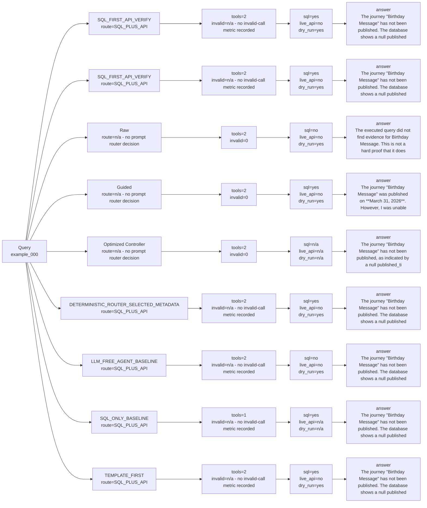

# Strategy Comparison: example_000

This view compares deterministic, Raw real LLM, Guided real LLM, and optimized-controller paths when those artifacts exist.

| Variant | Strategy | Route | Context mode | Endpoint family | Ranking changed? | SQL preview | API endpoint | Tool calls | Invalid calls | Endpoint repairs | SQL evidence | Live API evidence | Overall evidence | Dry-run only | Runtime | Tokens | Final answer preview |
| --- | --- | --- | --- | --- | --- | --- | --- | ---: | ---: | ---: | --- | --- | --- | --- | ---: | ---: | --- |
| SQL_FIRST_API_VERIFY | `LLM_SQL_FIRST_API_VERIFY` | SQL_PLUS_API | candidate | journey_list | True | SELECT "NAME" AS campaign_name, "LASTDEPLOYEDTIME" AS published_time FROM "dim_campaign" LIMIT 50 | GET /ajo/journey | 2 | n/a - no invalid-call metric recorded | n/a - no endpoint-repair metric recorded | True | False | True | True | 0.01375787507276982 |
| SQL_FIRST_API_VERIFY | `SQL_FIRST_API_VERIFY` | SQL_PLUS_API | candidate | journey_list | True | SELECT "NAME" AS campaign_name, "LASTDEPLOYEDTIME" AS published_time FROM "dim_campaign" LIMIT 50 | GET /ajo/journey | 2 | n/a - no invalid-call metric recorded | n/a - no endpoint-repair metric recorded | True | False | True | True | 0.012068375013768673 |
| Raw | `RAW_REAL_LLM_TWO_TOOLS_BASELINE` | n/a - no prompt router decision | candidate | journey_list | True | SELECT UPDATEDTIME FROM dim_campaign WHERE CAMPAIGNID IN (SELECT CAMPAIGNID FROM br_campaign_segment WHERE LABELSSEGMENT = 'Birthday Message') | GET /ajo/journey | 2 | 0 | 0 | False | False | False | True | 10.1537 |
| Guided | `GUIDED_REAL_LLM_TWO_TOOLS_BASELINE` | n/a - no prompt router decision | candidate | journey_list | True | SELECT UPDATEDTIME FROM dim_campaign WHERE NAME = 'Birthday Message' | GET /ajo/journey | 2 | 0 | 1 | True | False | True | True | 3.7744 |
| Optimized Controller | `LLM_CONTROLLER_OPTIMIZED_AGENT` | n/a - no prompt router decision | candidate | journey_list | True | n/a - no SQL call in trajectory | n/a - no API call in trajectory | 2 | 0 | 0 | n/a - no SQL call in trajectory | n/a - no API call in trajectory | False | n/a - no API call in trajectory | 1.3962 |
| DETERMINISTIC_ROUTER_SELECTED_METADATA | `DETERMINISTIC_ROUTER_SELECTED_METADATA` | SQL_PLUS_API | candidate | journey_list | True | SELECT "NAME" AS campaign_name, "LASTDEPLOYEDTIME" AS published_time FROM "dim_campaign" LIMIT 50 | GET /ajo/journey | 2 | n/a - no invalid-call metric recorded | n/a - no endpoint-repair metric recorded | True | False | True | True | 0.011692957952618599 |
| LLM_FREE_AGENT_BASELINE | `LLM_FREE_AGENT_BASELINE` | SQL_PLUS_API | candidate | journey_list | True | SELECT "IMSORGID", "LASTDEPLOYEDTIME", "STATE", "SANDBOXNAME", "NAME", "SANDBOXID", "STATUS", "CAMPAIGNID" FROM "dim_campaign" WHERE LOWER(CAST("SANDBOXNAME" AS VARCHAR)) LIKE LOWER('%Birthday Message%') AND LOWER(CAST("STATUS" AS VARCHAR)) LIKE LOWER('%published%') LIMIT 50 | GET /ajo/journey | 2 | n/a - no invalid-call metric recorded | n/a - no endpoint-repair metric recorded | False | False | False | True | 0.02012654091231525 |
| SQL_ONLY_BASELINE | `SQL_ONLY_BASELINE` | SQL_PLUS_API | candidate | journey_list | True | SELECT "NAME" AS campaign_name, "LASTDEPLOYEDTIME" AS published_time FROM "dim_campaign" LIMIT 50 | n/a - no API call in trajectory | 1 | n/a - no invalid-call metric recorded | n/a - no endpoint-repair metric recorded | True | n/a - no API call in trajectory | True | n/a - no API call in trajectory | 0.02018624998163432 |
| TEMPLATE_FIRST | `TEMPLATE_FIRST` | SQL_PLUS_API | candidate | journey_list | True | SELECT "NAME" AS campaign_name, "LASTDEPLOYEDTIME" AS published_time FROM "dim_campaign" LIMIT 50 | GET /ajo/journey | 2 | n/a - no invalid-call metric recorded | n/a - no endpoint-repair metric recorded | True | False | True | True | 0.012513165944255888 |
