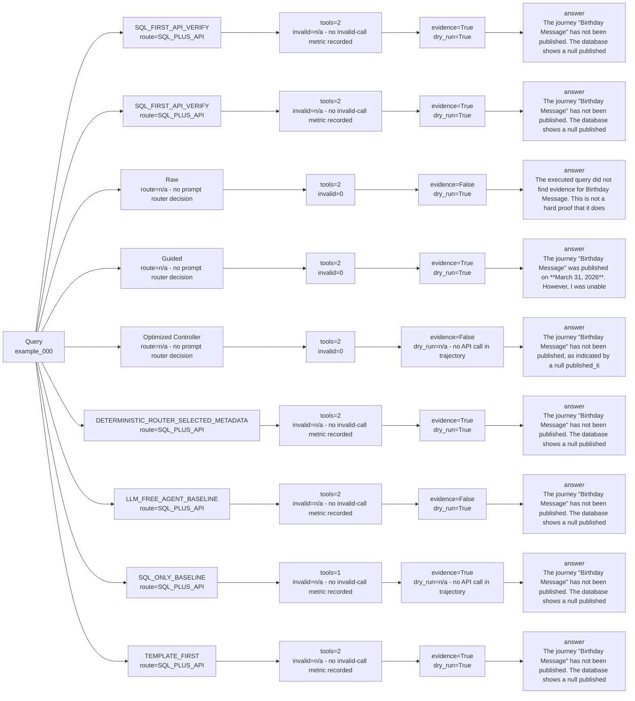

# Strategy Comparison: example_000

This view compares deterministic, Raw real LLM, Guided real LLM, and optimized-controller paths when those artifacts exist.

| Variant | Strategy | Route | Context mode | SQL preview | API endpoint | Tool calls | Invalid calls | Endpoint repairs | Evidence available | Dry-run only | Runtime | Tokens | Final answer preview |
| --- | --- | --- | --- | --- | --- | ---: | ---: | ---: | --- | --- | ---: | ---: | --- |
| SQL_FIRST_API_VERIFY | `LLM_SQL_FIRST_API_VERIFY` | SQL_PLUS_API | n/a - no candidate context mode recorded | SELECT "NAME" AS campaign_name, "LASTDEPLOYEDTIME" AS published_time FROM "dim_campaign" LIMIT 50 | GET /ajo/journey | 2 | n/a - no invalid-call metric recorded | n/a - no endpoint-repair metric recorded | True | True | 0.01375787507276982 | 719 | The journey "Birthday Message" has not been published. The database shows a null published_time for this journey, and live API verification was not executed because Adobe credentials are unavailable. |
| SQL_FIRST_API_VERIFY | `SQL_FIRST_API_VERIFY` | SQL_PLUS_API | n/a - no candidate context mode recorded | SELECT "NAME" AS campaign_name, "LASTDEPLOYEDTIME" AS published_time FROM "dim_campaign" LIMIT 50 | GET /ajo/journey | 2 | n/a - no invalid-call metric recorded | n/a - no endpoint-repair metric recorded | True | True | 0.010044333059340715 | 759 | The journey "Birthday Message" has not been published. The database shows a null published_time for this journey, and live API verification was not executed because Adobe credentials are unavailable. |
| Raw | `RAW_REAL_LLM_TWO_TOOLS_BASELINE` | n/a - no prompt router decision | n/a - no candidate context mode recorded | SELECT UPDATEDTIME FROM dim_campaign WHERE CAMPAIGNID IN (SELECT CAMPAIGNID FROM br_campaign_segment WHERE LABELSSEGMENT = 'Birthday Message') | GET /ajo/journey | 2 | 0 | 0 | False | True | 10.1537 | n/a - estimated_tokens missing | The executed query did not find evidence for Birthday Message. This is not a hard proof that it does not exist, because the query/schema choice may be incomplete. |
| Guided | `GUIDED_REAL_LLM_TWO_TOOLS_BASELINE` | n/a - no prompt router decision | n/a - no candidate context mode recorded | SELECT UPDATEDTIME FROM dim_campaign WHERE NAME = 'Birthday Message' | GET /ajo/journey | 2 | 0 | 1 | True | True | 3.7744 | n/a - estimated_tokens missing | The journey "Birthday Message" was published on **March 31, 2026**. However, I was unable to verify its current status via the API due to unavailable credentials. |
| Optimized Controller | `LLM_CONTROLLER_OPTIMIZED_AGENT` | n/a - no prompt router decision | n/a - no candidate context mode recorded | n/a - no SQL call in trajectory | n/a - no API call in trajectory | 2 | 0 | 0 | False | n/a - no API call in trajectory | 1.3962 | n/a - estimated_tokens missing | The journey "Birthday Message" has not been published, as indicated by a null published_time in the database. Live API verification could not be executed due to the unavailability of Adobe credentials. |
| DETERMINISTIC_ROUTER_SELECTED_METADATA | `DETERMINISTIC_ROUTER_SELECTED_METADATA` | SQL_PLUS_API | n/a - no candidate context mode recorded | SELECT "NAME" AS campaign_name, "LASTDEPLOYEDTIME" AS published_time FROM "dim_campaign" LIMIT 50 | GET /ajo/journey | 2 | n/a - no invalid-call metric recorded | n/a - no endpoint-repair metric recorded | True | True | 0.010027958080172539 | 682 | The journey "Birthday Message" has not been published. The database shows a null published_time for this journey, and live API verification was not executed because Adobe credentials are unavailable. |
| LLM_FREE_AGENT_BASELINE | `LLM_FREE_AGENT_BASELINE` | SQL_PLUS_API | n/a - no candidate context mode recorded | SELECT "IMSORGID", "LASTDEPLOYEDTIME", "STATE", "SANDBOXNAME", "NAME", "SANDBOXID", "STATUS", "CAMPAIGNID" FROM "dim_campaign" WHERE LOWER(CAST("SANDBOXNAME" AS VARCHAR)) LIKE LOWER('%Birthday Message%') AND LOWER(CAST("STATUS" AS VARCHAR)) LIKE LOWER('%published%') LIMIT 50 | GET /ajo/journey | 2 | n/a - no invalid-call metric recorded | n/a - no endpoint-repair metric recorded | False | True | 0.016719542094506323 | 764 | The journey "Birthday Message" has not been published. The database shows a null published_time for this journey, and live API verification was not executed because Adobe credentials are unavailable. |
| SQL_ONLY_BASELINE | `SQL_ONLY_BASELINE` | SQL_PLUS_API | n/a - no candidate context mode recorded | SELECT "NAME" AS campaign_name, "LASTDEPLOYEDTIME" AS published_time FROM "dim_campaign" LIMIT 50 | n/a - no API call in trajectory | 1 | n/a - no invalid-call metric recorded | n/a - no endpoint-repair metric recorded | True | n/a - no API call in trajectory | 0.011505834059789777 | 486 | The journey "Birthday Message" has not been published. The database shows a null published_time for this journey, and API evidence was not requested. |
| TEMPLATE_FIRST | `TEMPLATE_FIRST` | SQL_PLUS_API | n/a - no candidate context mode recorded | SELECT "NAME" AS campaign_name, "LASTDEPLOYEDTIME" AS published_time FROM "dim_campaign" LIMIT 50 | GET /ajo/journey | 2 | n/a - no invalid-call metric recorded | n/a - no endpoint-repair metric recorded | True | True | 0.009816540987230837 | 676 | The journey "Birthday Message" has not been published. The database shows a null published_time for this journey, and live API verification was not executed because Adobe credentials are unavailable. |
