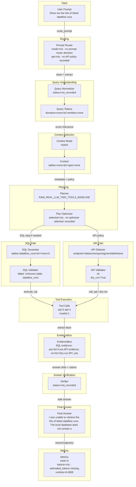

# DASHSys Prompt-To-Answer Dataflow

## Quality Gate Facts

| Field | Value |
| --- | --- |
| Query ID | `example_004` |
| User query | Show me the IDs of failed dataflow runs |
| Strategy | `RAW_REAL_LLM_TWO_TOOLS_BASELINE` |
| Variant | Raw |
| Final answer preview | I was unable to retrieve the IDs of failed dataflow runs. The local database does not contain a table named `dataflow_runs`, and the API call could not be executed due to unavailable credentials. Therefore, I cannot prov... |
| Tool call count | 3 |
| Runtime | 6.4608 |
| Estimated tokens | n/a - estimated_tokens missing |
| Checkpoint count | 0 |
| Candidate context mode | hybrid |
| Context mode note | recorded in checkpoint/trajectory |



## SQL And API Preview

| Path | Preview | Validation | Result / Status |
| --- | --- | --- | --- |
| SQL | SELECT ID FROM dataflow_runs WHERE status = 'failed' | failed: Unknown table: dataflow_runs | row_count=0; rows={"total_items": 0, "truncated_items": false} |
| API | GET /data/core/ups/segment/definitions | ok | dry_run=True; live_api_evidence=False; overall_evidence=True; preview=n/a - no API result preview recorded |

Context mode labels ending in `_inferred` are display-only summaries for the visualization; they are not recorded planner decisions.

## Tool Execution vs Evidence Availability

SQL evidence is available. API tool was invoked and validated, but live API evidence was unavailable because Adobe credentials were missing.

| Metric | Value |
| --- | --- |
| execute_sql calls | 2 |
| call_api calls | 1 |
| valid tool calls | 2 |
| invalid tool calls | 1 |
| endpoint repairs | 0 |
| schema hint injections | 0 |
| SQL evidence available | True |
| live API evidence available | False |
| overall evidence available | True |
| dry-run only | True |
| successful evidence count | 1 |
| zero-row uncertain | True |

## Research Technique Status

| Technique | Source inspiration | Active? | Effect on dataflow | Correctness impact | Efficiency impact | Visualization checkpoint |
| --- | --- | --- | --- | --- | --- | --- |
| SQLGlot AST validation | SQLGlot | False | AST SQL validation and table/column extraction | detects schema/safety mismatches structurally | diagnostic overhead only | checkpoint_sql_ast_validation |
| Robust schema linking | RSL-SQL | False | Bidirectional schema linking and bridge preservation | keeps relevant tables, columns, and bridges visible | diagnostic overhead only | checkpoint_schema_linking |
| Value/entity retrieval | CHESS | False | Entity-value grounding from local DB samples | grounds named entities and IDs before planning | bounded cached retrieval budget | checkpoint_value_entity_retrieval |
| Query decomposition | DIN-SQL | False | Complex-query decomposition into constraints | preserves complex constraints | diagnostic overhead only | checkpoint_query_decomposition |
| Gated SQL candidates | DIN-SQL / self-correction | False | Hard-case candidate validation before one execution | prevents invalid hard-case SQL from being selected | validates only; executes one selected plan | checkpoint_gated_sql_candidate_selection |
| Query-family examples | DAIL-SQL | False | Optional family hints for LLM SQL | makes technique visibility auditable | optional LLM-only token cost | checkpoint_query_family_examples |
| Span export | OpenAI Agents SDK tracing | True | Local span-style checkpoint export | makes technique visibility auditable | diagnostic overhead only | spans.json |
| Hybrid candidate scoring | Blended RAG / rank fusion | True | Report-only candidate separation scoring | makes technique visibility auditable | diagnostic overhead only | checkpoint_hybrid_candidate_scoring |
| Endpoint family ranking | Domain-aware retrieval | True | Report-only endpoint family reranking | makes technique visibility auditable | diagnostic overhead only | checkpoint_endpoint_family_ranking |
| Structural schema preservation | RSL-SQL | True | Report-only bridge/relationship preservation diagnostics | keeps relevant tables, columns, and bridges visible | diagnostic overhead only | checkpoint_structural_schema_preservation |
| Value-to-API ranking | CHESS | False | High-confidence entity matches can boost API-family ranking in reports | grounds named entities and IDs before planning | bounded cached retrieval budget | checkpoint_value_to_api_ranking |
| Gated risk-cluster repair | CHASE-SQL-style repair | True | Diagnostic repaired candidate comparison without execution change | makes technique visibility auditable | diagnostic overhead only | checkpoint_gated_risk_cluster_repair |

## Candidate Ranking Diagnostics

| Technique | Active | Output | Correctness role | Efficiency role |
| --- | --- | --- | --- | --- |
| Hybrid Candidate Scoring | True | {"ranking_changed": true, "score_margin": 0.0, "top_candidate_score": 1.8, "top_components": {"alias_score": 1.2, "endpoint_family_score": 0.0, "lexical_score": 0.0, "name": "dim_connector", "reciprocal_rank_fusion": 0.032018, "score_explanation": "base=2.000; lexical=0.000; alias=1.200; value=0.000; structural=0.000; endpoint_family=0.000", "structural_score": 0.0, "truncated_fields": 1, "value_match_score": 0.0}} | separates candidate context without changing executed plan | report-only scoring; no extra tools |
| Endpoint Family Ranker | True | {"boost_reason": {"items": ["flow_definitions: flow definition vocabulary", "flow_runs: flow run/status vocabulary"], "total_items": 2, "truncated_items": false}, "endpoint_family": "flow_runs", "endpoint_family_confidence": 1.0, "ranking_changed": true} | reduces endpoint-family confusion in candidate context | reranks metadata only |
| Structural Schema Preservation | True | {"structural_confidence_delta": 0.1, "structural_reason": "bridge-table heuristic", "structural_tables_added": {"items": ["br_campaign_segment", "hkg_br_segment_target", "hkg_br_source_collection"], "total_items": 9, "truncated_items": true}} | keeps relationship bridge tables visible | adds only compact schema context |
| Value-to-API Ranking | False | {"active": false, "boost_applied": true, "value_match_used_for_api_ranking": false} | uses only high-confidence retrieved values for endpoint family boosts | reuses existing value retrieval diagnostics |
| Gated Risk Cluster Repair | True | {"active": true, "candidate_count": 2, "cost_delta": 0, "diagnostic_only": true, "execution_repair_enabled": false, "expected_correctness_gain": "retrieval-only candidate separation; no accuracy claim without execution change", "hard_case_triggered": true, "rejected_candidate_reason": "lower endpoint-family confidence or lower hybrid score", "truncated_fields": 2} | compares a repaired candidate without executing losing plans | diagnostic-only; zero tool-call delta |

## Value Retrieval Cache

| Field | Value |
| --- | --- |
| status | n/a - value retrieval checkpoint inactive |

## SQL AST Validation

| Field | Value |
| --- | --- |
| status | n/a - SQL AST validation checkpoint inactive |

## Technique Impact Highlight

- Correctness: n/a - no checkpoint correctness role recorded
- Efficiency: n/a - no checkpoint efficiency role recorded
- Dataflow effect: n/a - no checkpoint effect recorded

## Prompt To SQL/API Mapping

```json
{
  "api": {
    "dry_run": true,
    "endpoint": "GET /data/core/ups/segment/definitions",
    "endpoint_repair": "n/a - no endpoint repair recorded",
    "live_evidence_available": false,
    "result_preview": "n/a - no API result preview recorded",
    "validation": "ok"
  },
  "context": {
    "candidate_apis": "n/a - no candidate APIs recorded",
    "candidate_tables": "n/a - no candidate tables recorded",
    "confidence": 0.72,
    "context_mode": "hybrid",
    "context_mode_note": "recorded in checkpoint/trajectory",
    "estimated_context_tokens": 1314,
    "score_margin": 0.0
  },
  "evidence": {
    "dry_run_only": true,
    "evidence_available": true,
    "explanation": "SQL evidence is available. API tool was invoked and validated, but live API evidence was unavailable because Adobe credentials were missing.",
    "live_api_evidence_available": false,
    "overall_evidence_available": true,
    "sql_evidence_available": true,
    "successful_evidence_count": 1,
    "zero_row_uncertain": true
  },
  "normalization": {
    "normalized_query": "n/a - no normalization checkpoint recorded"
  },
  "prompt": "Show me the IDs of failed dataflow runs",
  "route": {
    "api_policy": "n/a - no API policy recorded",
    "confidence": "n/a - no route confidence recorded",
    "mode": "n/a - no prompt router decision",
    "risk": "n/a - no route risk recorded"
  },
  "sql": {
    "preview": "SELECT ID FROM dataflow_runs WHERE status = 'failed'",
    "result_preview": "{\"total_items\": 0, \"truncated_items\": false}",
    "row_count": 0,
    "validation": "failed: Unknown table: dataflow_runs"
  },
  "tokens": {
    "tokens": "n/a - no tokens recorded"
  },
  "truncated_fields": 1
}
```

## Checkpoint Effect Table

| Checkpoint | Stage | Technique | Input | Output | Effect on data flow | Correctness role | Efficiency role |
| --- | --- | --- | --- | --- | --- | --- | --- |
| `n/a` | n/a | n/a | n/a | n/a | n/a - no checkpoints recorded | n/a | n/a |
