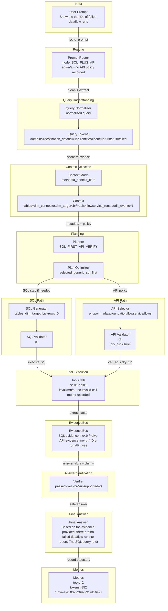

# DASHSys Prompt-To-Answer Dataflow

## Quality Gate Facts

| Field | Value |
| --- | --- |
| Query ID | `example_004` |
| User query | Show me the IDs of failed dataflow runs |
| Strategy | `SQL_FIRST_API_VERIFY` |
| Variant | n/a - not a baseline variant |
| Final answer preview | Based on the evidence provided, there are no failed dataflow runs to report. The SQL query returned zero rows, and live API verification was not executed because Adobe credentials are unavailable. |
| Tool call count | 2 |
| Runtime | 0.009926999919116497 |
| Estimated tokens | 852 |
| Checkpoint count | 20 |
| Candidate context mode | metadata_context_card |
| Context mode note | display-only inferred from checkpoint_07_context_card |



## SQL And API Preview

| Path | Preview | Validation | Result / Status |
| --- | --- | --- | --- |
| SQL | SELECT "DATAFLOWNAME", "STATE", "TARGETID", "CONNECTIONSPECID", "NAME" FROM "dim_target" WHERE LOWER(CAST("STATE" AS VARCHAR)) LIKE LOWER('%failed%') LIMIT 50 | ok | row_count=0; rows=n/a - no SQL rows preview recorded |
| API | GET /data/foundation/flowservice/flows | ok | dry_run=True; live_api_evidence=False; overall_evidence=False; preview=n/a - no API result preview recorded |

Context mode labels ending in `_inferred` are display-only summaries for the visualization; they are not recorded planner decisions.

## Tool Execution vs Evidence Availability

API tool was invoked and validated, but live evidence was unavailable because Adobe credentials were missing.

| Metric | Value |
| --- | --- |
| execute_sql calls | 1 |
| call_api calls | 1 |
| valid tool calls | 2 |
| invalid tool calls | n/a - no invalid-call metric recorded |
| endpoint repairs | n/a - no endpoint-repair metric recorded |
| schema hint injections | n/a - no schema-hint metric recorded |
| SQL evidence available | False |
| live API evidence available | False |
| overall evidence available | False |
| dry-run only | True |
| successful evidence count | 0 |
| zero-row uncertain | True |

## Technique Impact Highlight

- Correctness: keeps later normalization from changing the user-facing question
- Efficiency: starts one trace without extra tool calls
- Dataflow effect: preserves the original query for reproducibility

## Prompt To SQL/API Mapping

```json
{
  "api": {
    "dry_run": true,
    "endpoint": "GET /data/foundation/flowservice/flows",
    "endpoint_repair": "n/a - no endpoint repair recorded",
    "live_evidence_available": false,
    "result_preview": "n/a - no API result preview recorded",
    "validation": "ok"
  },
  "context": {
    "candidate_apis": {
      "items": {
        "items": [
          "flowservice_runs",
          "audit_events",
          "export_batch_failed"
        ],
        "total_items": 3,
        "truncated_items": false
      },
      "total_items": 3,
      "truncated_items": false
    },
    "candidate_tables": {
      "items": {
        "items": [
          "dim_connector",
          "dim_target"
        ],
        "total_items": 2,
        "truncated_items": false
      },
      "total_items": 2,
      "truncated_items": false
    },
    "confidence": 0.88,
    "context_mode": "metadata_context_card",
    "context_mode_note": "display-only inferred from checkpoint_07_context_card",
    "estimated_context_tokens": 565,
    "score_margin": "n/a - no candidate score margin recorded"
  },
  "evidence": {
    "dry_run_only": true,
    "evidence_available": false,
    "explanation": "API tool was invoked and validated, but live evidence was unavailable because Adobe credentials were missing.",
    "live_api_evidence_available": false,
    "overall_evidence_available": false,
    "sql_evidence_available": false,
    "successful_evidence_count": 0,
    "zero_row_uncertain": true
  },
  "normalization": {
    "matching_text": "show me the ids of failed dataflow runs",
    "normalized_query": "Show me the IDs of failed dataflow runs"
  },
  "prompt": "Show me the IDs of failed dataflow runs",
  "route": {
    "api_policy": "n/a - no API policy recorded",
    "confidence": 0.88,
    "mode": "SQL_PLUS_API",
    "risk": "medium"
  },
  "sql": {
    "preview": "SELECT \"DATAFLOWNAME\", \"STATE\", \"TARGETID\", \"CONNECTIONSPECID\", \"NAME\" FROM \"dim_target\" WHERE LOWER(CAST(\"STATE\" AS VARCHAR)) LIKE LOWER('%failed%') LIMIT 50",
    "result_preview": "n/a - no SQL rows preview recorded",
    "row_count": 0,
    "validation": "ok"
  },
  "tokens": {
    "domains": {
      "items": {
        "items": [
          "destination_dataflow"
        ],
        "total_items": 1,
        "truncated_items": false
      },
      "total_items": 1,
      "truncated_items": false
    },
    "statuses": {
      "items": {
        "items": [
          "failed"
        ],
        "total_items": 1,
        "truncated_items": false
      },
      "total_items": 1,
      "truncated_items": false
    }
  },
  "truncated_fields": 1
}
```

## Checkpoint Effect Table

| Checkpoint | Stage | Technique | Input | Output | Effect on data flow | Correctness role | Efficiency role |
| --- | --- | --- | --- | --- | --- | --- | --- |
| `checkpoint_01_raw_query` | input | raw user query capture |  | {"query": "Show me the IDs of failed dataflow runs", "query_id": "example_004", "strategy": "SQL_FIRST_API_VERIFY"} | preserves the original query for reproducibility | keeps later normalization from changing the user-facing question | starts one trace without extra tool calls |
| `checkpoint_00_prompt_router` | prompt routing | LLM_DIRECT / LOCAL_DB_ONLY / SQL_PLUS_API / API_ONLY routing policy | {"query": "Show me the IDs of failed dataflow runs"} | {"preview": "{\"confidence\": 0.88, \"matched_rules\": {\"items\": {\"items\": [\"sql_plus_api:failed\"], \"total_items\": 1, \"truncated_items\": false}, \"total_items\": 1, \"truncated_items\": false}, \"mode\": \"SQL_PLUS_API\", \"reason\": \"Live/status keyword(s) require SQL grounding plus AP...", "truncated": true} | chooses whether the prompt can be answered directly or needs SQL/API evidence | routes data questions to evidence tools instead of unsupported direct answers | allows clearly conceptual prompts to avoid unnecessary SQL/API calls |
| `checkpoint_simple_prompt_gate` | input routing | simple prompt gate | {"query": "Show me the IDs of failed dataflow runs"} | {"confidence": 0.88, "is_simple": false, "reason": "Live/status keyword(s) require SQL grounding plus API verification: failed.", "suggested_action": "USE_DATA_PIPELINE"} | lets an LLM wrapper answer conceptual questions directly while sending evidence questions to the backend | prevents direct answers for data questions that need SQL/API evidence | can skip the data pipeline only for safe conceptual prompts |
| `checkpoint_02_query_normalization` | normalization | data cleaning / query normalization | {"query": "Show me the IDs of failed dataflow runs"} | {"matching_text": "show me the ids of failed dataflow runs", "normalized_query": "Show me the IDs of failed dataflow runs"} | creates matching-friendly text while preserving the original query | improves template and route matching across wording variants | reduces repeated fuzzy matching work downstream |
| `checkpoint_03_query_tokens` | tokenization | domain-aware tokenization/entity extraction | {"normalized_query": "Show me the IDs of failed dataflow runs"} | {"preview": "{\"domains\": {\"items\": {\"items\": [\"destination_dataflow\"], \"total_items\": 1, \"truncated_items\": false}, \"total_items\": 1, \"truncated_items\": false}, \"statuses\": {\"items\": {\"items\": [\"failed\"], \"total_items\": 1, \"truncated_items\": false}, \"total_items\": 1, \"trun...", "truncated": true} | extracts reusable query fields for routing, planning, and answers | grounds names, IDs, dates, metrics, and statuses before planning | avoids reparsing the query in later modules |
| `checkpoint_04_relevance_scoring` | context selection | attention-style relevance scoring | {"preview": "{\"tokens\": {\"domains\": {\"items\": {\"items\": [\"destination_dataflow\"], \"total_items\": 1, \"truncated_items\": false}, \"total_items\": 1, \"truncated_items\": false}, \"statuses\": {\"items\": {\"items\": [\"failed\"], \"total_items\": 1, \"truncated_items\": false}, \"total_items...", "truncated": true} | {"preview": "{\"top_answer_families\": {\"items\": {\"items\": [\"failed_dataflow_runs\"], \"total_items\": 1, \"truncated_items\": false}, \"total_items\": 1, \"truncated_items\": false}, \"top_apis\": {\"items\": {\"items\": [\"flowservice_runs\", \"audit_events\", \"export_batch_failed\"], \"total_...", "truncated": true} | selects a smaller, more relevant schema/API context | keeps high-signal tables and endpoints near the planner | reduces metadata and prompt tokens when compact metadata is enabled |
| `checkpoint_05_query_analysis` | routing | branch prediction / QueryAnalysis | {"domain_type": "DESTINATION_DATAFLOW", "route_type": "SQL_THEN_API"} | {"preview": "{\"answer_family\": \"failed_dataflow_runs\", \"api_templates\": {\"items\": {\"items\": [\"failed_dataflow_flows\"], \"total_items\": 1, \"truncated_items\": false}, \"total_items\": 1, \"truncated_items\": false}, \"confidence\": 0.75, \"domain_type\": \"DESTINATION_DATAFLOW\", \"fast...", "truncated": true} | computes shared query understanding once | aligns routing, metadata, planning, and reporting decisions | avoids repeated template and routing analysis |
| `checkpoint_06_lookup_path` | path prediction | TLB-style lookup path prediction | {"answer_family": "failed_dataflow_runs", "domain_type": "DESTINATION_DATAFLOW"} | {"preview": "{\"api_families\": {\"items\": {\"items\": [\"destination_flows\", \"recent_destination_flows\", \"failed_dataflow_flows\"], \"total_items\": 3, \"truncated_items\": false}, \"total_items\": 3, \"truncated_items\": false}, \"api_mode\": \"optional\", \"family\": \"destination_dataflow\",...", "truncated": true} | predicts the relevant table/join/API path | guides relationship-heavy SQL/API selection | filters unrelated schema and endpoint candidates |
| `checkpoint_07_context_card` | metadata packing | huge-page-style compact context card | {"broad_context": false, "lookup_path": "destination_dataflow"} | {"preview": "{\"estimated_metadata_tokens\": 565, \"prompt_tokens\": 1164, \"selected_apis\": {\"items\": {\"items\": [\"flowservice_flows\"], \"total_items\": 1, \"truncated_items\": false}, \"total_items\": 1, \"truncated_items\": false}, \"selected_card_name\": \"destination_dataflow\", \"selec...", "truncated": true} | packs family-relevant context into metadata.json and the filled prompt | keeps required tables, columns, joins, and API candidates visible | limits context size for non-baseline strategies |
| `checkpoint_08_candidate_plans` | planning | pre-execution plan ensemble | {"base_step_count": 2, "strategy": "SQL_FIRST_API_VERIFY"} | {"preview": "{\"candidate_plan_names\": {\"items\": {\"items\": [\"generic_sql_first\"], \"total_items\": 1, \"truncated_items\": false}, \"total_items\": 1, \"truncated_items\": false}, \"reason_selected\": \"highest pre-execution validation/relevance/cost score\", \"scores\": {\"generic_sql_fi...", "truncated": true} | selects one plan before execution | prefers validated, family-matched plans | does not execute losing candidate plans |
| `checkpoint_09_plan_optimization` | optimization | compiler-style plan optimization | {"original_step_count": 2} | {"preview": "{\"call_budget_applied\": false, \"optimized_step_count\": 2, \"optimizer_actions\": {\"items\": {\"items\": [\"ensemble selected generic_sql_first\"], \"total_items\": 1, \"truncated_items\": false}, \"total_items\": 1, \"truncated_items\": false}, \"original_step_count\": 2, \"rem...", "truncated": true} | removes duplicate, skippable, or unsafe calls before validation | drops unresolved placeholder calls unless explicitly warned | enforces a bounded plan before execution |
| `checkpoint_10_evidence_policy` | evidence policy | API_REQUIRED/API_OPTIONAL/API_SKIP policy | {"answer_family": "failed_dataflow_runs", "route_type": "SQL_THEN_API"} | {"preview": "{\"allowed_api_families\": {\"items\": {\"items\": [\"failed_dataflow_flows\"], \"total_items\": 1, \"truncated_items\": false}, \"total_items\": 1, \"truncated_items\": false}, \"max_api_calls\": 1, \"mode\": \"API_OPTIONAL\", \"reason\": \"Live/platform verification may improve the ...", "truncated": true} | decides when API evidence is required, optional, or unnecessary | keeps API calls for API-only/live families | skips or caps API calls when SQL evidence is enough |
| `checkpoint_11_call_budget` | efficiency control | tool-call budgeting | {"preview": "{\"planned_steps\": {\"items\": {\"items\": [{\"action\": \"sql\", \"purpose\": \"Fast-path SQL grounding.\", \"sql\": \"SELECT \\\"DATAFLOWNAME\\\", \\\"STATE\\\", \\\"TARGETID\\\", \\\"CONNECTIONSPECID\\\", \\\"NAME\\\" FROM \\\"dim_target\\\" WHERE LOWER(CAST(\\\"STATE\\\" AS VARCHAR)) LIKE LOWER('%fa...", "truncated": true} | {"final_planned_calls": 2, "max_api_calls": 1, "max_sql_calls": 1, "max_total_tool_calls": 2, "planned_api_calls": 1, "planned_sql_calls": 1} | keeps tool calls within per-family limits | preserves required grounding steps | prevents accidental extra SQL/API calls |
| `checkpoint_12_validation` | validation | SQL/API safety validation | {"preview": "{\"optimized_steps\": {\"items\": {\"items\": [{\"action\": \"sql\", \"purpose\": \"Fast-path SQL grounding.\", \"sql\": \"SELECT \\\"DATAFLOWNAME\\\", \\\"STATE\\\", \\\"TARGETID\\\", \\\"CONNECTIONSPECID\\\", \\\"NAME\\\" FROM \\\"dim_target\\\" WHERE LOWER(CAST(\\\"STATE\\\" AS VARCHAR)) LIKE LOWER('%...", "truncated": true} | {"preview": "{\"api_validation_status\": {\"items\": {\"items\": [{\"errors\": {\"total_items\": 0, \"truncated_items\": false}, \"ok\": true}], \"total_items\": 1, \"truncated_items\": false}, \"total_items\": 1, \"truncated_items\": false}, \"sql_validation_status\": {\"items\": {\"items\": [{\"erro...", "truncated": true} | records whether planned SQL/API calls were safe to execute | blocks unsafe SQL and unknown/unresolved API calls | prevents wasted execution on invalid calls |
| `checkpoint_13_tool_execution` | execution | SQL/API tool execution | {"validated_step_count": 2} | {"preview": "{\"api_calls_executed\": 1, \"api_results\": {\"items\": {\"items\": [{\"result_preview\": {\"error\": \"Adobe credentials unavailable; API call not executed.\", \"result_preview\": null, \"dry_run\": true, \"endpoint\": \"/data/foundation/flowservice/flows\", \"method\": \"GET\", \"ok\"...", "truncated": true} | captures the actual SQL/API evidence gathered by the backend | records row counts, dry-run state, and API status for final answer grounding | makes tool-call count and result previews explicit |
| `checkpoint_14_evidence_bus` | evidence forwarding | operand forwarding / EvidenceBus | {"tool_result_count": 2} | {} | forwards structured facts to API params and answer slots | passes exact IDs, names, counts, timestamps, and statuses without text guessing | avoids repeated lookup or reparsing work |
| `checkpoint_15_answer_slots` | answer synthesis | structured answer slot extraction | {"tool_result_count": 2} | {"preview": "{\"answer_intent\": \"STATUS\", \"discrepancy_flags\": {\"sql_api_discrepancy\": false}, \"dry_run_flags\": {\"dry_run\": true}, \"missing_slots\": {\"items\": {\"items\": [\"status\"], \"total_items\": 1, \"truncated_items\": false}, \"total_items\": 1, \"truncated_items\": false}, \"slo...", "truncated": true} | turns raw tool results into typed evidence fields | makes final response generation evidence-grounded | keeps answer context compact |
| `checkpoint_16_answer_verification` | answer verification | claim verification / groundedness checking | {"claim_count": 2, "slots_present": {"items": {"items": ["counts", "dry_run"], "total_items": 2, "truncated_items": false}, "total_items": 2, "truncated_items": false}} | {"errors": {"total_items": 0, "truncated_items": false}, "rewrite_applied": false, "supported_claims_count": 2, "unsupported_claims_count": 0, "verifier_passed": true} | checks final-answer claims against SQL/API evidence | blocks unsupported numbers, entities, timestamps, statuses, and dry-run API confirmation | rewrites safely without extra tool calls |
| `checkpoint_17_answer_reranking` | answer selection | deterministic answer reranking | {"answer_family": "failed_dataflow_runs"} | {"candidate_count": 0, "selected_candidate_type": "base", "selection_reason": "best verifier-passing answer"} | selects the safest answer from same-evidence candidates | prefers verifier-passing and intent-matched answers | uses no additional SQL/API/LLM calls |
| `checkpoint_18_final_answer` | final response | concise grounded final response | {"verifier_passed": true} | {"preview": "{\"answer_length\": 196, \"final_answer\": \"Based on the evidence provided, there are no failed dataflow runs to report. The SQL query returned zero rows, and live API verification was not executed because Adobe credentials are unavailable.\", \"final_token_estimate...", "truncated": true} | returns the final concise answer to the agent harness | final answer remains tied to evidence and caveats | keeps response concise |
