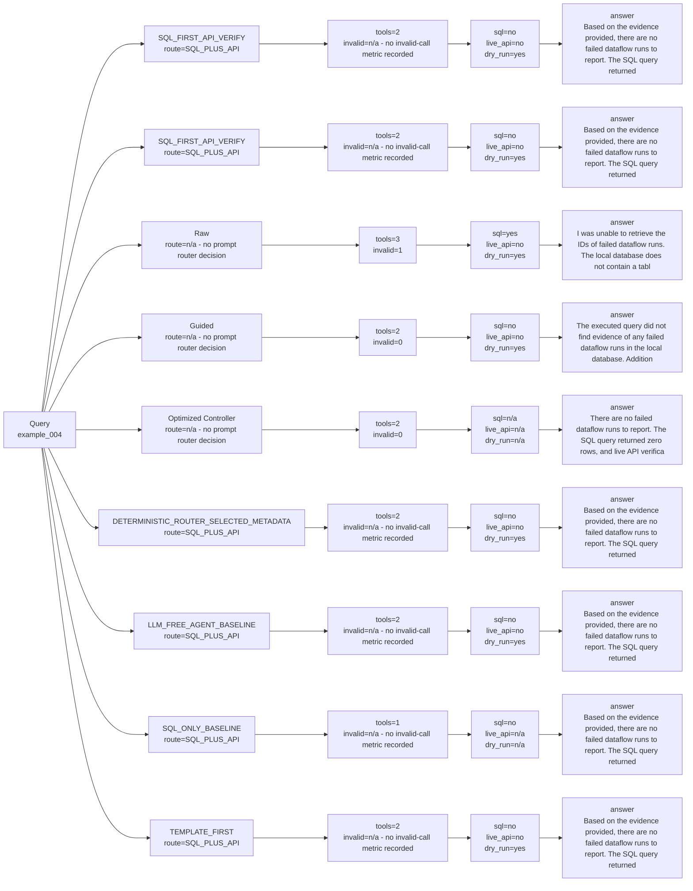

# Strategy Comparison: example_004

This view compares deterministic, Raw real LLM, Guided real LLM, and optimized-controller paths when those artifacts exist.

| Variant | Strategy | Route | Context mode | SQL preview | API endpoint | Tool calls | Invalid calls | Endpoint repairs | SQL evidence | Live API evidence | Overall evidence | Dry-run only | Runtime | Tokens | Final answer preview |
| --- | --- | --- | --- | --- | --- | ---: | ---: | ---: | --- | --- | --- | --- | ---: | ---: | --- |
| SQL_FIRST_API_VERIFY | `LLM_SQL_FIRST_API_VERIFY` | SQL_PLUS_API | metadata_context_card | SELECT "DATAFLOWNAME", "STATE", "TARGETID", "CONNECTIONSPECID", "NAME" FROM "dim_target" WHERE LOWER(CAST("STATE" AS VARCHAR)) LIKE LOWER('%failed%') LIMIT 50 | GET /data/foundation/flowservice/flows | 2 | n/a - no invalid-call metric recorded | n/a - no endpoint-repair metric recorded | False | False | False | True | 0.011947459075599909 | 812 | Based on the evidence provided, there are no failed dataflow runs to report. The SQL query returned zero rows, and live API verification was not executed because Adobe credentials are unavailable. |
| SQL_FIRST_API_VERIFY | `SQL_FIRST_API_VERIFY` | SQL_PLUS_API | metadata_context_card | SELECT "DATAFLOWNAME", "STATE", "TARGETID", "CONNECTIONSPECID", "NAME" FROM "dim_target" WHERE LOWER(CAST("STATE" AS VARCHAR)) LIKE LOWER('%failed%') LIMIT 50 | GET /data/foundation/flowservice/flows | 2 | n/a - no invalid-call metric recorded | n/a - no endpoint-repair metric recorded | False | False | False | True | 0.009926999919116497 | 852 | Based on the evidence provided, there are no failed dataflow runs to report. The SQL query returned zero rows, and live API verification was not executed because Adobe credentials are unavailable. |
| Raw | `RAW_REAL_LLM_TWO_TOOLS_BASELINE` | n/a - no prompt router decision | metadata_context_estimate_inferred | SELECT ID FROM dataflow_runs WHERE status = 'failed' | GET /data/core/ups/segment/definitions | 3 | 1 | 0 | True | False | True | True | 6.4608 | n/a - estimated_tokens missing | I was unable to retrieve the IDs of failed dataflow runs. The local database does not contain a table named `dataflow_runs`, and the API call could not be executed due to unavailable credentials. Therefore, I cannot prov... |
| Guided | `GUIDED_REAL_LLM_TWO_TOOLS_BASELINE` | n/a - no prompt router decision | metadata_context_estimate_inferred | SELECT DATAFLOWID FROM dim_connector WHERE STATE = 'failed' | GET /ajo/journey | 2 | 0 | 1 | False | False | False | True | 3.0491 | n/a - estimated_tokens missing | The executed query did not find evidence of any failed dataflow runs in the local database. Additionally, the API call to check for live journey statuses could not be executed due to unavailable Adobe credentials. |
| Optimized Controller | `LLM_CONTROLLER_OPTIMIZED_AGENT` | n/a - no prompt router decision | metadata_context_estimate_inferred | n/a - no SQL call in trajectory | n/a - no API call in trajectory | 2 | 0 | 0 | n/a - no SQL call in trajectory | n/a - no API call in trajectory | False | n/a - no API call in trajectory | 1.0852 | n/a - estimated_tokens missing | There are no failed dataflow runs to report. The SQL query returned zero rows, and live API verification was not executed due to the unavailability of Adobe credentials. |
| DETERMINISTIC_ROUTER_SELECTED_METADATA | `DETERMINISTIC_ROUTER_SELECTED_METADATA` | SQL_PLUS_API | metadata_context_card | SELECT "DATAFLOWNAME", "STATE", "TARGETID", "CONNECTIONSPECID", "NAME" FROM "dim_target" WHERE LOWER(CAST("STATE" AS VARCHAR)) LIKE LOWER('%failed%') LIMIT 50 | GET /data/foundation/flowservice/flows | 2 | n/a - no invalid-call metric recorded | n/a - no endpoint-repair metric recorded | False | False | False | True | 0.010147165972739458 | 786 | Based on the evidence provided, there are no failed dataflow runs to report. The SQL query returned zero rows, and live API verification was not executed because Adobe credentials are unavailable. |
| LLM_FREE_AGENT_BASELINE | `LLM_FREE_AGENT_BASELINE` | SQL_PLUS_API | metadata_context_card | SELECT "DATAFLOWNAME", "STATE", "TARGETID", "CONNECTIONSPECID", "NAME" FROM "dim_target" WHERE LOWER(CAST("STATE" AS VARCHAR)) LIKE LOWER('%failed%') LIMIT 50 | GET /data/foundation/flowservice/flows | 2 | n/a - no invalid-call metric recorded | n/a - no endpoint-repair metric recorded | False | False | False | True | 0.015830041957087815 | 786 | Based on the evidence provided, there are no failed dataflow runs to report. The SQL query returned zero rows, and live API verification was not executed because Adobe credentials are unavailable. |
| SQL_ONLY_BASELINE | `SQL_ONLY_BASELINE` | SQL_PLUS_API | metadata_context_card | SELECT "DATAFLOWNAME", "STATE", "TARGETID", "CONNECTIONSPECID", "NAME" FROM "dim_target" WHERE LOWER(CAST("STATE" AS VARCHAR)) LIKE LOWER('%failed%') LIMIT 50 | n/a - no API call in trajectory | 1 | n/a - no invalid-call metric recorded | n/a - no endpoint-repair metric recorded | False | n/a - no API call in trajectory | False | n/a - no API call in trajectory | 0.009002708946354687 | 550 | Based on the evidence provided, there are no failed dataflow runs to report. The SQL query returned zero rows, and API evidence was not requested. |
| TEMPLATE_FIRST | `TEMPLATE_FIRST` | SQL_PLUS_API | metadata_context_card | SELECT "DATAFLOWNAME", "STATE", "TARGETID", "CONNECTIONSPECID", "NAME" FROM "dim_target" WHERE LOWER(CAST("STATE" AS VARCHAR)) LIKE LOWER('%failed%') LIMIT 50 | GET /data/foundation/flowservice/flows | 2 | n/a - no invalid-call metric recorded | n/a - no endpoint-repair metric recorded | False | False | False | True | 0.009953291970305145 | 776 | Based on the evidence provided, there are no failed dataflow runs to report. The SQL query returned zero rows, and live API verification was not executed because Adobe credentials are unavailable. |
