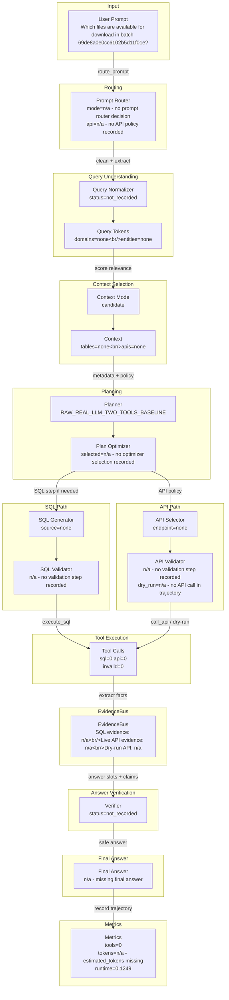

# DASHSys Prompt-To-Answer Dataflow

## Quality Gate Facts

| Field | Value |
| --- | --- |
| Query ID | `example_031` |
| User query | Which files are available for download in batch 69de8a0e0cc6102b5d11f01e? |
| Strategy | `RAW_REAL_LLM_TWO_TOOLS_BASELINE` |
| Variant | Raw |
| Final answer preview | n/a - missing final answer |
| Tool call count | 0 |
| Runtime | 0.1249 |
| Estimated tokens | n/a - estimated_tokens missing |
| Checkpoint count | 0 |
| Candidate context mode | candidate |
| Context mode note | recorded in checkpoint/trajectory |



## SQL And API Preview

| Path | Preview | Validation | Result / Status |
| --- | --- | --- | --- |
| SQL | n/a - no SQL call in trajectory | n/a - no validation step recorded | row_count=n/a - no SQL row count recorded; rows=n/a - no SQL rows preview recorded |
| API | n/a - no API call in trajectory | n/a - no validation step recorded | dry_run=n/a - no API call in trajectory; live_api_evidence=n/a - no API call in trajectory; overall_evidence=False; preview=n/a - no API result preview recorded |

Context mode labels ending in `_inferred` are display-only summaries for the visualization; they are not recorded planner decisions.

## Tool Execution vs Evidence Availability

No successful evidence was available from executed tools.

| Metric | Value |
| --- | --- |
| execute_sql calls | 0 |
| call_api calls | 0 |
| valid tool calls | 0 |
| invalid tool calls | 0 |
| endpoint repairs | 0 |
| schema hint injections | 0 |
| SQL evidence available | n/a - no SQL call in trajectory |
| live API evidence available | n/a - no API call in trajectory |
| overall evidence available | False |
| dry-run only | n/a - no API call in trajectory |
| successful evidence count | 0 |
| zero-row uncertain | n/a - no SQL call in trajectory |

## Research Technique Status

| Technique | Source inspiration | Active? | Effect on dataflow | Correctness impact | Efficiency impact | Visualization checkpoint |
| --- | --- | --- | --- | --- | --- | --- |
| SQLGlot AST validation | SQLGlot | False | AST SQL validation and table/column extraction | detects schema/safety mismatches structurally | diagnostic overhead only | checkpoint_sql_ast_validation |
| Robust schema linking | RSL-SQL | False | Bidirectional schema linking and bridge preservation | keeps relevant tables, columns, and bridges visible | diagnostic overhead only | checkpoint_schema_linking |
| Value/entity retrieval | CHESS | False | Entity-value grounding from local DB samples | grounds named entities and IDs before planning | bounded cached retrieval budget | checkpoint_value_entity_retrieval |
| Query decomposition | DIN-SQL | False | Complex-query decomposition into constraints | preserves complex constraints | diagnostic overhead only | checkpoint_query_decomposition |
| Gated SQL candidates | DIN-SQL / self-correction | False | Hard-case candidate validation before one execution | prevents invalid hard-case SQL from being selected | validates only; executes one selected plan | checkpoint_gated_sql_candidate_selection |
| Query-family examples | DAIL-SQL | False | Optional family hints for LLM SQL | makes technique visibility auditable | optional LLM-only token cost | checkpoint_query_family_examples |
| Span export | OpenAI Agents SDK tracing | True | Local span-style checkpoint export | makes technique visibility auditable | diagnostic overhead only | spans.json |
| Hybrid candidate scoring | Blended RAG / rank fusion | True | Report-only candidate separation scoring | makes technique visibility auditable | diagnostic overhead only | checkpoint_hybrid_candidate_scoring |
| Endpoint family ranking | Domain-aware retrieval | True | Report-only endpoint family reranking | makes technique visibility auditable | diagnostic overhead only | checkpoint_endpoint_family_ranking |
| Structural schema preservation | RSL-SQL | True | Report-only bridge/relationship preservation diagnostics | keeps relevant tables, columns, and bridges visible | diagnostic overhead only | checkpoint_structural_schema_preservation |
| Value-to-API ranking | CHESS | False | High-confidence entity matches can boost API-family ranking in reports | grounds named entities and IDs before planning | bounded cached retrieval budget | checkpoint_value_to_api_ranking |
| Gated risk-cluster repair | CHASE-SQL-style repair | True | Diagnostic repaired candidate comparison without execution change | makes technique visibility auditable | diagnostic overhead only | checkpoint_gated_risk_cluster_repair |

## Candidate Ranking Diagnostics

| Technique | Active | Output | Correctness role | Efficiency role |
| --- | --- | --- | --- | --- |
| Hybrid Candidate Scoring | True | {"ranking_changed": true, "score_margin": 0.19, "top_candidate_score": 1.8, "top_components": {"alias_score": 1.2, "endpoint_family_score": 0.0, "lexical_score": 0.0, "name": "dim_segment", "reciprocal_rank_fusion": 0.032258, "score_explanation": "base=2.000; lexical=0.000; alias=1.200; value=0.000; structural=0.000; endpoint_family=0.000", "structural_score": 0.0, "truncated_fields": 1, "value_match_score": 0.0}} | separates candidate context without changing executed plan | report-only scoring; no extra tools |
| Endpoint Family Ranker | True | {"boost_reason": {"items": ["batch_details: batch-shaped ID", "batch_files: batch ID with files/download terms", "audit_events: audit/change vocabulary"], "total_items": 3, "truncated_items": false}, "endpoint_family": "batch_files", "endpoint_family_confidence": 1.0, "ranking_changed": true} | reduces endpoint-family confusion in candidate context | reranks metadata only |
| Structural Schema Preservation | True | {"structural_confidence_delta": 0.1, "structural_reason": "bridge-table heuristic", "structural_tables_added": {"items": ["br_campaign_segment", "hkg_br_segment_target", "hkg_br_blueprint_collection"], "total_items": 9, "truncated_items": true}} | keeps relationship bridge tables visible | adds only compact schema context |
| Value-to-API Ranking | False | {"active": false, "boost_applied": true, "value_match_used_for_api_ranking": false} | uses only high-confidence retrieved values for endpoint family boosts | reuses existing value retrieval diagnostics |
| Gated Risk Cluster Repair | True | {"active": true, "candidate_count": 2, "cost_delta": 0, "diagnostic_only": true, "execution_repair_enabled": false, "expected_correctness_gain": "retrieval-only candidate separation; no accuracy claim without execution change", "hard_case_triggered": true, "rejected_candidate_reason": "lower endpoint-family confidence or lower hybrid score", "truncated_fields": 2} | compares a repaired candidate without executing losing plans | diagnostic-only; zero tool-call delta |

## Shadow Repair / What-if Evaluation

| Risk cluster | Current candidate | Repaired candidate | Safety verdict | Score delta | Tool/cost delta | Enable recommendation |
| --- | --- | --- | --- | ---: | --- | --- |
| batch_endpoint_confusion | {"api": {"items": [{"method": "GET", "path": "/data/foundation/export/batches/69de8a0e0cc6102b5d11f01e/files"}], "total_items": 1, "truncated_items": false}, "score": 0.5339} | {"api": {"items": [{"method": "GET", "path": "/data/foundation/export/batches/69de8a0e0cc6102b5d11f01e/files"}], "total_items": 1, "truncated_items": false}, "score": 0.5339} | safe | 0.0 | {'tool_delta': 0, 'token_delta': 0, 'runtime_delta': 0.0} | safe_shadow_tie_recommend_canary |
| execution changed? | False | reason | offline shadow evaluation only; packaged SQL_FIRST_API_VERIFY repair execution remains disabled | decision hash | 7c20bbc4f49528d9 | |

## Value Retrieval Cache

| Field | Value |
| --- | --- |
| status | n/a - value retrieval checkpoint inactive |

## SQL AST Validation

| Field | Value |
| --- | --- |
| status | n/a - SQL AST validation checkpoint inactive |

## Technique Impact Highlight

- Correctness: n/a - no checkpoint correctness role recorded
- Efficiency: n/a - no checkpoint efficiency role recorded
- Dataflow effect: n/a - no checkpoint effect recorded

## Prompt To SQL/API Mapping

```json
{
  "api": {
    "dry_run": "n/a - no API call in trajectory",
    "endpoint": "n/a - no API call in trajectory",
    "endpoint_repair": "n/a - no endpoint repair recorded",
    "live_evidence_available": "n/a - no API call in trajectory",
    "result_preview": "n/a - no API result preview recorded",
    "validation": "n/a - no validation step recorded"
  },
  "context": {
    "candidate_apis": "n/a - no candidate APIs recorded",
    "candidate_tables": "n/a - no candidate tables recorded",
    "confidence": 0.758,
    "context_mode": "candidate",
    "context_mode_note": "recorded in checkpoint/trajectory",
    "estimated_context_tokens": 1338,
    "score_margin": 0.19
  },
  "evidence": {
    "dry_run_only": "n/a - no API call in trajectory",
    "evidence_available": false,
    "explanation": "No successful evidence was available from executed tools.",
    "live_api_evidence_available": "n/a - no API call in trajectory",
    "overall_evidence_available": false,
    "sql_evidence_available": "n/a - no SQL call in trajectory",
    "successful_evidence_count": 0,
    "zero_row_uncertain": "n/a - no SQL call in trajectory"
  },
  "normalization": {
    "normalized_query": "n/a - no normalization checkpoint recorded"
  },
  "prompt": "Which files are available for download in batch 69de8a0e0cc6102b5d11f01e?",
  "route": {
    "api_policy": "n/a - no API policy recorded",
    "confidence": "n/a - no route confidence recorded",
    "mode": "n/a - no prompt router decision",
    "risk": "n/a - no route risk recorded"
  },
  "sql": {
    "preview": "n/a - no SQL call in trajectory",
    "result_preview": "n/a - no SQL rows preview recorded",
    "row_count": "n/a - no SQL row count recorded",
    "validation": "n/a - no validation step recorded"
  },
  "tokens": {
    "tokens": "n/a - no tokens recorded"
  },
  "truncated_fields": 1
}
```

## Checkpoint Effect Table

| Checkpoint | Stage | Technique | Input | Output | Effect on data flow | Correctness role | Efficiency role |
| --- | --- | --- | --- | --- | --- | --- | --- |
| `n/a` | n/a | n/a | n/a | n/a | n/a - no checkpoints recorded | n/a | n/a |
