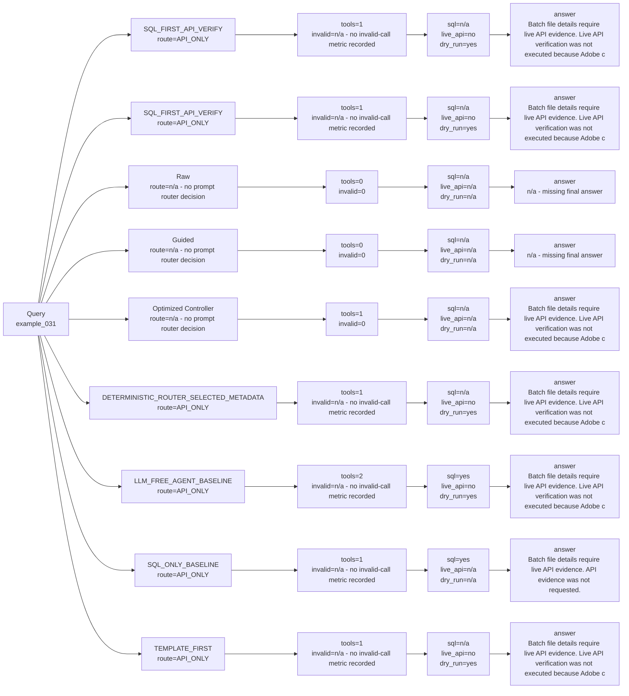

# Strategy Comparison: example_031

This view compares deterministic, Raw real LLM, Guided real LLM, and optimized-controller paths when those artifacts exist.

| Variant | Strategy | Route | Context mode | Endpoint family | Ranking changed? | SQL preview | API endpoint | Tool calls | Invalid calls | Endpoint repairs | SQL evidence | Live API evidence | Overall evidence | Dry-run only | Runtime | Tokens | Final answer preview |
| --- | --- | --- | --- | --- | --- | --- | --- | ---: | ---: | ---: | --- | --- | --- | --- | ---: | ---: | --- |
| SQL_FIRST_API_VERIFY | `LLM_SQL_FIRST_API_VERIFY` | API_ONLY | candidate | batch_files | True | n/a - no SQL call in trajectory | GET /data/foundation/export/batches/69de8a0e0cc6102b5d11f01e/files | 1 | n/a - no invalid-call metric recorded | n/a - no endpoint-repair metric recorded | n/a - no SQL call in trajectory | False | False | True | 0.011331833084113896 |
| SQL_FIRST_API_VERIFY | `SQL_FIRST_API_VERIFY` | API_ONLY | candidate | batch_files | True | n/a - no SQL call in trajectory | GET /data/foundation/export/batches/69de8a0e0cc6102b5d11f01e/files | 1 | n/a - no invalid-call metric recorded | n/a - no endpoint-repair metric recorded | n/a - no SQL call in trajectory | False | False | True | 0.010196209070272744 |
| Raw | `RAW_REAL_LLM_TWO_TOOLS_BASELINE` | n/a - no prompt router decision | candidate | batch_files | True | n/a - no SQL call in trajectory | n/a - no API call in trajectory | 0 | 0 | 0 | n/a - no SQL call in trajectory | n/a - no API call in trajectory | False | n/a - no API call in trajectory | 0.1249 |
| Guided | `GUIDED_REAL_LLM_TWO_TOOLS_BASELINE` | n/a - no prompt router decision | candidate | batch_files | True | n/a - no SQL call in trajectory | n/a - no API call in trajectory | 0 | 0 | 0 | n/a - no SQL call in trajectory | n/a - no API call in trajectory | False | n/a - no API call in trajectory | 0.2616 |
| Optimized Controller | `LLM_CONTROLLER_OPTIMIZED_AGENT` | n/a - no prompt router decision | candidate | batch_files | True | n/a - no SQL call in trajectory | n/a - no API call in trajectory | 1 | 0 | 0 | n/a - no SQL call in trajectory | n/a - no API call in trajectory | False | n/a - no API call in trajectory | 0.1366 |
| DETERMINISTIC_ROUTER_SELECTED_METADATA | `DETERMINISTIC_ROUTER_SELECTED_METADATA` | API_ONLY | candidate | batch_files | True | n/a - no SQL call in trajectory | GET /data/foundation/export/batches/69de8a0e0cc6102b5d11f01e/files | 1 | n/a - no invalid-call metric recorded | n/a - no endpoint-repair metric recorded | n/a - no SQL call in trajectory | False | False | True | 0.010171332978643477 |
| LLM_FREE_AGENT_BASELINE | `LLM_FREE_AGENT_BASELINE` | API_ONLY | candidate | batch_files | True | SELECT "SEGMENTID", "CAMPAIGNID", "LABELSSEGMENT", "LABELSCAMPAIGN" FROM "br_campaign_segment" LIMIT 50 | GET /data/foundation/export/batches/69de8a0e0cc6102b5d11f01e/files | 2 | n/a - no invalid-call metric recorded | n/a - no endpoint-repair metric recorded | True | False | True | True | 0.019631833070889115 |
| SQL_ONLY_BASELINE | `SQL_ONLY_BASELINE` | API_ONLY | candidate | batch_files | True | SELECT "SEGMENTID", "CAMPAIGNID", "LABELSSEGMENT", "LABELSCAMPAIGN" FROM "br_campaign_segment" LIMIT 50 | n/a - no API call in trajectory | 1 | n/a - no invalid-call metric recorded | n/a - no endpoint-repair metric recorded | True | n/a - no API call in trajectory | True | n/a - no API call in trajectory | 0.01211945794057101 |
| TEMPLATE_FIRST | `TEMPLATE_FIRST` | API_ONLY | candidate | batch_files | True | n/a - no SQL call in trajectory | GET /data/foundation/export/batches/69de8a0e0cc6102b5d11f01e/files | 1 | n/a - no invalid-call metric recorded | n/a - no endpoint-repair metric recorded | n/a - no SQL call in trajectory | False | False | True | 0.010183708975091577 |
