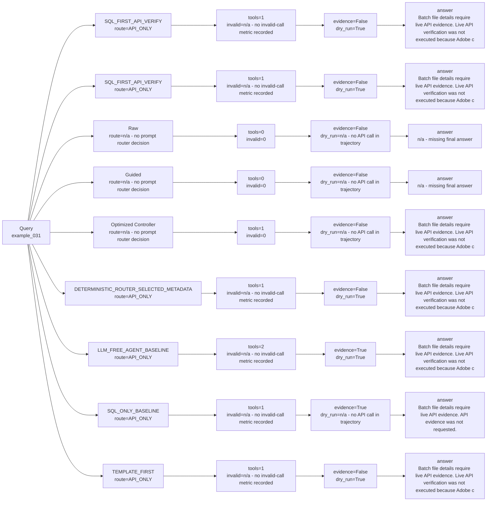

# Strategy Comparison: example_031

This view compares deterministic, Raw real LLM, Guided real LLM, and optimized-controller paths when those artifacts exist.

| Variant | Strategy | Route | Context mode | SQL preview | API endpoint | Tool calls | Invalid calls | Endpoint repairs | Evidence available | Dry-run only | Runtime | Tokens | Final answer preview |
| --- | --- | --- | --- | --- | --- | ---: | ---: | ---: | --- | --- | ---: | ---: | --- |
| SQL_FIRST_API_VERIFY | `LLM_SQL_FIRST_API_VERIFY` | API_ONLY | n/a - no candidate context mode recorded | n/a - no SQL call in trajectory | GET /data/foundation/export/batches/69de8a0e0cc6102b5d11f01e/files | 1 | n/a - no invalid-call metric recorded | n/a - no endpoint-repair metric recorded | False | True | 0.011331833084113896 | 683 | Batch file details require live API evidence. Live API verification was not executed because Adobe credentials are unavailable. |
| SQL_FIRST_API_VERIFY | `SQL_FIRST_API_VERIFY` | API_ONLY | n/a - no candidate context mode recorded | n/a - no SQL call in trajectory | GET /data/foundation/export/batches/69de8a0e0cc6102b5d11f01e/files | 1 | n/a - no invalid-call metric recorded | n/a - no endpoint-repair metric recorded | False | True | 0.009698958019725978 | 723 | Batch file details require live API evidence. Live API verification was not executed because Adobe credentials are unavailable. |
| Raw | `RAW_REAL_LLM_TWO_TOOLS_BASELINE` | n/a - no prompt router decision | n/a - no candidate context mode recorded | n/a - no SQL call in trajectory | n/a - no API call in trajectory | 0 | 0 | 0 | False | n/a - no API call in trajectory | 0.1249 | n/a - estimated_tokens missing | n/a - missing final answer |
| Guided | `GUIDED_REAL_LLM_TWO_TOOLS_BASELINE` | n/a - no prompt router decision | n/a - no candidate context mode recorded | n/a - no SQL call in trajectory | n/a - no API call in trajectory | 0 | 0 | 0 | False | n/a - no API call in trajectory | 0.2616 | n/a - estimated_tokens missing | n/a - missing final answer |
| Optimized Controller | `LLM_CONTROLLER_OPTIMIZED_AGENT` | n/a - no prompt router decision | n/a - no candidate context mode recorded | n/a - no SQL call in trajectory | n/a - no API call in trajectory | 1 | 0 | 0 | False | n/a - no API call in trajectory | 0.1366 | n/a - estimated_tokens missing | Batch file details require live API evidence. Live API verification was not executed because Adobe credentials are unavailable. |
| DETERMINISTIC_ROUTER_SELECTED_METADATA | `DETERMINISTIC_ROUTER_SELECTED_METADATA` | API_ONLY | n/a - no candidate context mode recorded | n/a - no SQL call in trajectory | GET /data/foundation/export/batches/69de8a0e0cc6102b5d11f01e/files | 1 | n/a - no invalid-call metric recorded | n/a - no endpoint-repair metric recorded | False | True | 0.00986512505915016 | 661 | Batch file details require live API evidence. Live API verification was not executed because Adobe credentials are unavailable. |
| LLM_FREE_AGENT_BASELINE | `LLM_FREE_AGENT_BASELINE` | API_ONLY | n/a - no candidate context mode recorded | SELECT "SEGMENTID", "CAMPAIGNID", "LABELSSEGMENT", "LABELSCAMPAIGN" FROM "br_campaign_segment" LIMIT 50 | GET /data/foundation/export/batches/69de8a0e0cc6102b5d11f01e/files | 2 | n/a - no invalid-call metric recorded | n/a - no endpoint-repair metric recorded | True | True | 0.016300915973261 | 1082 | Batch file details require live API evidence. Live API verification was not executed because Adobe credentials are unavailable. |
| SQL_ONLY_BASELINE | `SQL_ONLY_BASELINE` | API_ONLY | n/a - no candidate context mode recorded | SELECT "SEGMENTID", "CAMPAIGNID", "LABELSSEGMENT", "LABELSCAMPAIGN" FROM "br_campaign_segment" LIMIT 50 | n/a - no API call in trajectory | 1 | n/a - no invalid-call metric recorded | n/a - no endpoint-repair metric recorded | True | n/a - no API call in trajectory | 0.010920499917119741 | 831 | Batch file details require live API evidence. API evidence was not requested. |
| TEMPLATE_FIRST | `TEMPLATE_FIRST` | API_ONLY | n/a - no candidate context mode recorded | n/a - no SQL call in trajectory | GET /data/foundation/export/batches/69de8a0e0cc6102b5d11f01e/files | 1 | n/a - no invalid-call metric recorded | n/a - no endpoint-repair metric recorded | False | True | 0.009333709022030234 | 652 | Batch file details require live API evidence. Live API verification was not executed because Adobe credentials are unavailable. |
