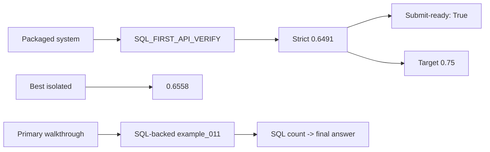
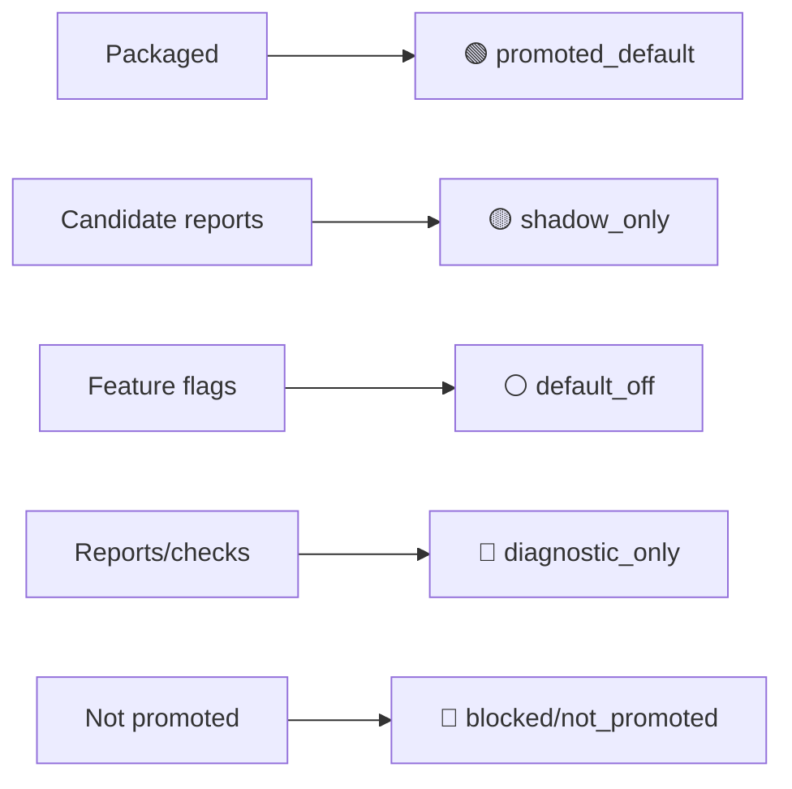

# DASHSys Executive Visualization Dashboard

## How To Read This Page

1. Start from the raw prompt card.
2. Follow the arrows/cards to see how DASHSys transforms prompt, data, and evidence.
3. Use badges to distinguish packaged, shadow, default-off, diagnostic, and blocked techniques.

## Primary Testing Prompt

> **example_011**
>
> # How many schemas do I have?
>
> Primary SQL-backed packaged walkthrough: the prompt becomes validated SQL, SQL returns the answer count, and API verification remains dry-run/unavailable.

## System At A Glance

| Metric | Value | Note |
| --- | --- | --- |
| **Packaged strict score** | `0.6491` | Current submit-ready score. |
| **Best isolated score** | `0.6558` | Safe trial progress, not promoted as winner-ready. |
| **Correctness** | `0.6743` | Must not regress. |
| **Hidden-style** | `48/48` | Current robustness gate. |
| **Final readiness** | `True` | Submission package still valid. |
| **Secret scan** | `True` | Readiness secret scan result. |

## Primary Prompt Journey

```mermaid
flowchart LR
  S0["Raw prompt"]
  S1["Prompt router view"]
  S0 --> S1
  S2["Simple-prompt gate"]
  S1 --> S2
  S3["Normalized query"]
  S2 --> S3
  S4["Tokens/entities/domains"]
  S3 --> S4
  S5["Query analysis"]
  S4 --> S5
  S6["Lookup path / route intent"]
  S5 --> S6
  S7["Context card"]
  S6 --> S7
  S8["Selected plan"]
  S7 --> S8
  S9["Evidence objects"]
  S8 --> S9
  S10["Answer slots / intent"]
  S9 --> S10
  S11["Verified final answer"]
  S10 --> S11
```

➡️ Open the flagship walkthrough: [sql_prompt_storyboard_primary.md](sql_prompt_storyboard_primary.md)

## Bottleneck Card

### 🟢 SQL-backed primary walkthrough

| Metric | Value | Note |
| --- | --- | --- |
| **SQL score** | `0.9` | Generated SQL is validated and scored. |
| **API score** | `1.0` | API verification is attempted as dry-run/unavailable. |
| **Answer score** | `0.3915` | Final answer is grounded by SQL count plus dry-run note. |
| **Strict score** | `0.7462` | Row-level strict score for the packaged path. |
| **Main distinction** | `SQL provides the answer source; API verification is dry-run/unavailable in the packaged trace.` | SQL is the answer source; API verification is not live. |

## Technique State Legend

| Metric | Value | Note |
| --- | --- | --- |
| **Official-token reduction** | `🟢 promoted_default` | Enabled in the packaged path. |
| **Answer-shape v2** | `⚪ default_off` | Evaluated, not promoted. |
| **Endpoint tie-break v2** | `🟡 shadow_only` | Shadow-only report. |
| **Live readiness** | `🔵 diagnostic_only` | Diagnostic only; credentials not visible. |
| **Compact context** | `⚪ default_off` | Disabled/default-off. |
| **Repair execution** | `⚪ default_off` | Disabled/default-off. |

## Submit-Ready, Not Winner-Ready

- Submit-ready because packaging, hidden-style, readiness, and secret checks pass.
- Not winner-ready because packaged strict score remains below `0.75` and the best safe isolated score is still below target.
- Secondary API-only bottleneck pages remain reference material; the main walkthrough is now SQL-backed.
