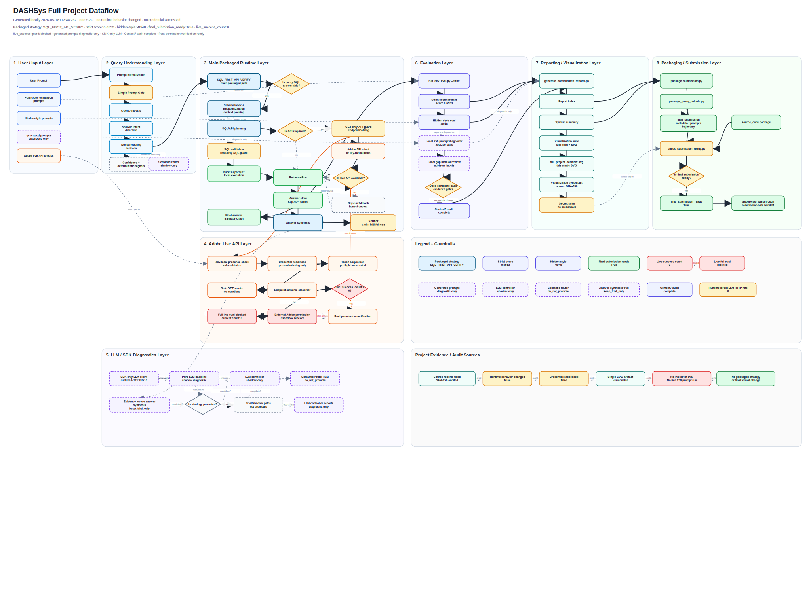

# Full Project Dataflow SVG

Single large SVG overview for supervisor/project walkthrough.

## Current Status

- Generated at: `2026-05-19T12:25:58Z`
- Packaged strategy: `SQL_FIRST_API_VERIFY`
- Strict score: `0.6553`
- Hidden-style: `48/48`
- Final submission ready: `True`
- Live success count: `0`
- Live guard status: `blocked`

Generated locally; no runtime behavior changed; no credentials accessed.

## Source Reports Used

- `outputs/reports/report_index.json`
- `outputs/reports/system_summary.json`
- `outputs/reports/workflow_decision_map.json`
- `outputs/reports/workflow_decision_audit.json`
- `outputs/reports/live_api_full_run_blocker.json`
- `outputs/reports/adobe_access_waiting_status.json`
- `outputs/reports/context7_code_alignment_audit.json`
- `outputs/reports/generated_prompt_suite_local_diagnostic.json`
- `outputs/reports/local_gap_manual_review.json`
- `outputs/reports/superpowers_fix_decision.json`
- `outputs/visualizations/end_to_end_pipeline_mermaid.md`
- `outputs/visualizations/project_architecture_c4.md`
- `outputs/visualizations/live_adobe_api_status_mermaid.md`
- `outputs/visualizations/report_generation_map.md`
