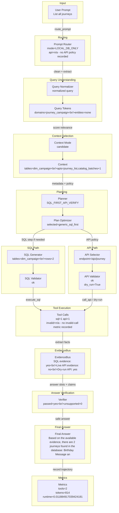

# DASHSys Prompt-To-Answer Dataflow

## Quality Gate Facts

| Field | Value |
| --- | --- |
| Query ID | `list_all_journeys` |
| User query | List all journeys |
| Strategy | `SQL_FIRST_API_VERIFY` |
| Variant | n/a - not a baseline variant |
| Final answer preview | Based on the available evidence, there are 2 journeys found in the database: Birthday Message and Gold Tier Welcome Email. Live API verification was not executed because Adobe credentials are unavailable. |
| Tool call count | 2 |
| Runtime | 0.011884917039424181 |
| Estimated tokens | 814 |
| Checkpoint count | 20 |
| Candidate context mode | candidate |
| Context mode note | recorded in checkpoint/trajectory |



## SQL And API Preview

| Path | Preview | Validation | Result / Status |
| --- | --- | --- | --- |
| SQL | SELECT CAMPAIGN."NAME" AS CAMPAIGNNAME, CAMPAIGN."CAMPAIGNID" AS CAMPAIGNID FROM "dim_campaign" AS CAMPAIGN | ok | row_count=2; rows={"preview": "{\"items\": {\"items\": [{\"CAMPAIGNID\": \"9f4ebca4-2fdd-4873-95f5-8d66bab358c6\", \"CAMPAIGNNAME\": \"Birthday Message\"}, {\"CAMPAIGNID\": \"3f277603-ac4d-4022-a993-8cbd3afc0d62\", \"CAMPAIGNNAME\": \"Gold Tier Welcome Email\"}], \"total_items\": 2, \"truncated_items\": false}, \"t...", "truncated": true} |
| API | GET /ajo/journey | ok | dry_run=True; live_api_evidence=False; overall_evidence=True; preview=n/a - no API result preview recorded |

Context mode labels ending in `_inferred` are display-only summaries for the visualization; they are not recorded planner decisions.

## Tool Execution vs Evidence Availability

SQL evidence is available. API tool was invoked and validated, but live API evidence was unavailable because Adobe credentials were missing.

| Metric | Value |
| --- | --- |
| execute_sql calls | 1 |
| call_api calls | 1 |
| valid tool calls | 2 |
| invalid tool calls | n/a - no invalid-call metric recorded |
| endpoint repairs | n/a - no endpoint-repair metric recorded |
| schema hint injections | n/a - no schema-hint metric recorded |
| SQL evidence available | True |
| live API evidence available | False |
| overall evidence available | True |
| dry-run only | True |
| successful evidence count | 1 |
| zero-row uncertain | False |

## Research Technique Status

| Technique | Source inspiration | Active? | Effect on dataflow | Correctness impact | Efficiency impact | Visualization checkpoint |
| --- | --- | --- | --- | --- | --- | --- |
| SQLGlot AST validation | SQLGlot | False | AST SQL validation and table/column extraction | detects schema/safety mismatches structurally | diagnostic overhead only | checkpoint_sql_ast_validation |
| Robust schema linking | RSL-SQL | False | Bidirectional schema linking and bridge preservation | keeps relevant tables, columns, and bridges visible | diagnostic overhead only | checkpoint_schema_linking |
| Value/entity retrieval | CHESS | False | Entity-value grounding from local DB samples | grounds named entities and IDs before planning | bounded cached retrieval budget | checkpoint_value_entity_retrieval |
| Query decomposition | DIN-SQL | False | Complex-query decomposition into constraints | preserves complex constraints | diagnostic overhead only | checkpoint_query_decomposition |
| Gated SQL candidates | DIN-SQL / self-correction | False | Hard-case candidate validation before one execution | prevents invalid hard-case SQL from being selected | validates only; executes one selected plan | checkpoint_gated_sql_candidate_selection |
| Query-family examples | DAIL-SQL | False | Optional family hints for LLM SQL | makes technique visibility auditable | optional LLM-only token cost | checkpoint_query_family_examples |
| Span export | OpenAI Agents SDK tracing | True | Local span-style checkpoint export | makes technique visibility auditable | diagnostic overhead only | spans.json |
| Hybrid candidate scoring | Blended RAG / rank fusion | True | Report-only candidate separation scoring | makes technique visibility auditable | diagnostic overhead only | checkpoint_hybrid_candidate_scoring |
| Endpoint family ranking | Domain-aware retrieval | True | Report-only endpoint family reranking | makes technique visibility auditable | diagnostic overhead only | checkpoint_endpoint_family_ranking |
| Structural schema preservation | RSL-SQL | True | Report-only bridge/relationship preservation diagnostics | keeps relevant tables, columns, and bridges visible | diagnostic overhead only | checkpoint_structural_schema_preservation |
| Value-to-API ranking | CHESS | False | High-confidence entity matches can boost API-family ranking in reports | grounds named entities and IDs before planning | bounded cached retrieval budget | checkpoint_value_to_api_ranking |
| Gated risk-cluster repair | CHASE-SQL-style repair | False | Diagnostic repaired candidate comparison without execution change | makes technique visibility auditable | diagnostic overhead only | checkpoint_gated_risk_cluster_repair |
| Risk-based efficiency controller | adaptive retrieval control | True | Diagnostic policy that estimates skipped module cost by risk level | makes technique visibility auditable | diagnostic overhead only | checkpoint_risk_efficiency_controller |
| Schema context voting | full-vs-compact context voting | False | High-risk diagnostic comparison of compact and broader context | makes technique visibility auditable | diagnostic overhead only | checkpoint_schema_context_voting |
| Compact context shadow eval | shadow replay | False | Replay-only compact-context cost comparison | makes technique visibility auditable | diagnostic overhead only | checkpoint_compact_context_shadow_eval |
| Risk-efficiency shadow eval | shadow replay | True | Replay-only diagnostic module-skipping cost comparison | makes technique visibility auditable | diagnostic overhead only | checkpoint_risk_efficiency_shadow_eval |

## Candidate Ranking Diagnostics

| Technique | Active | Output | Correctness role | Efficiency role |
| --- | --- | --- | --- | --- |
| Hybrid Candidate Scoring | True | {"ranking_changed": true, "score_margin": 1.3, "top_candidate_score": 1.8, "top_components": {"alias_score": 1.2, "endpoint_family_score": 0.0, "lexical_score": 0.0, "name": "dim_campaign", "reciprocal_rank_fusion": 0.032787, "score_explanation": "base=2.000; lexical=0.000; alias=1.200; value=0.000; structural=0.000; endpoint_family=0.000", "structural_score": 0.0, "truncated_fields": 1, "value_match_score": 0.0}} | separates candidate context without changing executed plan | report-only scoring; no extra tools |
| Endpoint Family Ranker | True | {"boost_reason": {"items": ["journey_list: journey/campaign vocabulary"], "total_items": 1, "truncated_items": false}, "endpoint_family": "journey_list", "endpoint_family_confidence": 1.0, "ranking_changed": false} | reduces endpoint-family confusion in candidate context | reranks metadata only |
| Structural Schema Preservation | True | {"structural_confidence_delta": 0.1, "structural_reason": "bridge-table heuristic", "structural_tables_added": {"items": ["br_campaign_segment"], "total_items": 1, "truncated_items": false}} | keeps relationship bridge tables visible | adds only compact schema context |
| Value-to-API Ranking | False | {"active": false, "boost_applied": true, "value_match_used_for_api_ranking": false} | uses only high-confidence retrieved values for endpoint family boosts | reuses existing value retrieval diagnostics |
| Gated Risk Cluster Repair | False | {"active": false, "candidate_count": 1, "cost_delta": 0, "diagnostic_only": true, "execution_repair_enabled": false, "expected_correctness_gain": "retrieval-only candidate separation; no accuracy claim without execution change", "hard_case_triggered": false, "selected_candidate": "journey_list"} | compares a repaired candidate without executing losing plans | diagnostic-only; zero tool-call delta |

## Shadow Repair / What-if Evaluation

| Risk cluster | Current candidate | Repaired candidate | Safety verdict | Score delta | Tool/cost delta | Enable recommendation |
| --- | --- | --- | --- | ---: | --- | --- |
| not_targeted | {"api": {"items": [{"method": "GET", "params": {"pageSize": "10"}, "path": "/ajo/journey"}], "total_items": 1, "truncated_items": false}, "score": 0.761, "sql": {"items": ["SELECT CAMPAIGN.\"NAME\" AS CAMPAIGNNAME, CAMPAIGN.\"CAMPAIGNID\" AS CAMPAIGNID FROM \"dim_campaign\" AS CAMPAIGN"], "total_items": 1, "truncated_items": false}} | {"api": {"items": [{"method": "GET", "params": {"pageSize": "10"}, "path": "/ajo/journey"}], "total_items": 1, "truncated_items": false}, "score": 0.761, "sql": {"items": ["SELECT CAMPAIGN.\"NAME\" AS CAMPAIGNNAME, CAMPAIGN.\"CAMPAIGNID\" AS CAMPAIGNID FROM \"dim_campaign\" AS CAMPAIGN"], "total_items": 1, "truncated_items": false}} | safe | 0.0 | {'tool_delta': 0, 'token_delta': 0, 'runtime_delta': 0.0} | no_op_shadow_tie_keep_current |
| execution changed? | False | reason | offline shadow evaluation only; packaged SQL_FIRST_API_VERIFY repair execution remains disabled | decision hash | eebe841f2a2aed58 | |

## Risk-Based Efficiency Controller

Token/runtime savings in this section are estimates only unless packaged execution explicitly changes and validation confirms measured savings.

| Field | Value |
| --- | --- |
| risk_level | low |
| accuracy_risk | low - candidates are separated and schema/API signals are consistent |
| module_policy | low risk: skip expensive diagnostics |
| module_skipped_by_risk | {"items": ["value_retrieval", "shadow_repair", "repair_safety_verifier"], "total_items": 4, "truncated_items": true} |
| token_saved_estimate | 264 |
| runtime_saved_estimate_ms | 25.0 |
| savings_are_estimates | True |
| measured_efficiency_improvement_claimed | False |
| behavior_changed | False |

## Schema Context Voting

Schema context voting is diagnostic guidance for high-risk rows and does not change executed SQL/API plans.

| Field | Value |
| --- | --- |
| active | False |
| schema_vote_agreement | n/a |
| compact_context_safe | n/a |
| fallback_reason | n/a |
| compact_candidate_tables | n/a |
| fallback_candidate_tables | n/a |
| compact_candidate_apis | n/a |
| fallback_candidate_apis | n/a |
| token_delta | n/a |
| behavior_changed | False |

## Compact Context Shadow Evaluation

| Field | Value |
| --- | --- |
| status | n/a - no compact-context shadow eval row attached |

## Risk-Efficiency Shadow Evaluation

| Field | Value |
| --- | --- |
| risk_level | low |
| module_skipped_by_risk | {"items": ["value_retrieval", "shadow_repair", "repair_safety_verifier"], "total_items": 4, "truncated_items": true} |
| current_score | 0.761 |
| risk_skipping_score | 0.761 |
| score_delta | 0.0 |
| token_delta | -264 |
| runtime_delta | -0.025 |
| tool_call_delta | 0 |
| final_answer_difference | False |
| packaged_execution_changed | False |
| measured_accuracy_improvement_claimed | False |
| measured_efficiency_improvement_claimed | False |

## Value Retrieval Cache

| Field | Value |
| --- | --- |
| status | n/a - value retrieval checkpoint inactive |

## SQL AST Validation

| Field | Value |
| --- | --- |
| status | n/a - SQL AST validation checkpoint inactive |

## Technique Impact Highlight

- Correctness: keeps later normalization from changing the user-facing question
- Efficiency: starts one trace without extra tool calls
- Dataflow effect: preserves the original query for reproducibility

## Prompt To SQL/API Mapping

```json
{
  "api": {
    "dry_run": true,
    "endpoint": "GET /ajo/journey",
    "endpoint_repair": "n/a - no endpoint repair recorded",
    "live_evidence_available": false,
    "result_preview": "n/a - no API result preview recorded",
    "validation": "ok"
  },
  "context": {
    "candidate_apis": {
      "items": {
        "items": [
          "journey_list",
          "catalog_batches",
          "catalog_datasets"
        ],
        "total_items": 3,
        "truncated_items": false
      },
      "total_items": 3,
      "truncated_items": false
    },
    "candidate_tables": {
      "items": {
        "items": [
          "dim_campaign"
        ],
        "total_items": 1,
        "truncated_items": false
      },
      "total_items": 1,
      "truncated_items": false
    },
    "confidence": 0.84,
    "context_mode": "candidate",
    "context_mode_note": "recorded in checkpoint/trajectory",
    "estimated_context_tokens": 383,
    "score_margin": 1.3
  },
  "evidence": {
    "dry_run_only": true,
    "evidence_available": true,
    "explanation": "SQL evidence is available. API tool was invoked and validated, but live API evidence was unavailable because Adobe credentials were missing.",
    "live_api_evidence_available": false,
    "overall_evidence_available": true,
    "sql_evidence_available": true,
    "successful_evidence_count": 1,
    "zero_row_uncertain": false
  },
  "normalization": {
    "matching_text": "list all journey",
    "normalized_query": "List all journeys",
    "rewrites": {
      "items": {
        "items": [
          "important_plurals->singular"
        ],
        "total_items": 1,
        "truncated_items": false
      },
      "total_items": 1,
      "truncated_items": false
    }
  },
  "prompt": "List all journeys",
  "route": {
    "api_policy": "n/a - no API policy recorded",
    "confidence": 0.84,
    "mode": "LOCAL_DB_ONLY",
    "risk": "low"
  },
  "sql": {
    "preview": "SELECT CAMPAIGN.\"NAME\" AS CAMPAIGNNAME, CAMPAIGN.\"CAMPAIGNID\" AS CAMPAIGNID FROM \"dim_campaign\" AS CAMPAIGN",
    "result_preview": "{\"preview\": \"{\\\"items\\\": {\\\"items\\\": [{\\\"CAMPAIGNID\\\": \\\"9f4ebca4-2fdd-4873-95f5-8d66bab358c6\\\", \\\"CAMPAIGNNAME\\\": \\\"Birthday Message\\\"}, {\\\"CAMPAIGNID\\\": \\\"3f277603-ac4d-4022-a993-8cbd3afc0d62\\\", \\\"CAMPAIGNNAME\\\": \\\"Gold Tier Welcome Email\\\"}], \\\"total_items\\\": 2, \\\"truncated_items\\\": false}, \\\"t...\", \"truncated\": true}",
    "row_count": 2,
    "validation": "ok"
  },
  "tokens": {
    "domains": {
      "items": {
        "items": [
          "journey_campaign"
        ],
        "total_items": 1,
        "truncated_items": false
      },
      "total_items": 1,
      "truncated_items": false
    }
  },
  "truncated_fields": 1
}
```

## Checkpoint Effect Table

| Checkpoint | Stage | Technique | Input | Output | Effect on data flow | Correctness role | Efficiency role |
| --- | --- | --- | --- | --- | --- | --- | --- |
| `checkpoint_01_raw_query` | input | raw user query capture |  | {"query": "List all journeys", "query_id": "list_all_journeys", "strategy": "SQL_FIRST_API_VERIFY"} | preserves the original query for reproducibility | keeps later normalization from changing the user-facing question | starts one trace without extra tool calls |
| `checkpoint_00_prompt_router` | prompt routing | LLM_DIRECT / LOCAL_DB_ONLY / SQL_PLUS_API / API_ONLY routing policy | {"query": "List all journeys"} | {"preview": "{\"confidence\": 0.84, \"matched_rules\": {\"items\": {\"items\": [\"local_db:journey\", \"local_db:list\"], \"total_items\": 2, \"truncated_items\": false}, \"total_items\": 2, \"truncated_items\": false}, \"mode\": \"LOCAL_DB_ONLY\", \"reason\": \"Local snapshot keyword(s) can be answ...", "truncated": true} | chooses whether the prompt can be answered directly or needs SQL/API evidence | routes data questions to evidence tools instead of unsupported direct answers | allows clearly conceptual prompts to avoid unnecessary SQL/API calls |
| `checkpoint_simple_prompt_gate` | input routing | simple prompt gate | {"query": "List all journeys"} | {"confidence": 0.84, "is_simple": false, "reason": "Local snapshot keyword(s) can be answered from DuckDB/parquet: journey, list.", "suggested_action": "USE_DATA_PIPELINE"} | lets an LLM wrapper answer conceptual questions directly while sending evidence questions to the backend | prevents direct answers for data questions that need SQL/API evidence | can skip the data pipeline only for safe conceptual prompts |
| `checkpoint_02_query_normalization` | normalization | data cleaning / query normalization | {"query": "List all journeys"} | {"matching_text": "list all journey", "normalized_query": "List all journeys", "rewrites": {"items": {"items": ["important_plurals->singular"], "total_items": 1, "truncated_items": false}, "total_items": 1, "truncated_items": false}} | creates matching-friendly text while preserving the original query | improves template and route matching across wording variants | reduces repeated fuzzy matching work downstream |
| `checkpoint_03_query_tokens` | tokenization | domain-aware tokenization/entity extraction | {"normalized_query": "List all journeys"} | {"domains": {"items": {"items": ["journey_campaign"], "total_items": 1, "truncated_items": false}, "total_items": 1, "truncated_items": false}} | extracts reusable query fields for routing, planning, and answers | grounds names, IDs, dates, metrics, and statuses before planning | avoids reparsing the query in later modules |
| `checkpoint_04_relevance_scoring` | context selection | attention-style relevance scoring | {"tokens": {"domains": {"items": {"items": ["journey_campaign"], "total_items": 1, "truncated_items": false}, "total_items": 1, "truncated_items": false}}} | {"preview": "{\"top_answer_families\": {\"items\": {\"items\": [\"inactive_journeys\", \"journey_published\"], \"total_items\": 2, \"truncated_items\": false}, \"total_items\": 2, \"truncated_items\": false}, \"top_apis\": {\"items\": {\"items\": [\"journey_list\", \"catalog_batches\", \"catalog_datas...", "truncated": true} | selects a smaller, more relevant schema/API context | keeps high-signal tables and endpoints near the planner | reduces metadata and prompt tokens when compact metadata is enabled |
| `checkpoint_05_query_analysis` | routing | branch prediction / QueryAnalysis | {"domain_type": "JOURNEY_CAMPAIGN", "route_type": "SQL_ONLY"} | {"preview": "{\"answer_family\": \"list_journeys\", \"api_templates\": {\"items\": {\"items\": [\"journey_list\"], \"total_items\": 1, \"truncated_items\": false}, \"total_items\": 1, \"truncated_items\": false}, \"confidence\": 0.65, \"domain_type\": \"JOURNEY_CAMPAIGN\", \"fast_path\": \"journey_cam...", "truncated": true} | computes shared query understanding once | aligns routing, metadata, planning, and reporting decisions | avoids repeated template and routing analysis |
| `checkpoint_06_lookup_path` | path prediction | TLB-style lookup path prediction | {"answer_family": "list_journeys", "domain_type": "JOURNEY_CAMPAIGN"} | {"preview": "{\"api_families\": {\"items\": {\"items\": [\"journey_by_name\", \"journey_inactive\", \"journey_list\"], \"total_items\": 3, \"truncated_items\": false}, \"total_items\": 3, \"truncated_items\": false}, \"api_mode\": \"optional\", \"family\": \"journey_campaign\", \"required_ids\": {\"item...", "truncated": true} | predicts the relevant table/join/API path | guides relationship-heavy SQL/API selection | filters unrelated schema and endpoint candidates |
| `checkpoint_07_context_card` | metadata packing | huge-page-style compact context card | {"broad_context": false, "lookup_path": "journey_campaign"} | {"preview": "{\"estimated_metadata_tokens\": 383, \"prompt_tokens\": 952, \"selected_apis\": {\"items\": {\"items\": [\"journey_list\"], \"total_items\": 1, \"truncated_items\": false}, \"total_items\": 1, \"truncated_items\": false}, \"selected_card_name\": \"journey_campaign\", \"selected_column...", "truncated": true} | packs family-relevant context into metadata.json and the filled prompt | keeps required tables, columns, joins, and API candidates visible | limits context size for non-baseline strategies |
| `checkpoint_08_candidate_plans` | planning | pre-execution plan ensemble | {"base_step_count": 2, "strategy": "SQL_FIRST_API_VERIFY"} | {"preview": "{\"candidate_plan_names\": {\"items\": {\"items\": [\"generic_sql_first\"], \"total_items\": 1, \"truncated_items\": false}, \"total_items\": 1, \"truncated_items\": false}, \"reason_selected\": \"highest pre-execution validation/relevance/cost score\", \"scores\": {\"generic_sql_fi...", "truncated": true} | selects one plan before execution | prefers validated, family-matched plans | does not execute losing candidate plans |
| `checkpoint_09_plan_optimization` | optimization | compiler-style plan optimization | {"original_step_count": 2} | {"preview": "{\"call_budget_applied\": false, \"optimized_step_count\": 2, \"optimizer_actions\": {\"items\": {\"items\": [\"ensemble selected generic_sql_first\"], \"total_items\": 1, \"truncated_items\": false}, \"total_items\": 1, \"truncated_items\": false}, \"original_step_count\": 2, \"rem...", "truncated": true} | removes duplicate, skippable, or unsafe calls before validation | drops unresolved placeholder calls unless explicitly warned | enforces a bounded plan before execution |
| `checkpoint_10_evidence_policy` | evidence policy | API_REQUIRED/API_OPTIONAL/API_SKIP policy | {"answer_family": "list_journeys", "route_type": "SQL_ONLY"} | {"allowed_api_families": {"items": {"items": ["journey_list"], "total_items": 1, "truncated_items": false}, "total_items": 1, "truncated_items": false}, "max_api_calls": 1, "mode": "API_OPTIONAL", "reason": "Live/platform verification may improve the answer."} | decides when API evidence is required, optional, or unnecessary | keeps API calls for API-only/live families | skips or caps API calls when SQL evidence is enough |
| `checkpoint_11_call_budget` | efficiency control | tool-call budgeting | {"preview": "{\"planned_steps\": {\"items\": {\"items\": [{\"action\": \"sql\", \"family\": \"journey_campaign_list\", \"purpose\": \"Fast-path SQL grounding.\", \"sql\": \"SELECT CAMPAIGN.\\\"NAME\\\" AS CAMPAIGNNAME, CAMPAIGN.\\\"CAMPAIGNID\\\" AS CAMPAIGNID FROM \\\"dim_campaign\\\" AS CAMPAIGN\"}, {\"ac...", "truncated": true} | {"final_planned_calls": 2, "max_api_calls": 1, "max_sql_calls": 1, "max_total_tool_calls": 2, "planned_api_calls": 1, "planned_sql_calls": 1} | keeps tool calls within per-family limits | preserves required grounding steps | prevents accidental extra SQL/API calls |
| `checkpoint_12_validation` | validation | SQL/API safety validation | {"preview": "{\"optimized_steps\": {\"items\": {\"items\": [{\"action\": \"sql\", \"family\": \"journey_campaign_list\", \"purpose\": \"Fast-path SQL grounding.\", \"sql\": \"SELECT CAMPAIGN.\\\"NAME\\\" AS CAMPAIGNNAME, CAMPAIGN.\\\"CAMPAIGNID\\\" AS CAMPAIGNID FROM \\\"dim_campaign\\\" AS CAMPAIGN\"}, {\"...", "truncated": true} | {"preview": "{\"api_validation_status\": {\"items\": {\"items\": [{\"errors\": {\"total_items\": 0, \"truncated_items\": false}, \"ok\": true}], \"total_items\": 1, \"truncated_items\": false}, \"total_items\": 1, \"truncated_items\": false}, \"sql_validation_status\": {\"items\": {\"items\": [{\"erro...", "truncated": true} | records whether planned SQL/API calls were safe to execute | blocks unsafe SQL and unknown/unresolved API calls | prevents wasted execution on invalid calls |
| `checkpoint_13_tool_execution` | execution | SQL/API tool execution | {"validated_step_count": 2} | {"preview": "{\"api_calls_executed\": 1, \"api_results\": {\"items\": {\"items\": [{\"result_preview\": {\"error\": \"Adobe credentials unavailable; API call not executed.\", \"result_preview\": null, \"dry_run\": true, \"endpoint\": \"/ajo/journey\", \"method\": \"GET\", \"ok\": false, \"params\": {\"p...", "truncated": true} | captures the actual SQL/API evidence gathered by the backend | records row counts, dry-run state, and API status for final answer grounding | makes tool-call count and result previews explicit |
| `checkpoint_14_evidence_bus` | evidence forwarding | operand forwarding / EvidenceBus | {"tool_result_count": 2} | {"evidence": {"ids": {"campaign_id": "9f4ebca4-2fdd-4873-95f5-8d66bab358c6"}, "names": {"items": {"items": ["Birthday Message", "Gold Tier Welcome Email"], "total_items": 2, "truncated_items": false}, "total_items": 2, "truncated_items": false}}} | forwards structured facts to API params and answer slots | passes exact IDs, names, counts, timestamps, and statuses without text guessing | avoids repeated lookup or reparsing work |
| `checkpoint_15_answer_slots` | answer synthesis | structured answer slot extraction | {"tool_result_count": 2} | {"preview": "{\"answer_intent\": \"LIST\", \"discrepancy_flags\": {\"sql_api_discrepancy\": false}, \"dry_run_flags\": {\"dry_run\": true}, \"slots\": {\"answer_family\": \"list_journeys\", \"api_error\": false, \"discrepancy\": false, \"dry_run\": true, \"entity_ids\": {\"items\": {\"items\": [\"9f4ebc...", "truncated": true} | turns raw tool results into typed evidence fields | makes final response generation evidence-grounded | keeps answer context compact |
| `checkpoint_16_answer_verification` | answer verification | claim verification / groundedness checking | {"claim_count": 1, "slots_present": {"items": {"items": ["entity_names", "entity_ids", "counts"], "total_items": 3, "truncated_items": false}, "total_items": 6, "truncated_items": true}} | {"errors": {"total_items": 0, "truncated_items": false}, "rewrite_applied": false, "supported_claims_count": 1, "unsupported_claims_count": 0, "verifier_passed": true} | checks final-answer claims against SQL/API evidence | blocks unsupported numbers, entities, timestamps, statuses, and dry-run API confirmation | rewrites safely without extra tool calls |
| `checkpoint_17_answer_reranking` | answer selection | deterministic answer reranking | {"answer_family": "list_journeys"} | {"candidate_count": 0, "selected_candidate_type": "base", "selection_reason": "best verifier-passing answer"} | selects the safest answer from same-evidence candidates | prefers verifier-passing and intent-matched answers | uses no additional SQL/API/LLM calls |
| `checkpoint_18_final_answer` | final response | concise grounded final response | {"verifier_passed": true} | {"preview": "{\"answer_length\": 204, \"final_answer\": \"Based on the available evidence, there are 2 journeys found in the database: Birthday Message and Gold Tier Welcome Email. Live API verification was not executed because Adobe credentials are unavailable.\", \"final_token_...", "truncated": true} | returns the final concise answer to the agent harness | final answer remains tied to evidence and caveats | keeps response concise |
