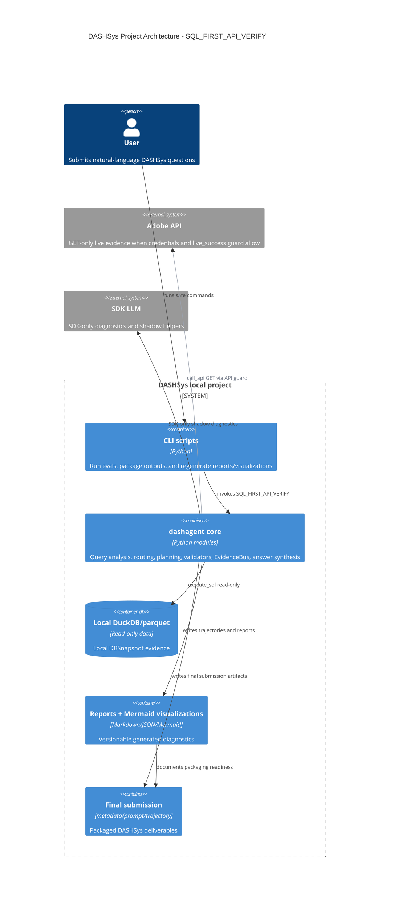

# Project Architecture C4

Generated: 2026-05-25T20:45:23Z

This generated Mermaid diagram is synchronized from current local reports and code/module names only. It does not change runtime behavior.

- Packaged strategy: `SQL_FIRST_API_VERIFY`
- live_success guard: `allowed_full_live_diagnostic_eval`

