# Primary Prompt Storyboard: example_031

## How To Read This Page

1. Start from the raw prompt card.
2. Follow the arrows/cards to see how DASHSys transforms prompt, data, and evidence.
3. Use badges to distinguish packaged, shadow, default-off, diagnostic, and blocked techniques.

## Primary Testing Prompt

> **example_011**
>
> # How many schemas do I have?
>
> Chosen because it shows the real submit-ready/not-winner-ready gap: API selection is correct, but dry-run answer evidence is incomplete.

## Bottleneck Snapshot

| Metric | Value | Note |
| --- | --- | --- |
| **API score** | `1.0` | The selected API call is scored as correct. |
| **Answer score** | `0.5396` | The final answer is weak because live file payload is unavailable. |
| **Main bottleneck** | `SQL provides the answer source; API verification is dry-run/unavailable in the packaged trace.` | No file list can be safely stated from dry-run evidence. |
| **Dry-run status** | `Live/API evidence available.` | Credentials were not available for live API payloads. |

## Storyboard Flow

```mermaid
flowchart LR
  S0["Raw prompt"]
  S1["Prompt router view"]
  S0 --> S1
  S2["Simple-prompt gate"]
  S1 --> S2
  S3["Normalized query"]
  S2 --> S3
  S4["Tokens/entities/domains"]
  S3 --> S4
  S5["Query analysis"]
  S4 --> S5
  S6["Lookup path / route intent"]
  S5 --> S6
  S7["Context card"]
  S6 --> S7
  S8["Selected plan"]
  S7 --> S8
  S9["Evidence objects"]
  S8 --> S9
  S10["Answer slots / intent"]
  S9 --> S10
  S11["Verified final answer"]
  S10 --> S11
```

## Visual Step Cards

### ▣ 1. Raw prompt

**Payload:** How many schemas do I have?
**Technique:** `raw user query capture`
**What changed:** Original test prompt enters the packaged SQL_FIRST_API_VERIFY path.
**Primary impact:** observability

### ▣ 2. Prompt router view

**Payload:** confidence=0.84; reason=Local snapshot keyword(s) can be answered from DuckDB/par...
**Technique:** `prompt_router`
**What changed:** Recognizes the prompt as a schema count/data question.
**Primary impact:** accuracy

### ▣ 3. Simple-prompt gate

**Payload:** confidence=0.84; is_simple=False; suggested_action=USE_DATA_PIPELINE; reason=Local snapshot keyword(s) can be answered from DuckDB/par...
**Technique:** `simple_prompt_gate`
**What changed:** Sends the prompt into the evidence pipeline rather than a direct answer.
**Primary impact:** safety

### ▣ 4. Normalized query

**Payload:** normalized_query=How many schemas do I have?; matching_text=how many schema do i have?
**Technique:** `query_normalizer`
**What changed:** Creates matching-friendly text while preserving original wording.
**Primary impact:** accuracy

### ▣ 5. Tokens/entities/domains

**Payload:** domains=1 item(s)
**Technique:** `query_tokens`
**What changed:** Extracts schema/count intent for routing and SQL generation.
**Primary impact:** accuracy

### ▣ 6. Query analysis

**Payload:** strategy=SQL_FIRST_API_VERIFY; route_type=SQL_ONLY; domain_type=DATASET_SCHEMA; answer_family=schema_dataset
**Technique:** `query_analysis`
**What changed:** Classifies the route and answer family for schema counting.
**Primary impact:** accuracy

### ▣ 7. Lookup path / route intent

**Payload:** api_mode=required
**Technique:** `lookup_path`
**What changed:** Narrows to schema tables and schema API verification options.
**Primary impact:** accuracy

### ▣ 8. Context card

**Payload:** estimated_metadata_tokens=490; prompt_tokens=1072; selected_apis=1 item(s); selected_card_name=schema_dataset
**Technique:** `metadata_selector + context_cards`
**What changed:** Packs the endpoint catalog/context into metadata and prompt budget.
**Primary impact:** efficiency

### ▣ 9. Selected plan

**Payload:** selected_plan=generic_sql_first
**Technique:** `planner + plan_ensemble`
**What changed:** Selects a SQL-first plan with dry-run API verification.
**Primary impact:** efficiency

### ▣ 10. Evidence objects

**Payload:** sql_calls_executed=1; api_calls_executed=1
**Technique:** `executor + evidence_bus`
**What changed:** Executes SQL for the answer count and records dry-run API verification.
**Primary impact:** safety

### ▣ 11. Answer slots / intent

**Payload:** answer_intent=COUNT
**Technique:** `answer_slots`
**What changed:** Maps SQL count evidence into COUNT answer intent.
**Primary impact:** accuracy

### ▣ 12. Verified final answer

**Payload:** verifier_passed=True
**Technique:** `answer_verifier + answer_reranker`
**What changed:** Verifies the SQL-grounded count and preserves dry-run honesty.
**Primary impact:** safety

## Final Answer

> You have 74 schemas. This count comes from your blueprint query and is confirmed by the API response from Adobe Schema Registry, which shows tenant schemas are available.
