# Prompt Transformation: example_031

## How To Read This Page

1. Start from the raw prompt card.
2. Follow the arrows/cards to see how DASHSys transforms prompt, data, and evidence.
3. Use badges to distinguish packaged, shadow, default-off, diagnostic, and blocked techniques.

## Primary Testing Prompt

> **example_031**
>
> # Which files are available for download in batch 69de8a0e0cc6102b5d11f01e?
>
> Representative API-correct but answer-weak dry-run row: endpoint selection is correct, but live payload is unavailable.

## Transformation Lineage

```mermaid
flowchart LR
  S0["Raw prompt"]
  S1["Prompt router view"]
  S0 --> S1
  S2["Simple-prompt gate"]
  S1 --> S2
  S3["Normalized query"]
  S2 --> S3
  S4["Tokens/entities/domains"]
  S3 --> S4
  S5["Query analysis"]
  S4 --> S5
  S6["Lookup path / route intent"]
  S5 --> S6
  S7["Context card"]
  S6 --> S7
  S8["Selected plan"]
  S7 --> S8
  S9["Evidence objects"]
  S8 --> S9
  S10["Answer slots / intent"]
  S9 --> S10
  S11["Verified final answer"]
  S10 --> S11
```

## Before → After Panels

### Raw → normalized

| Before | After | Technique | Impact |
| --- | --- | --- | --- |
| Which files are available for download in batch 69de8a0e0cc6102b5d11f01e? | normalized_query=Which files are available for download in batch 69de8a0e0...; matching_text=which file are available for download in batch 69de8a0e0c... | query_normalizer | accuracy + observability |

### Normalized → tokens/entities

| Before | After | Technique | Impact |
| --- | --- | --- | --- |
| normalized_query=Which files are available for download in batch 69de8a0e0...; matching_text=which file are available for download in batch 69de8a0e0c... | ids=1; domains=2 item(s) | query_tokens | accuracy |

### Tokens/entities → query analysis

| Before | After | Technique | Impact |
| --- | --- | --- | --- |
| ids=1; domains=2 item(s) | strategy=SQL_FIRST_API_VERIFY; route_type=API_ONLY; domain_type=UNKNOWN; answer_family=batch | query_analysis | accuracy |

### Analysis → context card

| Before | After | Technique | Impact |
| --- | --- | --- | --- |
| analysis=strategy=SQL_FIRST_API_VERIFY; route_type=API_ONLY; domai...; lookup=api_mode=required | estimated_metadata_tokens=1000; prompt_tokens=1673; selected_apis=1 item(s); selected_card_name=batch | metadata_selector + context cards | accuracy + efficiency |

### Context → selected plan

| Before | After | Technique | Impact |
| --- | --- | --- | --- |
| estimated_metadata_tokens=1000; prompt_tokens=1673; selected_apis=1 item(s); selected_card_name=batch | selected_plan=generic_sql_first | planner + plan_ensemble | efficiency + safety |

### Plan → evidence

| Before | After | Technique | Impact |
| --- | --- | --- | --- |
| selected_plan=generic_sql_first | sql_calls_executed=0; api_calls_executed=1 | executor + API validator | safety |

### Evidence → final answer

| Before | After | Technique | Impact |
| --- | --- | --- | --- |
| evidence=sql_calls_executed=0; api_calls_executed=1; slots=answer_intent=LIST | answer_length=127; final_answer=Batch file details require live API evidence. Live API ve... | answer slots + verifier | accuracy + safety |
