# Prompt Transformation: example_011

## How To Read This Page

1. Start from the raw prompt card.
2. Follow the arrows/cards to see how DASHSys transforms prompt, data, and evidence.
3. Use badges to distinguish packaged, shadow, default-off, diagnostic, and blocked techniques.

## Primary Testing Prompt

> **example_011**
>
> # How many schemas do I have?
>
> Primary SQL-backed packaged walkthrough: the prompt becomes validated SQL, SQL returns the answer count, and API verification remains dry-run/unavailable.

## Transformation Lineage

```mermaid
flowchart LR
  S0["Raw prompt"]
  S1["Prompt router view"]
  S0 --> S1
  S2["Simple-prompt gate"]
  S1 --> S2
  S3["Normalized query"]
  S2 --> S3
  S4["Tokens/entities/domains"]
  S3 --> S4
  S5["Query analysis"]
  S4 --> S5
  S6["Lookup path / route intent"]
  S5 --> S6
  S7["Context card"]
  S6 --> S7
  S8["Selected plan"]
  S7 --> S8
  S9["Evidence objects"]
  S8 --> S9
  S10["Answer slots / intent"]
  S9 --> S10
  S11["Verified final answer"]
  S10 --> S11
```

## Before → After Panels

### Raw → normalized

| Before | After | Technique | Impact |
| --- | --- | --- | --- |
| How many schemas do I have? | normalized_query=How many schemas do I have?; matching_text=how many schema do i have? | query_normalizer | accuracy + observability |

### Normalized → tokens/entities

| Before | After | Technique | Impact |
| --- | --- | --- | --- |
| normalized_query=How many schemas do I have?; matching_text=how many schema do i have? | domains=1 item(s) | query_tokens | accuracy |

### Tokens/entities → query analysis

| Before | After | Technique | Impact |
| --- | --- | --- | --- |
| domains=1 item(s) | strategy=SQL_FIRST_API_VERIFY; route_type=SQL_ONLY; domain_type=DATASET_SCHEMA; answer_family=schema_dataset | query_analysis | accuracy |

### Analysis → context card

| Before | After | Technique | Impact |
| --- | --- | --- | --- |
| analysis=strategy=SQL_FIRST_API_VERIFY; route_type=SQL_ONLY; domai...; lookup=api_mode=required | estimated_metadata_tokens=451; prompt_tokens=1032; selected_apis=1 item(s); selected_card_name=schema_dataset | metadata_selector + context cards | accuracy + efficiency |

### Context → selected plan

| Before | After | Technique | Impact |
| --- | --- | --- | --- |
| estimated_metadata_tokens=451; prompt_tokens=1032; selected_apis=1 item(s); selected_card_name=schema_dataset | selected_plan=generic_sql_first | planner + plan_ensemble | efficiency + safety |

### Plan → evidence

| Before | After | Technique | Impact |
| --- | --- | --- | --- |
| selected_plan=generic_sql_first | sql_calls_executed=1; api_calls_executed=1 | executor + API validator | safety |

### Evidence → final answer

| Before | After | Technique | Impact |
| --- | --- | --- | --- |
| evidence=sql_calls_executed=1; api_calls_executed=1; slots=answer_intent=COUNT | answer_length=102; final_answer=You have 74 schemas. Live API verification was not execut... | answer slots + verifier | accuracy + safety |
