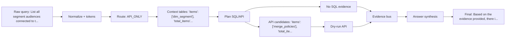

# Query Dataflow: example_003

## Query Summary

| Field | Value |
| --- | --- |
| Query | List all segment audiences connected to the destination named 'SMS Opt-In', showing audienceId, name, totalProfiles, createdTime, updatedTime, and used in other audience count for each audience. Remove any row limit from the results. |
| Current packaged strategy | SQL_FIRST_API_VERIFY |
| Final answer | Based on the evidence provided, there is no data available to answer this question. The SQL query returned zero rows, and live API verification was not executed because Adobe credentials are unavailable, so audience and flow service evidence could not be checked. |
| Strict score | 0.716 |
| Correctness score | 0.7668 |
| Answer / SQL / API score | 0.3559 / 0.9 / 1.0 |
| Tools / tokens / runtime | 3 / 1571 / 0.04420170793309808 |

## Dataflow Graph

## Checkpoint Timeline

| # | Checkpoint | Stage | Technique | Input | Output | What changed | Accuracy | Efficiency | Safety |
| --- | --- | --- | --- | --- | --- | --- | --- | --- | --- |
| 1 | checkpoint_01_raw_query | input | raw user query capture | unavailable | query=List all segment audiences connected to the destination n...; query_id=example_003; strategy=SQL_FIRST_API_VERIFY | preserves the original query for reproducibility | yes | yes | no |
| 2 | checkpoint_00_prompt_router | prompt routing | LLM_DIRECT / LOCAL_DB_ONLY / SQL_PLUS_API / API_ONLY routing policy | query=List all segment audiences connected to the destination n... | confidence=0.9; reason=API/platform family keyword(s): file, files. | chooses whether the prompt can be answered directly or needs SQL/API evidence | yes | yes | no |
| 3 | checkpoint_simple_prompt_gate | input routing | simple prompt gate | query=List all segment audiences connected to the destination n... | confidence=0.9; is_simple=False; suggested_action=USE_DATA_PIPELINE; reason=API/platform family keyword(s): file, files. | lets an LLM wrapper answer conceptual questions directly while sending evidence questions to the backend | yes | yes | no |
| 4 | checkpoint_02_query_normalization | normalization | data cleaning / query normalization | query=List all segment audiences connected to the destination n... | matching_text=list all segment connected to the destination named 'sms...; normalized_query=List all segments connected to the destination named 'SMS...; rewrites=2 item(s) | creates matching-friendly text while preserving the original query | yes | yes | no |
| 5 | checkpoint_03_query_tokens | tokenization | domain-aware tokenization/entity extraction | normalized_query=List all segments connected to the destination named 'SMS... | domains=4 item(s); quoted_entities=1 item(s) | extracts reusable query fields for routing, planning, and answers | yes | yes | no |
| 6 | checkpoint_04_relevance_scoring | context selection | attention-style relevance scoring | tokens=2 field(s) | top_answer_families=1 item(s); top_apis=3 item(s); top_join_hints=3 item(s); top_tables=3 item(s) | selects a smaller, more relevant schema/API context | yes | yes | no |
| 7 | checkpoint_value_entity_retrieval | query understanding | CHESS-style value/entity retrieval | query_values=1 item(s) | active=True; cache_hit=True; cache_key=573ae10238226eac; cache_key_algorithm=sha256 | grounds query entities against sampled local DB values before planning | yes | yes | no |
| 8 | checkpoint_query_decomposition | query understanding | DIN-SQL-style deterministic query decomposition | query=List all segment audiences connected to the destination n... | active=True; expected_answer_shape=scalar_count; required_aggregations=1 item(s); required_entities=1 item(s) | breaks complex prompts into entities, filters, joins, and answer-shape constraints | yes | yes | no |
| 9 | checkpoint_05_query_analysis | routing | branch prediction / QueryAnalysis | route_type=SQL_ONLY; domain_type=SEGMENT_AUDIENCE | strategy=SQL_FIRST_API_VERIFY; route_type=SQL_ONLY; domain_type=SEGMENT_AUDIENCE; answer_family=segment_destination | computes shared query understanding once | yes | yes | no |
| 10 | checkpoint_06_lookup_path | path prediction | TLB-style lookup path prediction | domain_type=SEGMENT_AUDIENCE; answer_family=segment_destination | api_families=2 item(s); api_mode=optional; family=segment_destination; join_path=2 item(s) | predicts the relevant table/join/API path | yes | yes | no |
| 11 | checkpoint_07_context_card | metadata packing | huge-page-style compact context card | lookup_path=segment_destination | estimated_metadata_tokens=1022; prompt_tokens=1694; selected_apis=2 item(s); selected_card_name=segment_destination | packs family-relevant context into metadata.json and the filled prompt | yes | yes | no |
| 12 | checkpoint_08_candidate_plans | planning | pre-execution plan ensemble | strategy=SQL_FIRST_API_VERIFY; base_step_count=3 | candidate_plan_names=1 item(s); reason_selected=highest pre-execution validation/relevance/cost score; scores=1 field(s); selected_plan=generic_sql_first | selects one plan before execution | yes | yes | no |
| 13 | checkpoint_09_plan_optimization | optimization | compiler-style plan optimization | original_step_count=3 | optimized_step_count=3 | removes duplicate, skippable, or unsafe calls before validation | yes | yes | no |
| 14 | checkpoint_10_evidence_policy | evidence policy | API_REQUIRED/API_OPTIONAL/API_SKIP policy | route_type=SQL_ONLY; answer_family=segment_destination | reason=Known multi-call verification family. | decides when API evidence is required, optional, or unnecessary | yes | yes | no |
| 15 | checkpoint_11_call_budget | efficiency control | tool-call budgeting | preview={"planned_steps": {"items": [{"action": "sql", "purpose":...; truncated=True | planned_sql_calls=1; planned_api_calls=2; final_planned_calls=3; max_total_tool_calls=3 | keeps tool calls within per-family limits | yes | yes | no |
| 16 | checkpoint_gated_sql_candidate_selection | planning | hard-case gated SQL candidate validation | trigger_reasons=2 item(s) | preview={"active": true, "hard_case_triggered": true, "trigger_re...; truncated=True | validates hard-case SQL candidates before execution without executing losing candidates | yes | yes | yes |
| 17 | checkpoint_12_validation | validation | SQL/API safety validation | preview={"optimized_steps": {"items": [{"action": "sql", "purpose...; truncated=True | api_validation_status=2 item(s); sql_validation_status=1 item(s) | records whether planned SQL/API calls were safe to execute | yes | yes | yes |
| 18 | checkpoint_sql_ast_validation | validation | SQLGlot AST-based SQL validation and extraction | sql_call_count=1 | preview={"summaries": {"items": [{"enabled": true, "parsed_ok": t...; truncated=True | adds AST-level table and column extraction after existing SQL validation | yes | yes | yes |
| 19 | checkpoint_13_tool_execution | execution | SQL/API tool execution | validated_step_count=3 | preview={"sql_calls_executed": 1, "api_calls_executed": 2, "dry_r...; truncated=True | captures the actual SQL/API evidence gathered by the backend | yes | yes | no |
| 20 | checkpoint_14_evidence_bus | evidence forwarding | operand forwarding / EvidenceBus | tool_result_count=3 | {} | forwards structured facts to API params and answer slots | yes | yes | no |
| 21 | checkpoint_15_answer_slots | answer synthesis | structured answer slot extraction | tool_result_count=3 | answer_intent=WHEN; discrepancy_flags=1 field(s); dry_run_flags=1 field(s); missing_slots=1 item(s) | turns raw tool results into typed evidence fields | yes | yes | no |
| 22 | checkpoint_16_answer_verification | answer verification | claim verification / groundedness checking | claim_count=2; slots_present=3 item(s) | verifier_passed=True; rewrite_applied=False | checks final-answer claims against SQL/API evidence | yes | yes | no |
| 23 | checkpoint_17_answer_reranking | answer selection | deterministic answer reranking | answer_family=segment_destination | candidate_count=0; selected_candidate_type=base | selects the safest answer from same-evidence candidates | yes | yes | no |
| 24 | checkpoint_18_final_answer | final response | concise grounded final response | verifier_passed=True | answer_length=263; final_answer=Based on the evidence provided, there is no data availabl... | returns the final concise answer to the agent harness | yes | yes | no |
| 25 | checkpoint_official_token_reduction | query understanding | unavailable | unavailable | unavailable | Checkpoint recorded query understanding progress. | no | no | no |

## Evidence Table

| Evidence | Used/status | Source | Preview |
| --- | --- | --- | --- |
| SQL evidence | no | SELECT A."SEGMENTID" AS segment_id, A."NAME" AS segment_name, A."TOTALMEMBERS" AS total_profiles, A."CREATEDTIME" AS created_time, A."UPDATEDTIME" AS updated_time FROM "dim_segment" AS A JOIN "hkg_br_segment_target" AS AD ON A."SEGMENTID" = AD."SEGMENTID" JOIN "dim_target" AS D ON AD."TARGETID" = D."TARGETID" WHERE D."DATAFLOWNAME" = 'SMS Opt-In' OR D."NAME" = 'SMS Opt-In' ORDER BY A."NAME" | n/a - no SQL rows preview recorded |
| API evidence | dry-run | GET /data/core/ups/audiences | n/a - no API result preview recorded |
| Local Parquet evidence | yes | unavailable | query=List all segment audiences connected to the destination n...; query_id=example_003 |
| Dry-run label | yes | API dry-run result label | API tool was invoked and validated, but live evidence was unavailable because Adobe credentials were missing. |
| Unsupported claims replaced | no | supportable_answer_rewrite_eval | unavailable |

## Decision Table

| Decision | Selected value | Reason | Promotion status |
| --- | --- | --- | --- |
| Why SQL was used | SQL calls=1 | API_ONLY | promoted_default |
| Why API was used or skipped | API calls=2; dry_run=True | n/a - no API policy recorded | promoted_default |
| Answer template / rewriter | packaged answer synthesizer | No default-on answer rewrite promoted. | promoted_default + shadow_only diagnostics |
| Endpoint family changed? | unavailable | no_validated_replacement_endpoint_candidate | shadow_only |
| Candidate promoted? | unavailable | No promoted candidate for packaged path. | shadow_only / isolated_trial |
