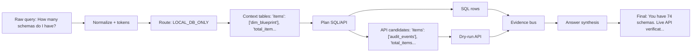

# Query Dataflow: example_011

## Query Summary

| Field | Value |
| --- | --- |
| Query | How many schemas do I have? |
| Current packaged strategy | SQL_FIRST_API_VERIFY |
| Final answer | You have 74 schemas. Live API verification was not executed because Adobe credentials are unavailable. |
| Strict score | 0.7462 |
| Correctness score | 0.7774 |
| Answer / SQL / API score | 0.3915 / 0.9 / 1.0 |
| Tools / tokens / runtime | 2 / 751 / 0.010836665984243155 |

## Dataflow Graph

## Checkpoint Timeline

| # | Checkpoint | Stage | Technique | Input | Output | What changed | Accuracy | Efficiency | Safety |
| --- | --- | --- | --- | --- | --- | --- | --- | --- | --- |
| 1 | checkpoint_01_raw_query | input | raw user query capture | unavailable | query=How many schemas do I have?; query_id=example_011; strategy=SQL_FIRST_API_VERIFY | preserves the original query for reproducibility | yes | yes | no |
| 2 | checkpoint_00_prompt_router | prompt routing | LLM_DIRECT / LOCAL_DB_ONLY / SQL_PLUS_API / API_ONLY routing policy | query=How many schemas do I have? | confidence=0.84; reason=Local snapshot keyword(s) can be answered from DuckDB/par... | chooses whether the prompt can be answered directly or needs SQL/API evidence | yes | yes | no |
| 3 | checkpoint_simple_prompt_gate | input routing | simple prompt gate | query=How many schemas do I have? | confidence=0.84; is_simple=False; suggested_action=USE_DATA_PIPELINE; reason=Local snapshot keyword(s) can be answered from DuckDB/par... | lets an LLM wrapper answer conceptual questions directly while sending evidence questions to the backend | yes | yes | no |
| 4 | checkpoint_02_query_normalization | normalization | data cleaning / query normalization | query=How many schemas do I have? | matching_text=how many schema do i have?; normalized_query=How many schemas do I have?; rewrites=1 item(s) | creates matching-friendly text while preserving the original query | yes | yes | no |
| 5 | checkpoint_03_query_tokens | tokenization | domain-aware tokenization/entity extraction | normalized_query=How many schemas do I have? | domains=1 item(s) | extracts reusable query fields for routing, planning, and answers | yes | yes | no |
| 6 | checkpoint_04_relevance_scoring | context selection | attention-style relevance scoring | tokens=1 field(s) | top_answer_families=1 item(s); top_apis=3 item(s); top_join_hints=3 item(s); top_tables=3 item(s) | selects a smaller, more relevant schema/API context | yes | yes | no |
| 7 | checkpoint_05_query_analysis | routing | branch prediction / QueryAnalysis | route_type=SQL_ONLY; domain_type=DATASET_SCHEMA | strategy=SQL_FIRST_API_VERIFY; route_type=SQL_ONLY; domain_type=DATASET_SCHEMA; answer_family=schema_dataset | computes shared query understanding once | yes | yes | no |
| 8 | checkpoint_06_lookup_path | path prediction | TLB-style lookup path prediction | domain_type=DATASET_SCHEMA; answer_family=schema_dataset | api_families=4 item(s); api_mode=required; family=schema_dataset; join_path=2 item(s) | predicts the relevant table/join/API path | yes | yes | no |
| 9 | checkpoint_07_context_card | metadata packing | huge-page-style compact context card | lookup_path=schema_dataset | estimated_metadata_tokens=451; prompt_tokens=1032; selected_apis=1 item(s); selected_card_name=schema_dataset | packs family-relevant context into metadata.json and the filled prompt | yes | yes | no |
| 10 | checkpoint_08_candidate_plans | planning | pre-execution plan ensemble | strategy=SQL_FIRST_API_VERIFY; base_step_count=2 | candidate_plan_names=1 item(s); reason_selected=highest pre-execution validation/relevance/cost score; scores=1 field(s); selected_plan=generic_sql_first | selects one plan before execution | yes | yes | no |
| 11 | checkpoint_09_plan_optimization | optimization | compiler-style plan optimization | original_step_count=2 | optimized_step_count=2 | removes duplicate, skippable, or unsafe calls before validation | yes | yes | no |
| 12 | checkpoint_10_evidence_policy | evidence policy | API_REQUIRED/API_OPTIONAL/API_SKIP policy | route_type=SQL_ONLY; answer_family=schema_dataset | reason=Query family requires Adobe API evidence. | decides when API evidence is required, optional, or unnecessary | yes | yes | no |
| 13 | checkpoint_11_call_budget | efficiency control | tool-call budgeting | planned_steps=2 item(s) | planned_sql_calls=1; planned_api_calls=1; final_planned_calls=2; max_total_tool_calls=2 | keeps tool calls within per-family limits | yes | yes | no |
| 14 | checkpoint_12_validation | validation | SQL/API safety validation | optimized_steps=2 item(s) | api_validation_status=1 item(s); sql_validation_status=1 item(s) | records whether planned SQL/API calls were safe to execute | yes | yes | yes |
| 15 | checkpoint_sql_ast_validation | validation | SQLGlot AST-based SQL validation and extraction | sql_call_count=1 | destructive_sql_detected=False; parsed_ok=True; selected_columns=1 item(s); selected_tables=1 item(s) | adds AST-level table and column extraction after existing SQL validation | yes | yes | yes |
| 16 | checkpoint_13_tool_execution | execution | SQL/API tool execution | validated_step_count=2 | sql_calls_executed=1; api_calls_executed=1 | captures the actual SQL/API evidence gathered by the backend | yes | yes | no |
| 17 | checkpoint_14_evidence_bus | evidence forwarding | operand forwarding / EvidenceBus | tool_result_count=2 | evidence=1 field(s) | forwards structured facts to API params and answer slots | yes | yes | no |
| 18 | checkpoint_15_answer_slots | answer synthesis | structured answer slot extraction | tool_result_count=2 | answer_intent=COUNT; discrepancy_flags=1 field(s); dry_run_flags=1 field(s); missing_slots=1 item(s) | turns raw tool results into typed evidence fields | yes | yes | no |
| 19 | checkpoint_16_answer_verification | answer verification | claim verification / groundedness checking | claim_count=1; slots_present=4 item(s) | verifier_passed=True; rewrite_applied=False | checks final-answer claims against SQL/API evidence | yes | yes | no |
| 20 | checkpoint_17_answer_reranking | answer selection | deterministic answer reranking | answer_family=schema_dataset | candidate_count=0; selected_candidate_type=base | selects the safest answer from same-evidence candidates | yes | yes | no |
| 21 | checkpoint_18_final_answer | final response | concise grounded final response | verifier_passed=True | answer_length=102; final_answer=You have 74 schemas. Live API verification was not execut... | returns the final concise answer to the agent harness | yes | yes | no |
| 22 | checkpoint_official_token_reduction | query understanding | unavailable | unavailable | unavailable | Checkpoint recorded query understanding progress. | no | no | no |

## Evidence Table

| Evidence | Used/status | Source | Preview |
| --- | --- | --- | --- |
| SQL evidence | yes | SELECT COUNT(DISTINCT B."BLUEPRINTID") AS blueprint_count FROM "dim_blueprint" AS B | {"items": {"items": [{"blueprint_count": 74}], "total_items": 1, "truncated_items": false}, "total_items": 1, "truncated_items": false} |
| API evidence | dry-run | GET /schemas | n/a - no API result preview recorded |
| Local Parquet evidence | yes | unavailable | query=How many schemas do I have?; query_id=example_011 |
| Dry-run label | yes | API dry-run result label | SQL evidence is available. API tool was invoked and validated, but live API evidence was unavailable because Adobe credentials were missing. |
| Unsupported claims replaced | no | supportable_answer_rewrite_eval | unavailable |

## Decision Table

| Decision | Selected value | Reason | Promotion status |
| --- | --- | --- | --- |
| Why SQL was used | SQL calls=1 | LOCAL_DB_ONLY | promoted_default |
| Why API was used or skipped | API calls=1; dry_run=True | n/a - no API policy recorded | promoted_default |
| Answer template / rewriter | packaged answer synthesizer | No default-on answer rewrite promoted. | promoted_default + shadow_only diagnostics |
| Endpoint family changed? | unavailable | no_family_divergence | shadow_only |
| Candidate promoted? | unavailable | No promoted candidate for packaged path. | shadow_only / isolated_trial |
