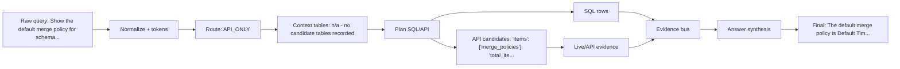

# Query Dataflow: example_021

## Query Summary

| Field | Value |
| --- | --- |
| Query | Show the default merge policy for schema class '_xdm.context.profile'. |
| Current packaged strategy | SQL_FIRST_API_VERIFY |
| Final answer | The default merge policy is Default Timebased. This is based on live merge-policy API evidence. |
| Strict score | 0.5388 |
| Correctness score | 0.5579 |
| Answer / SQL / API score | 0.1157 / None / 1.0 |
| Tools / tokens / runtime | 1 / 650 / 0.3314867499284446 |

## Dataflow Graph

## Checkpoint Timeline

| # | Checkpoint | Stage | Technique | Input | Output | What changed | Accuracy | Efficiency | Safety |
| --- | --- | --- | --- | --- | --- | --- | --- | --- | --- |
| 1 | checkpoint_01_raw_query | input | raw user query capture | unavailable | query=Show the default merge policy for schema class '_xdm.cont...; query_id=example_021; strategy=SQL_FIRST_API_VERIFY | preserves the original query for reproducibility | yes | yes | no |
| 2 | checkpoint_00_prompt_router | prompt routing | LLM_DIRECT / LOCAL_DB_ONLY / SQL_PLUS_API / API_ONLY routing policy | query=Show the default merge policy for schema class '_xdm.cont... | confidence=0.9; reason=API/platform family keyword(s): file, merge policy. | chooses whether the prompt can be answered directly or needs SQL/API evidence | yes | yes | no |
| 3 | checkpoint_simple_prompt_gate | input routing | simple prompt gate | query=Show the default merge policy for schema class '_xdm.cont... | confidence=0.9; is_simple=False; suggested_action=USE_DATA_PIPELINE; reason=API/platform family keyword(s): file, merge policy. | lets an LLM wrapper answer conceptual questions directly while sending evidence questions to the backend | yes | yes | no |
| 4 | checkpoint_02_query_normalization | normalization | data cleaning / query normalization | query=Show the default merge policy for schema class '_xdm.cont... | matching_text=show the default merge policy for schema class '_xdm.cont...; normalized_query=Show the default merge policy for schema class '_xdm.cont... | creates matching-friendly text while preserving the original query | yes | yes | no |
| 5 | checkpoint_03_query_tokens | tokenization | domain-aware tokenization/entity extraction | normalized_query=Show the default merge policy for schema class '_xdm.cont... | domains=4 item(s); field_paths=1 item(s); quoted_entities=1 item(s) | extracts reusable query fields for routing, planning, and answers | yes | yes | no |
| 6 | checkpoint_04_relevance_scoring | context selection | attention-style relevance scoring | tokens=3 field(s) | top_answer_families=2 item(s); top_apis=3 item(s) | selects a smaller, more relevant schema/API context | yes | yes | no |
| 7 | checkpoint_value_entity_retrieval | query understanding | CHESS-style value/entity retrieval | query_values=1 item(s) | active=True; cache_hit=True; cache_key=a2f6025ad4340fb6; cache_key_algorithm=sha256 | grounds query entities against sampled local DB values before planning | yes | yes | no |
| 8 | checkpoint_query_decomposition | query understanding | DIN-SQL-style deterministic query decomposition | query=Show the default merge policy for schema class '_xdm.cont... | active=True; expected_answer_shape=table_or_list; required_entities=1 item(s); sub_questions=1 item(s) | breaks complex prompts into entities, filters, joins, and answer-shape constraints | yes | yes | no |
| 9 | checkpoint_05_query_analysis | routing | branch prediction / QueryAnalysis | route_type=API_ONLY; domain_type=SEGMENT_AUDIENCE | strategy=SQL_FIRST_API_VERIFY; route_type=API_ONLY; domain_type=SEGMENT_AUDIENCE; answer_family=merge_policy | computes shared query understanding once | yes | yes | no |
| 10 | checkpoint_06_lookup_path | path prediction | TLB-style lookup path prediction | domain_type=SEGMENT_AUDIENCE; answer_family=merge_policy | api_families=1 item(s); api_mode=required; family=merge_policy; required_ids=1 item(s) | predicts the relevant table/join/API path | yes | yes | no |
| 11 | checkpoint_07_context_card | metadata packing | huge-page-style compact context card | lookup_path=merge_policy | estimated_metadata_tokens=885; prompt_tokens=1538; selected_apis=2 item(s); selected_card_name=merge_policy | packs family-relevant context into metadata.json and the filled prompt | yes | yes | no |
| 12 | checkpoint_08_candidate_plans | planning | pre-execution plan ensemble | strategy=SQL_FIRST_API_VERIFY; base_step_count=1 | candidate_plan_names=1 item(s); reason_selected=highest pre-execution validation/relevance/cost score; scores=1 field(s); selected_plan=generic_sql_first | selects one plan before execution | yes | yes | no |
| 13 | checkpoint_09_plan_optimization | optimization | compiler-style plan optimization | original_step_count=1 | optimized_step_count=1 | removes duplicate, skippable, or unsafe calls before validation | yes | yes | no |
| 14 | checkpoint_10_evidence_policy | evidence policy | API_REQUIRED/API_OPTIONAL/API_SKIP policy | route_type=API_ONLY; answer_family=merge_policy | reason=Merge policies are Adobe API objects. | decides when API evidence is required, optional, or unnecessary | yes | yes | no |
| 15 | checkpoint_11_call_budget | efficiency control | tool-call budgeting | planned_steps=1 item(s) | planned_sql_calls=0; planned_api_calls=1; final_planned_calls=1; max_total_tool_calls=2 | keeps tool calls within per-family limits | yes | yes | no |
| 16 | checkpoint_12_validation | validation | SQL/API safety validation | optimized_steps=1 item(s) | api_validation_status=1 item(s) | records whether planned SQL/API calls were safe to execute | yes | yes | yes |
| 17 | checkpoint_13_tool_execution | execution | SQL/API tool execution | validated_step_count=1 | sql_calls_executed=0; api_calls_executed=1 | captures the actual SQL/API evidence gathered by the backend | yes | yes | no |
| 18 | checkpoint_14_evidence_bus | evidence forwarding | operand forwarding / EvidenceBus | tool_result_count=1 | evidence=9 field(s) | forwards structured facts to API params and answer slots | yes | yes | no |
| 19 | checkpoint_15_answer_slots | answer synthesis | structured answer slot extraction | tool_result_count=1 | answer_intent=DETAIL; discrepancy_flags=1 field(s); dry_run_flags=1 field(s); slots=9 field(s) | turns raw tool results into typed evidence fields | yes | yes | no |
| 20 | checkpoint_16_answer_verification | answer verification | claim verification / groundedness checking | claim_count=1; slots_present=10 item(s) | verifier_passed=True; rewrite_applied=False | checks final-answer claims against SQL/API evidence | yes | yes | no |
| 21 | checkpoint_17_answer_reranking | answer selection | deterministic answer reranking | answer_family=merge_policy | candidate_count=0; selected_candidate_type=base | selects the safest answer from same-evidence candidates | yes | yes | no |
| 22 | checkpoint_18_final_answer | final response | concise grounded final response | verifier_passed=True | answer_length=95; final_answer=The default merge policy is Default Timebased. This is ba... | returns the final concise answer to the agent harness | yes | yes | no |
| 23 | checkpoint_official_token_reduction | query understanding | unavailable | unavailable | unavailable | Checkpoint recorded query understanding progress. | no | no | no |

## Evidence Table

| Evidence | Used/status | Source | Preview |
| --- | --- | --- | --- |
| SQL evidence | n/a - no SQL call in trajectory | n/a - no SQL call in trajectory | n/a - no SQL rows preview recorded |
| API evidence | no | GET /data/core/ups/config/mergePolicies | n/a - no API result preview recorded |
| Local Parquet evidence | unavailable | unavailable | query=Show the default merge policy for schema class '_xdm.cont...; query_id=example_021 |
| Dry-run label | no | API dry-run result label | No successful evidence was available from executed tools. |
| Unsupported claims replaced | no | supportable_answer_rewrite_eval | unavailable |

## Decision Table

| Decision | Selected value | Reason | Promotion status |
| --- | --- | --- | --- |
| Why SQL was used | SQL calls=0 | API_ONLY | promoted_default |
| Why API was used or skipped | API calls=1; dry_run=False | n/a - no API policy recorded | promoted_default |
| Answer template / rewriter | packaged answer synthesizer | No default-on answer rewrite promoted. | promoted_default + shadow_only diagnostics |
| Endpoint family changed? | unavailable | no_validated_replacement_endpoint_candidate | shadow_only |
| Candidate promoted? | unavailable | No promoted candidate for packaged path. | shadow_only / isolated_trial |
