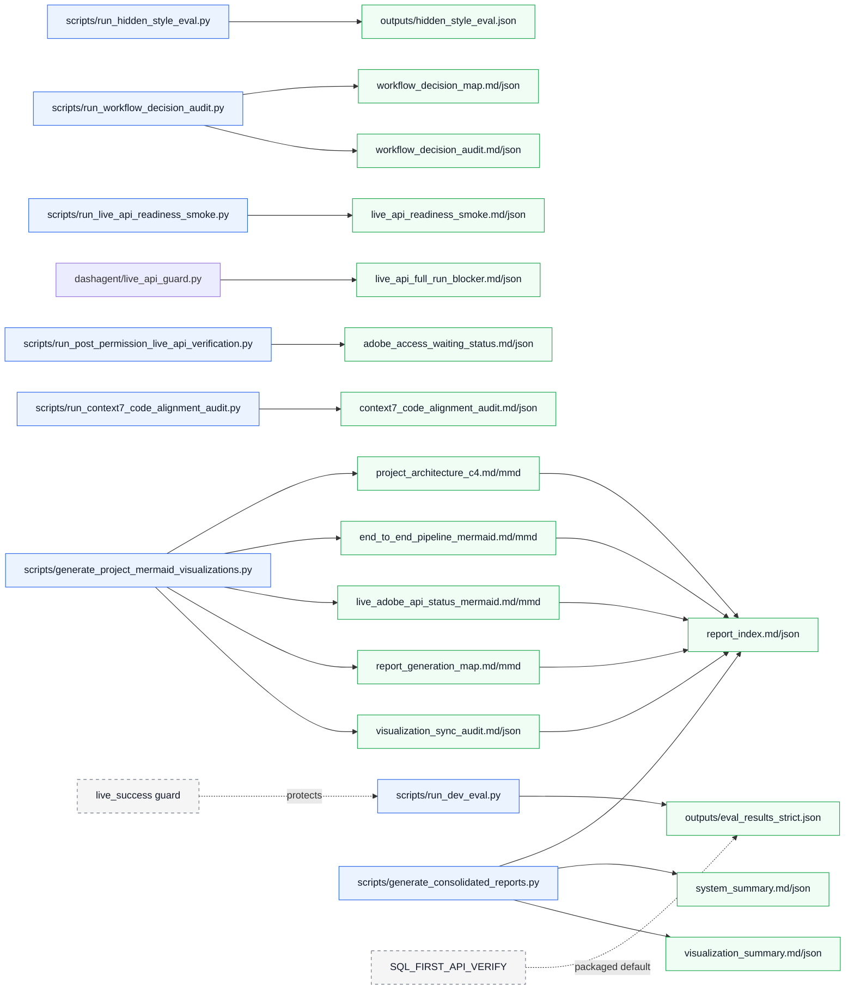

# Report Generation Map

Generated: 2026-05-18T12:30:10Z

This generated Mermaid diagram is synchronized from current local reports and code/module names only. It does not change runtime behavior.

- Packaged strategy: `SQL_FIRST_API_VERIFY`
- live_success guard: `blocked`

