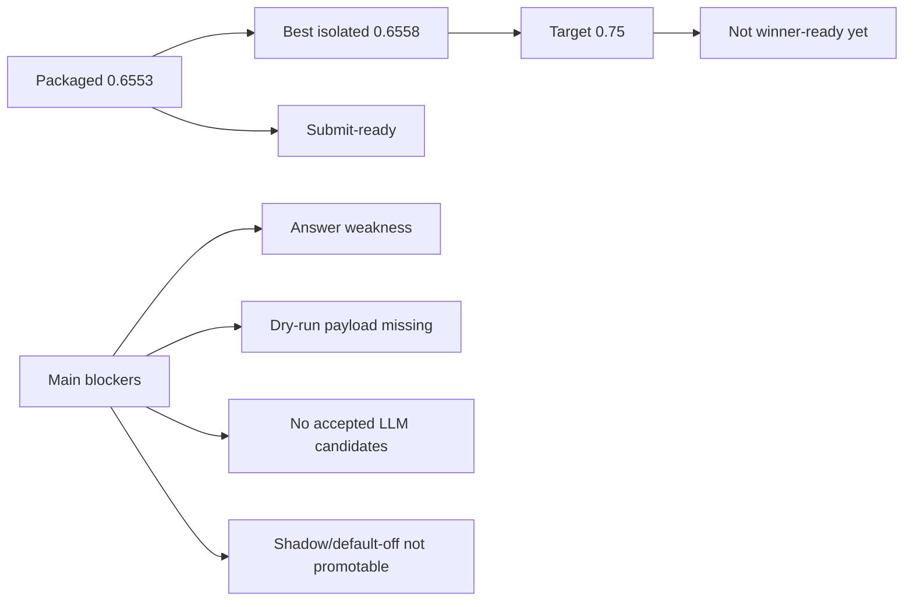

# Score Bottleneck Dashboard

## How To Read This Page

1. Start from the score gap card.
2. Follow the arrows/cards to see how DASHSys transforms prompt, data, and evidence.
3. Use badges to distinguish packaged, shadow, default-off, diagnostic, and blocked techniques.

## Primary Testing Prompt

> **example_011**
>
> # How many schemas do I have?
>
> Primary SQL-backed packaged walkthrough: the prompt becomes validated SQL, SQL returns the answer count, and API verification remains dry-run/unavailable.

## Score Gap Visual

## Current Score Cards

| Metric | Value | Note |
| --- | --- | --- |
| **Packaged strict score** | `0.6553` | Current submit-ready package. |
| **Best isolated score** | `0.6558` | Safe progress, below target. |
| **Target** | `0.75` | Winner-readiness target in this score-push thread. |
| **Primary walkthrough** | `example_011` | SQL-backed example used by the main visualization pages. |
| **Primary SQL/API distinction** | `SQL provides the answer source; API verification is dry-run/unavailable in the packaged trace.` | SQL provides the answer; API verification is dry-run/unavailable. |
| **Secondary API bottleneck** | `example_031` | Reference-only API/dry-run bottleneck example. |
| **Secondary API score** | `1.0` | Endpoint selection is correct for the API bottleneck row. |
| **Secondary answer score** | `0.3833` | Final answer is weak because live payload is unavailable. |

## Blocker Cards

| Metric | Value | Note |
| --- | --- | --- |
| **Answer-score bottleneck** | `example_031 API score=1.0, answer score=0.3833` | Dry-run API evidence lacks live payload, so files cannot be listed safely. |
| **Dry-run dependency** | `live credentials visible=False; dry-run rows=34` | The packaged path must not fabricate live API payload values. |
| **No accepted LLM candidates** | `accepted=0; candidates=6` | LLM rewrite search remains shadow-only and did not add a promoted candidate. |
| **Endpoint tie-break not promotable** | `trial eligible rows=0` | Tie-break v2 did not produce a safe positive trial set. |
| **Answer-shape v2 not promotable** | `recommendation=safe_for_answer_shape_v2_trial; projected=0.6497` | Answer-shape v2 remains default-off because gates did not justify promotion. |
| **Live credentials missing** | `credentials visible=False` | Live-readiness is diagnostic only and cannot change dry-run answers by itself. |

## Bottom Line

- The system is submit-ready because the packaged path is safe and readiness checks pass.
- It is not winner-ready because the packaged score remains below `0.75` and the remaining high-value fixes are blocked by evidence availability or promotion gates.
