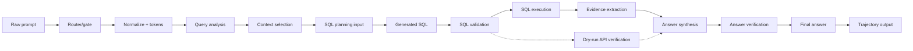
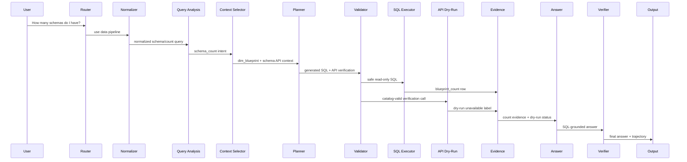
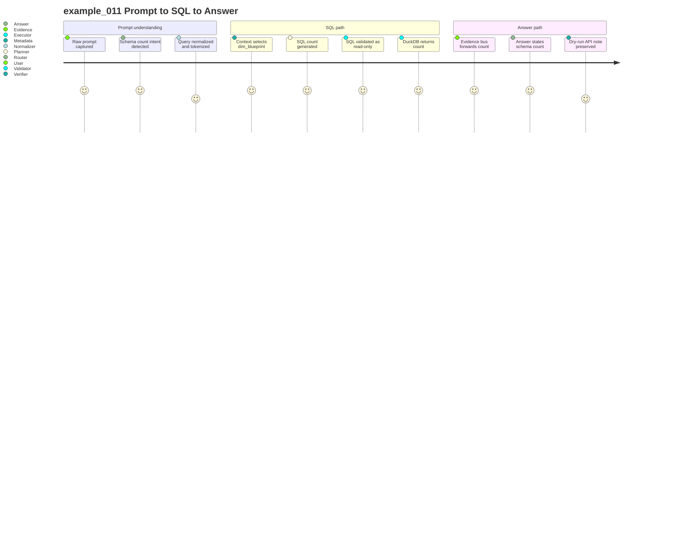

# SQL-Backed Primary Prompt Storyboard

## How To Read This Page

1. Start from the SQL-backed raw prompt card.
2. Follow the arrows/cards to see how DASHSys transforms prompt, data, and evidence.
3. Use badges to distinguish packaged, shadow, default-off, diagnostic, and blocked techniques.

## Primary Testing Prompt

> **example_011**
>
> # How many schemas do I have?
>
> Primary SQL-backed packaged walkthrough: the prompt becomes validated SQL, SQL returns the answer count, and API verification remains dry-run/unavailable.

## Why This Example Was Chosen

- It is SQL-backed in the packaged path: SQL is the answer source.
- It still shows the real system nuance: API verification was attempted but only dry-run/unavailable.
- It demonstrates prompt → SQL → SQL evidence → final answer without using an API-only row as the main walkthrough.

## Full End-to-End Flow Diagram



## System Sequence Diagram



## Prompt → SQL → Answer Journey



## Prompt Transformation Storyboard

### ▶ Raw prompt

**Payload:** How many schemas do I have?
**Technique:** `raw user query capture`
**What changed:** Original test prompt enters the packaged SQL_FIRST_API_VERIFY path.
**Impact:** observability

### ▶ Prompt router view

**Payload:** confidence=0.84; reason=Local snapshot keyword(s) can be answered from DuckDB/par...
**Technique:** `prompt_router`
**What changed:** Recognizes the prompt as a schema count/data question.
**Impact:** accuracy

### ▶ Simple-prompt gate

**Payload:** confidence=0.84; is_simple=False; suggested_action=USE_DATA_PIPELINE; reason=Local snapshot keyword(s) can be answered from DuckDB/par...
**Technique:** `simple_prompt_gate`
**What changed:** Sends the prompt into the evidence pipeline rather than a direct answer.
**Impact:** safety

### ▶ Normalized query

**Payload:** normalized_query=How many schemas do I have?; matching_text=how many schema do i have?
**Technique:** `query_normalizer`
**What changed:** Creates matching-friendly text while preserving original wording.
**Impact:** accuracy

### ▶ Tokens/entities/domains

**Payload:** domains=1 item(s)
**Technique:** `query_tokens`
**What changed:** Extracts schema/count intent for routing and SQL generation.
**Impact:** accuracy

### ▶ Query analysis

**Payload:** strategy=SQL_FIRST_API_VERIFY; route_type=SQL_ONLY; domain_type=DATASET_SCHEMA; answer_family=schema_dataset
**Technique:** `query_analysis`
**What changed:** Classifies the route and answer family for schema counting.
**Impact:** accuracy

### ▶ Lookup path / route intent

**Payload:** api_mode=required
**Technique:** `lookup_path`
**What changed:** Narrows to schema tables and schema API verification options.
**Impact:** accuracy

### ▶ Context card

**Payload:** estimated_metadata_tokens=451; prompt_tokens=1032; selected_apis=1 item(s); selected_card_name=schema_dataset
**Technique:** `metadata_selector + context_cards`
**What changed:** Packs the endpoint catalog/context into metadata and prompt budget.
**Impact:** efficiency

### ▶ Selected plan

**Payload:** selected_plan=generic_sql_first
**Technique:** `planner + plan_ensemble`
**What changed:** Selects a SQL-first plan with dry-run API verification.
**Impact:** efficiency

### ▶ Evidence objects

**Payload:** sql_calls_executed=1; api_calls_executed=1
**Technique:** `executor + evidence_bus`
**What changed:** Executes SQL for the answer count and records dry-run API verification.
**Impact:** safety

### ▶ Answer slots / intent

**Payload:** answer_intent=COUNT
**Technique:** `answer_slots`
**What changed:** Maps SQL count evidence into COUNT answer intent.
**Impact:** accuracy

### ▶ Verified final answer

**Payload:** verifier_passed=True
**Technique:** `answer_verifier + answer_reranker`
**What changed:** Verifies the SQL-grounded count and preserves dry-run honesty.
**Impact:** safety

## Prompt → SQL Derivation

### 🟢 SQL answer source Generated SQL

**Prompt intent:** `SQL_ONLY` schema count.
**Generated SQL:**

```sql
SELECT COUNT(DISTINCT B."BLUEPRINTID") AS blueprint_count FROM "dim_blueprint" AS B
```

## SQL Validation / Execution

### 🟢 validated read-only SQL Validated SQL and DuckDB Result

**SQL calls executed:** `1`
**API calls executed:** `1`
**API verification:** API verification attempted as dry-run; live API payload unavailable.
**SQL result:** `blueprint_count = 74`
**Raw result preview:** `items=1 item(s); total_items=1; truncated_items=False`

## Evidence → Final Answer

### 🟢 SQL evidence Evidence Extraction

**Evidence:** `evidence=1 field(s)`
**Extracted fact:** `blueprint_count = 74`
**Meaning:** SQL returns the schema count; dry-run API status explains why live API verification is unavailable.

## Checkpoint Timeline Visualization

### ▣ 1. checkpoint_01_raw_query

**Stage:** input
**Technique:** `raw user query capture`
**Input:** unavailable
**Output:** query=How many schemas do I have?; query_id=example_011; strategy=SQL_FIRST_API_VERIFY
**Effect:** keeps later normalization from changing the user-facing question

### ▣ 2. checkpoint_00_prompt_router

**Stage:** prompt routing
**Technique:** `LLM_DIRECT / LOCAL_DB_ONLY / SQL_PLUS_API / API_ONLY routing policy`
**Input:** query=How many schemas do I have?
**Output:** confidence=0.84; reason=Local snapshot keyword(s) can be answered from DuckDB/par...
**Effect:** routes data questions to evidence tools instead of unsupported direct answers

### ▣ 3. checkpoint_simple_prompt_gate

**Stage:** input routing
**Technique:** `simple prompt gate`
**Input:** query=How many schemas do I have?
**Output:** confidence=0.84; is_simple=False; suggested_action=USE_DATA_PIPELINE; reason=Local snapshot keyword(s) can be answered from Duc...
**Effect:** prevents direct answers for data questions that need SQL/API evidence

### ▣ 4. checkpoint_02_query_normalization

**Stage:** normalization
**Technique:** `data cleaning / query normalization`
**Input:** query=How many schemas do I have?
**Output:** normalized_query=How many schemas do I have?; matching_text=how many schema do i have?
**Effect:** improves template and route matching across wording variants

### ▣ 5. checkpoint_03_query_tokens

**Stage:** tokenization
**Technique:** `domain-aware tokenization/entity extraction`
**Input:** normalized_query=How many schemas do I have?
**Output:** domains=1 item(s)
**Effect:** grounds names, IDs, dates, metrics, and statuses before planning

### ▣ 6. checkpoint_04_relevance_scoring

**Stage:** context selection
**Technique:** `attention-style relevance scoring`
**Input:** tokens=1 field(s)
**Output:** top_answer_families=1 item(s); top_apis=3 item(s); top_join_hints=3 item(s); top_tables=3 item(s)
**Effect:** keeps high-signal tables and endpoints near the planner

### ▣ 7. checkpoint_05_query_analysis

**Stage:** routing
**Technique:** `branch prediction / QueryAnalysis`
**Input:** route_type=SQL_ONLY; domain_type=DATASET_SCHEMA
**Output:** strategy=SQL_FIRST_API_VERIFY; route_type=SQL_ONLY; domain_type=DATASET_SCHEMA; answer_family=schema_dataset
**Effect:** aligns routing, metadata, planning, and reporting decisions

### ▣ 8. checkpoint_06_lookup_path

**Stage:** path prediction
**Technique:** `TLB-style lookup path prediction`
**Input:** domain_type=DATASET_SCHEMA; answer_family=schema_dataset
**Output:** api_mode=required
**Effect:** guides relationship-heavy SQL/API selection

### ▣ 9. checkpoint_07_context_card

**Stage:** metadata packing
**Technique:** `huge-page-style compact context card`
**Input:** lookup_path=schema_dataset
**Output:** estimated_metadata_tokens=451; prompt_tokens=1032; selected_apis=1 item(s); selected_card_name=schema_dataset
**Effect:** keeps required tables, columns, joins, and API candidates visible

### ▣ 10. checkpoint_08_candidate_plans

**Stage:** planning
**Technique:** `pre-execution plan ensemble`
**Input:** strategy=SQL_FIRST_API_VERIFY
**Output:** selected_plan=generic_sql_first
**Effect:** prefers validated, family-matched plans

### ▣ 11. checkpoint_09_plan_optimization

**Stage:** optimization
**Technique:** `compiler-style plan optimization`
**Input:** original_step_count=2
**Output:** call_budget_applied=False; optimized_step_count=2; optimizer_actions=1 item(s); original_step_count=2
**Effect:** drops unresolved placeholder calls unless explicitly warned

### ▣ 12. checkpoint_10_evidence_policy

**Stage:** evidence policy
**Technique:** `API_REQUIRED/API_OPTIONAL/API_SKIP policy`
**Input:** route_type=SQL_ONLY; answer_family=schema_dataset
**Output:** reason=Query family requires Adobe API evidence.
**Effect:** keeps API calls for API-only/live families

### ▣ 13. checkpoint_11_call_budget

**Stage:** efficiency control
**Technique:** `tool-call budgeting`
**Input:** planned_steps=2 item(s)
**Output:** planned_sql_calls=1; planned_api_calls=1
**Effect:** preserves required grounding steps

### ▣ 14. checkpoint_12_validation

**Stage:** validation
**Technique:** `SQL/API safety validation`
**Input:** optimized_steps=2 item(s)
**Output:** api_validation_status=1 item(s); sql_validation_status=1 item(s)
**Effect:** blocks unsafe SQL and unknown/unresolved API calls

### ▣ 15. checkpoint_sql_ast_validation

**Stage:** validation
**Technique:** `SQLGlot AST-based SQL validation and extraction`
**Input:** sql_call_count=1
**Output:** destructive_sql_detected=False; parsed_ok=True; selected_columns=1 item(s); selected_tables=1 item(s)
**Effect:** detects unsafe SQL and schema mismatches with parser-backed structure

### ▣ 16. checkpoint_13_tool_execution

**Stage:** execution
**Technique:** `SQL/API tool execution`
**Input:** validated_step_count=2
**Output:** sql_calls_executed=1; api_calls_executed=1
**Effect:** records row counts, dry-run state, and API status for final answer grounding

### ▣ 17. checkpoint_14_evidence_bus

**Stage:** evidence forwarding
**Technique:** `operand forwarding / EvidenceBus`
**Input:** tool_result_count=2
**Output:** evidence=1 field(s)
**Effect:** passes exact IDs, names, counts, timestamps, and statuses without text guessing

### ▣ 18. checkpoint_15_answer_slots

**Stage:** answer synthesis
**Technique:** `structured answer slot extraction`
**Input:** tool_result_count=2
**Output:** answer_intent=COUNT
**Effect:** makes final response generation evidence-grounded

### ▣ 19. checkpoint_16_answer_verification

**Stage:** answer verification
**Technique:** `claim verification / groundedness checking`
**Input:** claim_count=1; slots_present=4 item(s)
**Output:** verifier_passed=True
**Effect:** blocks unsupported numbers, entities, timestamps, statuses, and dry-run API confirmation

### ▣ 20. checkpoint_17_answer_reranking

**Stage:** answer selection
**Technique:** `deterministic answer reranking`
**Input:** answer_family=schema_dataset
**Output:** candidate_count=0; selected_candidate_type=base; selection_reason=best verifier-passing answer
**Effect:** prefers verifier-passing and intent-matched answers

### ▣ 21. checkpoint_18_final_answer

**Stage:** final response
**Technique:** `concise grounded final response`
**Input:** verifier_passed=True
**Output:** answer_length=102; final_answer=You have 74 schemas. Live API verification was not execut...
**Effect:** final answer remains tied to evidence and caveats

### ▣ 22. checkpoint_official_token_reduction

**Stage:** query understanding
**Technique:** `unavailable`
**Input:** unavailable
**Output:** unavailable
**Effect:** observability

## Final Answer Card

### 🟢 SQL-grounded answer Final Answer

> You have 74 schemas. Live API verification was not executed because Adobe credentials are unavailable.

## Key Takeaway

SQL provides the answer. API verification is present in the packaged trace, but it is dry-run/unavailable, so the final answer includes the honest live-API disclaimer.

## Supporting Metrics

| Metric | Value | Note |
| --- | --- | --- |
| **Strict score** | `0.7462` | Row-level strict score. |
| **Correctness** | `0.7774` | Row-level correctness score. |
| **SQL score** | `0.9` | Strict SQL component. |
| **API score** | `1.0` | Dry-run verification call still scored. |
| **Answer score** | `0.3915` | Final-answer component. |
| **Tools/tokens/runtime** | `2 / 751 / 0.008387499954551458` | Packaged trajectory metrics. |
