# SQL-Backed Primary Prompt Storyboard

`example_011` was chosen because it is SQL-backed in the packaged path: the prompt becomes validated SQL, SQL returns the answer count, and API verification returned live supporting evidence.

```mermaid
flowchart TD
  classDef prompt fill:#e8f3ff,stroke:#2f6fad,stroke-width:1px,color:#102a43
  classDef interpret fill:#eef8ef,stroke:#3b873e,stroke-width:1px,color:#183b1b
  classDef mapping fill:#fff7df,stroke:#b7791f,stroke-width:2px,color:#3d2a00
  classDef plan fill:#fffaf0,stroke:#b7791f,stroke-width:1px,color:#3d2a00
  classDef sql fill:#eafff7,stroke:#00856f,stroke-width:2px,color:#063b33
  classDef api fill:#f7f2ff,stroke:#805ad5,stroke-width:1px,color:#2d1b69,stroke-dasharray: 5 3
  classDef evidence fill:#f0fff4,stroke:#2f855a,stroke-width:2px,color:#1c4532
  classDef answer fill:#fff0f6,stroke:#b83280,stroke-width:2px,color:#521b41
  classDef output fill:#f7fafc,stroke:#4a5568,stroke-width:1px,color:#1a202c

  subgraph U["1. User Prompt"]
    U0["Raw prompt<br/>How many schemas do I have?"]:::prompt
  end

  subgraph P["2. Prompt Understanding"]
    P0["Router<br/>use data pipeline"]:::interpret
    P1["Normalize text<br/>How many schemas do I have?"]:::interpret
    P2["Extract signals<br/>&quot;schemas&quot; + &quot;how many&quot;"]:::interpret
    P3["Query analysis<br/>route = SQL_ONLY<br/>answer type = COUNT<br/>family = schema_dataset"]:::interpret
  end

  subgraph M["3. Prompt → Data Mapping"]
    M0["Prompt-to-SQL mapping<br/>&quot;schemas&quot; → dim_blueprint<br/>&quot;how many&quot; → COUNT DISTINCT"]:::mapping
    M1["System interpretation<br/>&quot;schemas&quot; = records in dim_blueprint"]:::mapping
    M2["Table selected<br/>dim_blueprint"]:::mapping
    M3["Schema ID column<br/>BLUEPRINTID"]:::mapping
  end

  subgraph C["4. Context + Planning"]
    C0["Selected plan<br/>SQL_FIRST_API_VERIFY<br/>generic_sql_first"]:::plan
    C1["Plan split<br/>main answer path: SQL count<br/>side check: live API verification"]:::plan
    C2["Main answer path<br/>SQL count → evidence → final answer"]:::evidence
  end

  subgraph S["5. SQL Derivation"]
    S0["SQL template selected<br/>schema_count"]:::plan
    S1["Generated SQL<br/>SELECT COUNT(DISTINCT<br/>B.&quot;BLUEPRINTID&quot;)<br/>AS blueprint_count<br/>FROM &quot;dim_blueprint&quot; AS B"]:::sql
    S2["SQL validation<br/>read-only ✓<br/>known table ✓<br/>known column ✓"]:::sql
    S3["SQLGlot AST check<br/>parsed_ok = true<br/>destructive_sql = false"]:::sql
  end

  subgraph E["6. SQL Execution + Evidence"]
    E0["DuckDB execution<br/>execute validated SQL"]:::sql
    E1["SQL result<br/>blueprint_count = 74"]:::sql
    E2["Grounded fact<br/>The SQL result means:<br/>user has 74 schemas"]:::evidence
    E3["SQL is the answer source<br/>SQL_ONLY = SQL provides the count"]:::evidence
    E4["Evidence bus<br/>SQL evidence = 74 schemas<br/>API status = Live/API evidence available."]:::evidence
    API0["API verification branch<br/>live API verification<br/>supporting evidence"]:::api
  end

  subgraph A["7. Answer Generation"]
    A0["Answer intent<br/>COUNT"]:::answer
    A1["Answer synthesis<br/>use SQL count + live API note"]:::answer
    A2["Answer verification<br/>&quot;74 schemas&quot; supported by SQL result"]:::answer
    A3["Final answer<br/>You have 74 schemas. This count comes from your blueprint query and is confirmed by the API response from Adobe Schem..."]:::answer
  end

  subgraph O["8. Output + Trace"]
    O0["Trajectory output<br/>strategy = SQL_FIRST_API_VERIFY<br/>plan = generic_sql_first"]:::output
    O1["Efficiency metrics<br/>tools = 2<br/>tokens = 751<br/>runtime ≈ 1.211s"]:::output
  end

  U0 -->|"schema-count question"| P0
  P0 -->|"send to evidence pipeline"| P1
  P1 -->|"preserve meaning"| P2
  P2 -->|"intent signals"| P3
  P3 -->|"schema/count intent"| M0
  M0 -->|"noun maps to local table"| M1
  M1 -->|"schema records live here"| M2
  M2 -->|"count unique schema IDs"| M3
  M3 -->|"table + column + count operation"| C0
  C0 -->|"selected strategy"| C1
  C1 -->|"main answer path"| C2
  C2 -->|"fill SQL template"| S0
  S0 -->|"COUNT request becomes SQL"| S1
  S1 -->|"validate before execution"| S2
  S2 -->|"parse and inspect AST"| S3
  S3 -->|"safe read-only SQL"| E0
  E0 -->|"DuckDB returns one row"| E1
  E1 -->|"interpret result"| E2
  E2 -->|"answer fact"| E3
  E3 -->|"structured evidence"| E4
  C1 -.->|"verification side path"| API0
  API0 -.->|"live API status"| E4
  E4 -->|"answer slot receives count"| A0
  A0 -->|"compose concise answer"| A1
  A1 -->|"claim support check"| A2
  A2 -->|"verified"| A3
  A3 -->|"logged as final output"| O0
  O0 -->|"submission trace metrics"| O1
```

**Takeaway:** SQL is the answer source (`blueprint_count = 74`). The API branch is shown because the packaged trace attempts verification; it provides supporting live evidence while SQL remains the count source.
