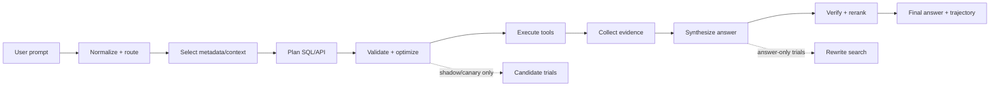
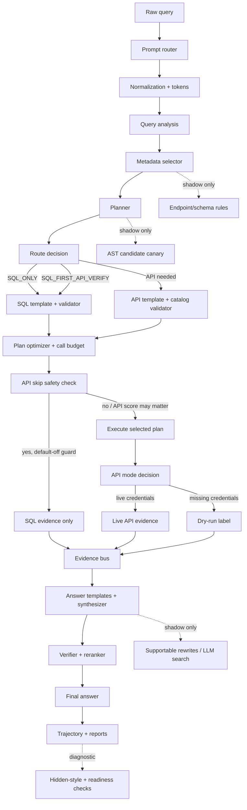

# DASHSys End-to-End System Workflow

This view shows the promoted packaged path and where default-off, shadow-only, and diagnostic-only branches split from it.

## High-Level Workflow

## Detailed Workflow

## Stage Table

| Stage | Goal | Inputs | Outputs | Files | Checkpoints | Status |
| --- | --- | --- | --- | --- | --- | --- |
| User prompt | Capture original natural-language question unchanged. | User query | original_query in trajectory | dashagent/executor.py | trajectory root | promoted_default |
| Prompt router | Choose SQL-only, SQL-first/API-verify, or API-oriented path. | original query | route_type, requires_api, risk/API policy | dashagent/prompt_router.py, dashagent/router.py | checkpoint_00_prompt_router | promoted_default |
| Query normalization and tokens | Normalize text and extract quoted entities/tokens. | original query | normalized query, tokens, quoted entities | dashagent/query_normalizer.py, dashagent/query_tokens.py | checkpoint_02_query_normalization, checkpoint_03_query_tokens | promoted_default |
| Query analysis | Classify domain, answer shape, and route intent. | tokens, route policy, schema/API hints | domain_type, answer shape, route_type | dashagent/query_analysis.py, dashagent/answer_intent.py | checkpoint_query_analysis | promoted_default |
| Metadata/context selection | Select compact schema/API context for planning. | schema index, endpoint catalog, relevance scores | metadata.json, filled_system_prompt.txt | dashagent/metadata_selector.py, dashagent/context_cards.py | checkpoint_metadata_selection | promoted_default |
| SQL planning | Create read-only SQL when local data can ground facts. | metadata, SQL templates, query analysis | validated SQL step or no SQL step | dashagent/sql_templates.py, dashagent/planner.py | checkpoint_sql_ast_validation | promoted_default |
| API planning | Create endpoint-catalog-valid API calls when required. | endpoint catalog, API templates, grounded params | method/path/params or API_SKIP | dashagent/api_templates.py, dashagent/endpoint_catalog.py | checkpoint_api_validation | promoted_default |
| Optimization and budget | Dedupe plan steps and enforce call/token budgets. | candidate plan | one selected optimized plan | dashagent/plan_optimizer.py, dashagent/plan_ensemble.py, dashagent/call_budget.py | checkpoint_plan_optimizer, checkpoint_11_call_budget | promoted_default |
| Execution | Execute exactly one selected plan through SQL/API tools. | validated SQL/API steps | SQL rows, API result or dry-run label | dashagent/executor.py, dashagent/db.py | checkpoint_execution | promoted_default |
| Evidence collection | Record SQL, API, local evidence, and dry-run/live status. | tool outputs and local evidence | evidence objects for synthesis and audit | dashagent/evidence_bus.py, dashagent/evidence_policy.py | checkpoint_evidence_policy | promoted_default |
| Answer synthesis | Compose concise evidence-supported final answer. | evidence, answer templates, answer shape | final answer candidate | dashagent/answer_synthesizer.py, dashagent/answer_templates.py | checkpoint_answer_synthesis | promoted_default |
| Answer verification/reranking | Validate answer support and choose safer wording. | answer candidates and evidence | verified final answer | dashagent/answer_verifier.py, dashagent/answer_reranker.py | checkpoint_16_answer_verification | promoted_default |
| Trajectory and reports | Persist audit trail and metrics for evaluation/visualization. | checkpoints, steps, metrics | trajectory.json, reports, visualization summaries | dashagent/trajectory.py, dashagent/span_exporter.py | checkpoints list | promoted_default |
| Shadow/canary branches | Evaluate answer-shape v2, supportable rewrites, endpoint rules, AST, LLM, and local-index candidates without changing packaged output. | baseline trajectories and reports | isolated reports and candidate bundles | scripts/run_*_eval.py, scripts/run_*_canary.py | report-specific rows | shadow_only / diagnostic_only / default_off |
