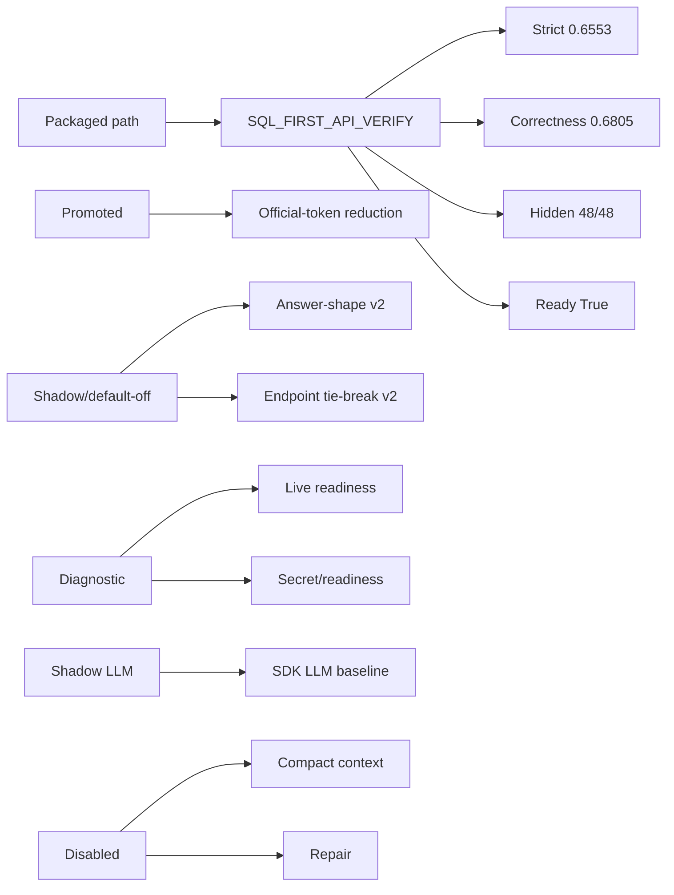

# System Status Dashboard

## How To Read This Page

1. Start from the status cards.
2. Follow the arrows/cards to see how DASHSys transforms prompt, data, and evidence.
3. Use badges to distinguish packaged, shadow, default-off, diagnostic, and blocked techniques.

## Status Map

## Packaged Metrics

| Metric | Value | Note |
| --- | --- | --- |
| **Preferred strategy** | `SQL_FIRST_API_VERIFY` | Must remain SQL_FIRST_API_VERIFY. |
| **Packaged strict score** | `0.6553` | Submit-ready packaged score. |
| **Best isolated score** | `0.6558` | Best safe trial score; below winner target. |
| **Correctness** | `0.6805` | Current strict correctness. |
| **Tokens/runtime/tools** | `834.6 / 0.012 / 1.4571` | Efficiency metrics. |
| **Hidden-style** | `48/48` | Current hidden-style pass result. |
| **Readiness** | `True` | Final submission package status. |
| **Secret scan** | `True` | Readiness secret scan status. |
| **LLM baseline framework** | `qwen2.5-32b-instruct` | Backend type=openai_sdk; recommendation=keep_shadow_only. |

## Technique Status Cards

| Metric | Value | Note |
| --- | --- | --- |
| **Official-token reduction** | `🟢 promoted_default` | Promoted in the packaged path. |
| **LLM rewrite search** | `🟡 shadow_only` | Candidates=6; accepted=0. |
| **LLM baseline framework** | `🟡 shadow_only` | Current backend=qwen2.5-32b-instruct; strict=available; tools=False. |
| **Live-mode readiness** | `🔵 diagnostic_only` | Credentials visible=False; dry-run rows=34. |
| **Answer-shape v2** | `⚪ default_off` | Recommendation=safe_for_answer_shape_v2_trial. |
| **SQL-only API-skip** | `⚪ default_off` | Rows=0. |
| **Endpoint-family tie-break** | `🟡 shadow_only` | Trial eligible rows=0. |
| **Compact context** | `⚪ default_off` | Enabled=False. |
| **Repair execution** | `⚪ default_off` | Enabled=False. |

## Readiness Interpretation

- Submit-ready: final package, preferred strategy, hidden-style, and secret checks are valid.
- Not winner-ready: packaged strict score is below `0.75`, and shadow/default-off ideas have not passed promotion gates.
