# Technique Dataflow Views

Each view shows where a technique enters the pipeline, what representation it changes, and what downstream stage is affected.

## query_normalizer + query_tokens + relevance_scorer

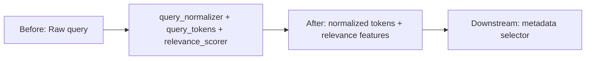

| Field | Value |
| --- | --- |
| State | promoted_default |
| Input consumed | Raw query |
| Representation changed | normalized tokens + relevance features |
| Output produced | normalized tokens + relevance features |
| Downstream affected | metadata selector |
| Accuracy / efficiency / safety / observability | True / True / True / True |
| Before | Pipeline has Raw query. |
| After | Pipeline has normalized tokens + relevance features; downstream stage is metadata selector. |

## metadata_selector

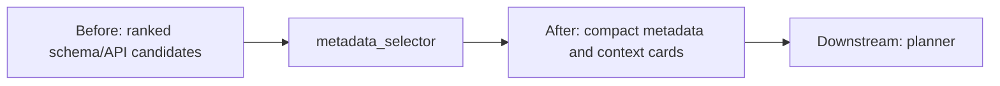

| Field | Value |
| --- | --- |
| State | promoted_default |
| Input consumed | ranked schema/API candidates |
| Representation changed | compact metadata and context cards |
| Output produced | compact metadata and context cards |
| Downstream affected | planner |
| Accuracy / efficiency / safety / observability | True / True / True / True |
| Before | Pipeline has ranked schema/API candidates. |
| After | Pipeline has compact metadata and context cards; downstream stage is planner. |

## SQL templates

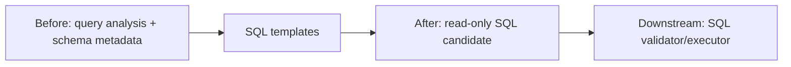

| Field | Value |
| --- | --- |
| State | promoted_default |
| Input consumed | query analysis + schema metadata |
| Representation changed | read-only SQL candidate |
| Output produced | read-only SQL candidate |
| Downstream affected | SQL validator/executor |
| Accuracy / efficiency / safety / observability | True / False / True / True |
| Before | Pipeline has query analysis + schema metadata. |
| After | Pipeline has read-only SQL candidate; downstream stage is SQL validator/executor. |

## API templates

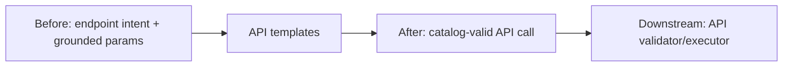

| Field | Value |
| --- | --- |
| State | promoted_default |
| Input consumed | endpoint intent + grounded params |
| Representation changed | catalog-valid API call |
| Output produced | catalog-valid API call |
| Downstream affected | API validator/executor |
| Accuracy / efficiency / safety / observability | True / False / True / True |
| Before | Pipeline has endpoint intent + grounded params. |
| After | Pipeline has catalog-valid API call; downstream stage is API validator/executor. |

## evidence_policy

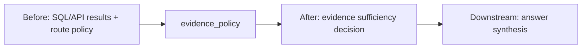

| Field | Value |
| --- | --- |
| State | promoted_default |
| Input consumed | SQL/API results + route policy |
| Representation changed | evidence sufficiency decision |
| Output produced | evidence sufficiency decision |
| Downstream affected | answer synthesis |
| Accuracy / efficiency / safety / observability | True / True / True / True |
| Before | Pipeline has SQL/API results + route policy. |
| After | Pipeline has evidence sufficiency decision; downstream stage is answer synthesis. |

## supportable_answer_rewriter

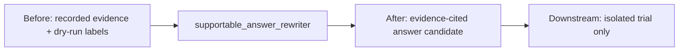

| Field | Value |
| --- | --- |
| State | shadow_only |
| Input consumed | recorded evidence + dry-run labels |
| Representation changed | evidence-cited answer candidate |
| Output produced | evidence-cited answer candidate |
| Downstream affected | isolated trial only |
| Accuracy / efficiency / safety / observability | True / False / True / True |
| Before | Pipeline has recorded evidence + dry-run labels. |
| After | Pipeline has evidence-cited answer candidate; downstream stage is isolated trial only. |

## answer-shape v2

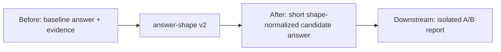

| Field | Value |
| --- | --- |
| State | default_off |
| Input consumed | baseline answer + evidence |
| Representation changed | short shape-normalized candidate answer |
| Output produced | short shape-normalized candidate answer |
| Downstream affected | isolated A/B report |
| Accuracy / efficiency / safety / observability | True / True / True / True |
| Before | Pipeline has baseline answer + evidence. |
| After | Pipeline has short shape-normalized candidate answer; downstream stage is isolated A/B report. |

## official-token reduction

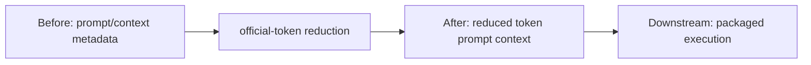

| Field | Value |
| --- | --- |
| State | promoted_default |
| Input consumed | prompt/context metadata |
| Representation changed | reduced token prompt context |
| Output produced | reduced token prompt context |
| Downstream affected | packaged execution |
| Accuracy / efficiency / safety / observability | False / True / True / True |
| Before | Pipeline has prompt/context metadata. |
| After | Pipeline has reduced token prompt context; downstream stage is packaged execution. |

## local_knowledge_index

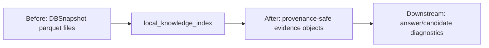

| Field | Value |
| --- | --- |
| State | diagnostic_only |
| Input consumed | DBSnapshot parquet files |
| Representation changed | provenance-safe evidence objects |
| Output produced | provenance-safe evidence objects |
| Downstream affected | answer/candidate diagnostics |
| Accuracy / efficiency / safety / observability | True / True / True / True |
| Before | Pipeline has DBSnapshot parquet files. |
| After | Pipeline has provenance-safe evidence objects; downstream stage is answer/candidate diagnostics. |

## endpoint_family_ranker

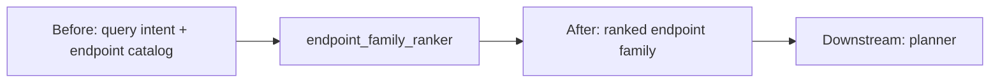

| Field | Value |
| --- | --- |
| State | promoted_default |
| Input consumed | query intent + endpoint catalog |
| Representation changed | ranked endpoint family |
| Output produced | ranked endpoint family |
| Downstream affected | planner |
| Accuracy / efficiency / safety / observability | True / False / True / True |
| Before | Pipeline has query intent + endpoint catalog. |
| After | Pipeline has ranked endpoint family; downstream stage is planner. |

## endpoint-family tie-break v2

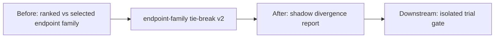

| Field | Value |
| --- | --- |
| State | shadow_only |
| Input consumed | ranked vs selected endpoint family |
| Representation changed | shadow divergence report |
| Output produced | shadow divergence report |
| Downstream affected | isolated trial gate |
| Accuracy / efficiency / safety / observability | True / False / True / True |
| Before | Pipeline has ranked vs selected endpoint family. |
| After | Pipeline has shadow divergence report; downstream stage is isolated trial gate. |

## hidden-style eval

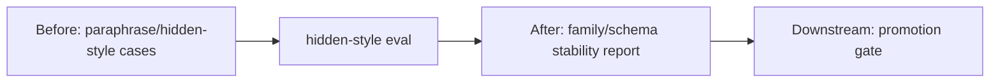

| Field | Value |
| --- | --- |
| State | diagnostic_only |
| Input consumed | paraphrase/hidden-style cases |
| Representation changed | family/schema stability report |
| Output produced | family/schema stability report |
| Downstream affected | promotion gate |
| Accuracy / efficiency / safety / observability | True / False / True / True |
| Before | Pipeline has paraphrase/hidden-style cases. |
| After | Pipeline has family/schema stability report; downstream stage is promotion gate. |

## live-mode readiness

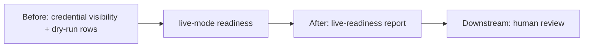

| Field | Value |
| --- | --- |
| State | diagnostic_only |
| Input consumed | credential visibility + dry-run rows |
| Representation changed | live-readiness report |
| Output produced | live-readiness report |
| Downstream affected | human review |
| Accuracy / efficiency / safety / observability | False / False / True / True |
| Before | Pipeline has credential visibility + dry-run rows. |
| After | Pipeline has live-readiness report; downstream stage is human review. |

## LLM answer rewrite search

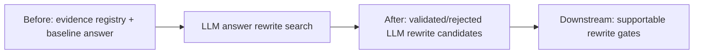

| Field | Value |
| --- | --- |
| State | shadow_only |
| Input consumed | evidence registry + baseline answer |
| Representation changed | validated/rejected LLM rewrite candidates |
| Output produced | validated/rejected LLM rewrite candidates |
| Downstream affected | supportable rewrite gates |
| Accuracy / efficiency / safety / observability | True / False / True / True |
| Before | Pipeline has evidence registry + baseline answer. |
| After | Pipeline has validated/rejected LLM rewrite candidates; downstream stage is supportable rewrite gates. |
