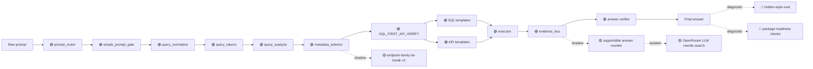

# Technique Pipeline Map

## How To Read This Page

1. Start from the pipeline diagram.
2. Follow the arrows/cards to see how DASHSys transforms prompt, data, and evidence.
3. Use badges to distinguish packaged, shadow, default-off, diagnostic, and blocked techniques.

## Pipeline Placement

## Badge Legend

| Status | Meaning |
| --- | --- |
| 🟢 promoted_default | Runs in the packaged path. |
| 🟡 shadow_only | Evaluated in shadow reports; not packaged. |
| ⚪ default_off | Feature-flagged or isolated only. |
| 🔵 diagnostic_only | Reports/checks only. |
| 🔴 blocked/not_promoted | Blocked or not promoted. |

## Query understanding / routing

### 🟢 promoted_default `metadata_selector`

**Runtime path:** 🟢 packaged

**Input → output:** candidate tables, APIs, context cards → metadata.json and filled system prompt context

**Changed artifact:** context selection

**Downstream effect:** Builds compact per-query metadata/context for planning.

**Affects:** efficiency

### 🟢 promoted_default `plan_ensemble`

**Runtime path:** 🟢 packaged

**Input → output:** candidate plans → one selected plan

**Changed artifact:** planning

**Downstream effect:** Deduplicates and selects a single plan from deterministic planning candidates.

**Affects:** accuracy

### 🟢 promoted_default `prompt_router`

**Runtime path:** 🟢 packaged

**Input → output:** raw query → route policy and requires_api decision

**Changed artifact:** routing

**Downstream effect:** Fast prompt-level route gate for SQL/API need and risk.

**Affects:** accuracy, efficiency

### 🟢 promoted_default `query_analysis`

**Runtime path:** 🟢 packaged

**Input → output:** query tokens and schema/API hints → route_type, domain_type, answer intent

**Changed artifact:** query analysis

**Downstream effect:** Classifies route type, answer shape, and domain family.

**Affects:** accuracy

### 🟢 promoted_default `query_normalizer`

**Runtime path:** 🟢 packaged

**Input → output:** raw query → normalized query and rewrite hints

**Changed artifact:** query understanding

**Downstream effect:** Canonicalizes user text before routing and retrieval.

**Affects:** observability

### 🟢 promoted_default `query_tokens`

**Runtime path:** 🟢 packaged

**Input → output:** normalized query → tokens and quoted entities

**Changed artifact:** query understanding

**Downstream effect:** Extracts tokens, quoted entities, and intent words for downstream ranking.

**Affects:** accuracy, efficiency

### 🟢 promoted_default `relevance_scorer`

**Runtime path:** 🟢 packaged

**Input → output:** tokens, schema metadata, endpoint metadata → candidate relevance scores

**Changed artifact:** candidate ranking

**Downstream effect:** Ranks schema/API candidates using query-token overlap and metadata relevance.

**Affects:** accuracy, efficiency

### 🟢 promoted_default `simple_prompt_gate`

**Runtime path:** 🟢 packaged

**Input → output:** raw prompt → USE_DATA_PIPELINE or direct-answer decision

**Changed artifact:** prompt routing

**Downstream effect:** Checkpointed gate that sends evidence questions into the backend pipeline.

**Affects:** observability

## Planning / execution

### 🟢 promoted_default `API templates`

**Runtime path:** 🟢 packaged

**Input → output:** endpoint catalog, route policy, grounded IDs → method/path/params

**Changed artifact:** API planning

**Downstream effect:** Generate endpoint-catalog-valid API calls.

**Affects:** accuracy

### 🟢 promoted_default `SQL templates`

**Runtime path:** 🟢 packaged

**Input → output:** schema metadata and query analysis → read-only SQL

**Changed artifact:** SQL planning

**Downstream effect:** Generate validated SQL for recurring local-data query families.

**Affects:** accuracy

### ⚪ default_off `SQL-only API-skip guard`

**Runtime path:** 🟡 isolated_trial

**Input → output:** route policy, SQL evidence, strict diagnostics → API_SKIP decision metadata

**Changed artifact:** pre-execution guard

**Downstream effect:** Conservatively skips API only when SQL fully answers and API score is not needed.

**Affects:** accuracy, efficiency

### 🟢 promoted_default `SQL_FIRST_API_VERIFY`

**Runtime path:** 🟢 packaged

**Input → output:** metadata/context and route policy → SQL/API execution plan

**Changed artifact:** strategy

**Downstream effect:** Grounds with local SQL first, then verifies with API where needed.

**Affects:** accuracy

### ⚪ default_off `answer-shape v2`

**Runtime path:** 🟡 isolated_trial

**Input → output:** baseline answer and evidence → candidate answer

**Changed artifact:** answer synthesis

**Downstream effect:** Tests concise answer-shape rewrites with row-level A/B diagnostics.

**Affects:** accuracy, observability

### 🟡 shadow_only `candidate generation`

**Runtime path:** 🟡 shadow_report

**Input → output:** query, schema metadata, endpoint catalog → candidate SQL/API/answer plans

**Changed artifact:** candidate search

**Downstream effect:** Generates deterministic alternative plans for isolated search.

**Affects:** accuracy

### 🟢 promoted_default `endpoint catalog`

**Runtime path:** 🟢 packaged

**Input → output:** endpoint templates and planned API calls → catalog validation result

**Changed artifact:** API validation

**Downstream effect:** Defines allowed Adobe API endpoints and validation metadata.

**Affects:** accuracy, safety

### 🟢 promoted_default `endpoint family ranker`

**Runtime path:** 🟢 packaged

**Input → output:** query tokens and endpoint metadata → ranked endpoint families

**Changed artifact:** endpoint ranking

**Downstream effect:** Ranks endpoint families from reusable intent features.

**Affects:** accuracy

### 🟡 shadow_only `endpoint-schema rule candidates`

**Runtime path:** 🟡 shadow_report

**Input → output:** query vocabulary, catalog metadata, path shapes → candidate reranking diagnostics

**Changed artifact:** endpoint/schema routing

**Downstream effect:** Shadow-tests reusable endpoint/schema routing rules.

**Affects:** accuracy

### 🟡 shadow_only `execution-based candidate selector`

**Runtime path:** 🟡 shadow_report

**Input → output:** candidate plans and strict offline scores → safe candidate bundle

**Changed artifact:** candidate search

**Downstream effect:** Scores isolated candidates and selects only safe improvements.

**Affects:** accuracy, safety

### 🟢 promoted_default `executor`

**Runtime path:** 🟢 packaged

**Input → output:** selected plan → tool results, evidence, trajectory

**Changed artifact:** execution

**Downstream effect:** Runs validated SQL/API calls and records trajectory evidence.

**Affects:** accuracy, observability

### 🟢 promoted_default `official-token reduction`

**Runtime path:** 🟢 packaged

**Input → output:** metadata and prompt context → reduced prompt/context tokens

**Changed artifact:** context optimization

**Downstream effect:** Reduces context/token cost while preserving packaged behavior.

**Affects:** efficiency

### 🟢 promoted_default `planner`

**Runtime path:** 🟢 packaged

**Input → output:** route, metadata, templates → candidate plan

**Changed artifact:** planning

**Downstream effect:** Builds constrained SQL/API steps from route and context.

**Affects:** accuracy

### 🟡 shadow_only `supportable answer rewriter`

**Runtime path:** 🟡 shadow_report

**Input → output:** recorded evidence, endpoint params, dry-run labels → supportable answer candidates

**Changed artifact:** answer synthesis

**Downstream effect:** Creates evidence-cited dry-run-safe answer rewrites.

**Affects:** accuracy, safety

## Evidence / context / optimization

### 🟡 shadow_only `AST-guided SQL candidate canary`

**Runtime path:** 🟡 shadow_report

**Input → output:** candidate SQL → AST validation/ranking diagnostics

**Changed artifact:** SQL candidate diagnostics

**Downstream effect:** Tests AST quality as a tie-break for SQL candidates.

**Affects:** accuracy, observability

### 🟢 promoted_default `cache`

**Runtime path:** 🟢 packaged

**Input → output:** schema and value retrieval keys → cache hits or regenerated values

**Changed artifact:** retrieval optimization

**Downstream effect:** Caches deterministic retrieval/index artifacts.

**Affects:** efficiency, observability

### 🟢 promoted_default `call budget`

**Runtime path:** 🟢 packaged

**Input → output:** planned steps and route policy → call budget decision

**Changed artifact:** planning optimization

**Downstream effect:** Limits SQL/API calls for efficiency and trajectory stability.

**Affects:** accuracy, efficiency, observability

### ⚪ default_off `compact context experiment`

**Runtime path:** 🟡 isolated_trial

**Input → output:** candidate context → compact candidate context

**Changed artifact:** context optimization

**Downstream effect:** Tests smaller context windows under strict gates.

**Affects:** efficiency

### 🟢 promoted_default `context cards`

**Runtime path:** 🟢 packaged

**Input → output:** schema/API metadata and query analysis → context cards

**Changed artifact:** context selection

**Downstream effect:** Summarizes schema/API/domain hints for compact prompts.

**Affects:** accuracy, efficiency

### 🟡 shadow_only `endpoint-family tie-break v2`

**Runtime path:** 🟡 shadow_report

**Input → output:** ranked and selected endpoint families → divergence report

**Changed artifact:** endpoint routing diagnostics

**Downstream effect:** Shadow-tests deterministic preference for high-confidence ranked endpoint family.

**Affects:** accuracy, observability

### 🟢 promoted_default `evidence policy`

**Runtime path:** 🟢 packaged

**Input → output:** route, SQL results, API policy → evidence sufficiency decision

**Changed artifact:** evidence gating

**Downstream effect:** Decides when SQL/API evidence is sufficient or API is required.

**Affects:** accuracy

### 🟢 promoted_default `evidence_bus`

**Runtime path:** 🟢 packaged

**Input → output:** tool results and local evidence → structured evidence records

**Changed artifact:** evidence collection

**Downstream effect:** Carries SQL/API/local evidence into answer synthesis.

**Affects:** accuracy

### 🟢 promoted_default `fast paths`

**Runtime path:** 🟢 packaged

**Input → output:** query analysis and schema/API hints → fast-path plan or no-op

**Changed artifact:** planning optimization

**Downstream effect:** Handles simple deterministic query families with low overhead.

**Affects:** efficiency

### 🔵 diagnostic_only `live-mode readiness diagnostics`

**Runtime path:** 🔵 diagnostic_report

**Input → output:** environment credential visibility and trajectories → live readiness report

**Changed artifact:** diagnostics

**Downstream effect:** Reports whether real Adobe credentials and live API payload readiness exist.

**Affects:** accuracy, safety, observability

### 🔵 diagnostic_only `local knowledge index`

**Runtime path:** 🔵 diagnostic_report

**Input → output:** DBSnapshot parquet data and schema metadata → provenance-safe evidence objects

**Changed artifact:** evidence retrieval

**Downstream effect:** Builds Parquet-derived evidence objects for grounding.

**Affects:** observability

### 🟢 promoted_default `plan optimizer`

**Runtime path:** 🟢 packaged

**Input → output:** planned steps → optimized plan

**Changed artifact:** planning optimization

**Downstream effect:** Deduplicates and budgets plan steps before execution.

**Affects:** efficiency

### 🟡 shadow_only `shadow repair`

**Runtime path:** 🟡 shadow_report

**Input → output:** current plan and repaired candidate → shadow repair score comparison

**Changed artifact:** repair diagnostics

**Downstream effect:** Evaluates repaired plans without enabling repair execution.

**Affects:** safety, observability

## Safety / evaluation

### 🟡 shadow_only `OpenRouter LLM rewrite search`

**Runtime path:** 🟡 shadow_report

**Input → output:** baseline answer and local evidence registry → candidate rewrites with claim citations

**Changed artifact:** isolated candidate search

**Downstream effect:** Uses LLM proposals only for evidence-cited answer rewrites.

**Affects:** accuracy, safety, observability

### 🟡 shadow_only `SDK LLM baseline framework`

**Runtime path:** 🟡 shadow_report

**Input → output:** dev prompts plus configured SDK backend metadata → shadow baseline trajectories and strict comparison reports

**Changed artifact:** shadow LLM baseline evaluation

**Downstream effect:** Provider-agnostic SDK baseline for OpenAI-compatible and Anthropic LLM comparisons.

**Affects:** safety, observability

### 🟢 promoted_default `answer reranker`

**Runtime path:** 🟢 packaged

**Input → output:** candidate answers → selected answer

**Changed artifact:** answer synthesis

**Downstream effect:** Ranks candidate answer phrasings when alternatives are available.

**Affects:** accuracy, safety, observability

### 🟢 promoted_default `answer verifier`

**Runtime path:** 🟢 packaged

**Input → output:** final answer and evidence → verification result

**Changed artifact:** answer validation

**Downstream effect:** Checks final answer support and consistency.

**Affects:** accuracy, safety, observability

### 🟡 shadow_only `autonomous packaged trials`

**Runtime path:** 🟡 shadow_report

**Input → output:** safe candidate bundle → best isolated score and gate results

**Changed artifact:** isolated trial

**Downstream effect:** Runs isolated packaged-style trials over safe candidate bundles.

**Affects:** accuracy, safety, observability

### 🔵 diagnostic_only `hidden-style eval`

**Runtime path:** 🔵 diagnostic_report

**Input → output:** hidden-style cases → pass/fail and stability metrics

**Changed artifact:** evaluation gate

**Downstream effect:** Checks paraphrase/hidden-style routing robustness.

**Affects:** safety, observability

### 🔵 diagnostic_only `leakage / robustness checks`

**Runtime path:** 🔵 diagnostic_report

**Input → output:** candidate triggers and reports → leakage pass/fail flags

**Changed artifact:** safety gate

**Downstream effect:** Rejects query-id, exact-query, gold-path, or answer-memorization behavior.

**Affects:** accuracy, safety, observability

### 🔵 diagnostic_only `package readiness checks`

**Runtime path:** 🔵 diagnostic_report

**Input → output:** final submission artifacts → readiness result

**Changed artifact:** packaging gate

**Downstream effect:** Verifies packaged outputs and final submission readiness.

**Affects:** safety, observability

### 🔵 diagnostic_only `secret scan`

**Runtime path:** 🔵 diagnostic_report

**Input → output:** repo outputs and final submission → no_secret_scan result

**Changed artifact:** packaging gate

**Downstream effect:** Prevents credential leakage in packaged outputs/reports.

**Affects:** safety, observability

### 🟡 shadow_only `supportable dry-run rewrite validation`

**Runtime path:** 🟡 shadow_report

**Input → output:** candidate rewrites → safe/unsafe rewrite labels

**Changed artifact:** answer candidate safety

**Downstream effect:** Validates claim citations, dry-run unavailable wording, and SQL/API hash invariance.

**Affects:** accuracy, safety, observability

## Safety / robustness / evaluation

### 🟢 promoted_default `answer claims / slots / intent / diagnostics`

**Runtime path:** 🟢 packaged

**Input → output:** query and answer evidence → answer intent/slots/claims

**Changed artifact:** answer analysis

**Downstream effect:** Extracts answer shape, requested facts, and diagnostic slots.

**Affects:** accuracy, safety, observability

### 🟢 promoted_default `trajectory checkpoints`

**Runtime path:** 🟢 packaged

**Input → output:** pipeline stage outputs → trajectory checkpoint list

**Changed artifact:** observability

**Downstream effect:** Records execution checkpoints for explainability and auditability.

**Affects:** safety, observability
